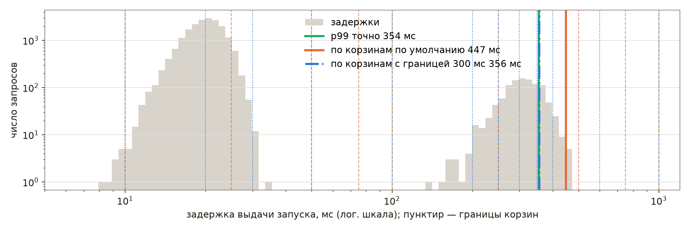
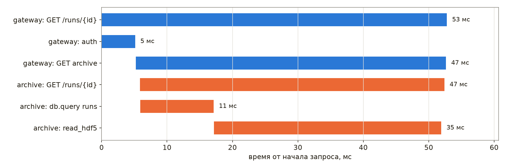
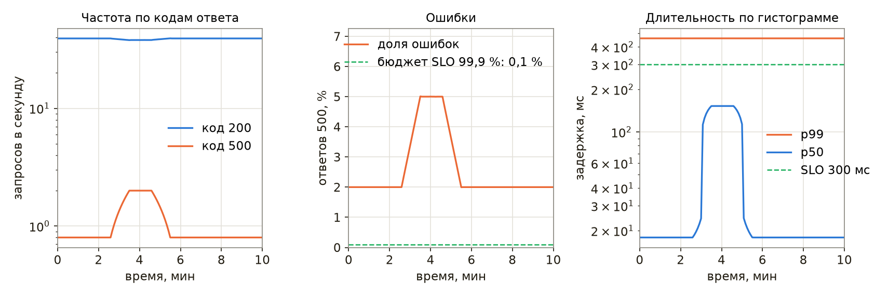
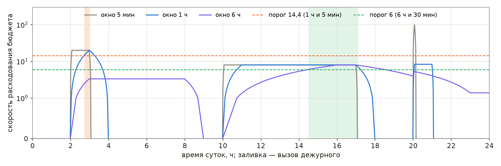

# Наблюдаемость

Служба, которую разработчик запустил и проверил вручную, со временем начинает работать без него: ночью, в выходные, под нагрузкой, которой не было при отладке. Отказ такой службы обнаруживается либо её собственными средствами, либо пользователями — сменой установки, которая не может открыть данные последнего запуска, или скриптом обработки, который всю ночь получал пустые ответы. Разница между этими случаями измеряется часами простоя и потерянными данными.

Термин «наблюдаемость» заимствован из теории управления: в работе Р. Калмана 1960 года система называется наблюдаемой, если её внутреннее состояние можно восстановить по выходным сигналам за конечное время. В эксплуатации программ смысл тот же. Программа является **наблюдаемой**, если по тому, что она сообщает о себе, — по журналам, метрикам и трассировкам — можно понять, что происходит внутри неё, в том числе в ситуации, которую никто заранее не предусмотрел [52]. Мониторинг в узком смысле отвечает на заранее заданные вопросы: работает ли служба, не заполнен ли диск. Наблюдаемость позволяет задавать новые вопросы к уже собранным данным, не выпуская новую версию программы.

В настоящей главе рассматриваются четыре задачи: запись журналов, сбор метрик, трассировка запросов и оповещение дежурного. Последовательно разобраны журналы, метрики и их хранение в Prometheus, трассировки OpenTelemetry, построение панелей и правила оповещений по целям уровня обслуживания, а в завершение перечисленные приёмы применены к программам физической установки. Глава продолжает раздел «Журналы, метрики и трассировки» главы [«Системный дизайн»](./system-design.md), где введены три вида сигналов, идентификатор запроса и пороги скорости расходования бюджета ошибок, и раздел «Логирование вместо print» главы [«От скрипта к приложению»](./app.md). Действия при уже случившемся отказе рассмотрены в следующей главе, [«Поиск неисправностей»](./troubleshooting.md).

Сквозным примером главы служат две программы ускорительного комплекса. Служба вакуумной системы опрашивает контроллер вакуумметров и сообщает давление в секторах, а архив измерений выдаёт данные запусков сотрудникам и их скриптам по HTTP. Листинги главы выполнены под Python 3.11 с prometheus-client 0.26.0 и opentelemetry-sdk 1.45.0, команда jq — в версии 1.7.1. Демонстрации лекции «Наблюдаемость» записаны на виртуальной машине под Ubuntu 24.04 с Python 3.12, Prometheus 3.15 и node_exporter 1.12; на ней выполнены приведённые в главе команды journalctl и promtool и проверены конфигурация и правила Prometheus, а числа со ссылкой на демонстрацию к лекции взяты из этих записей.

> **Слайды к главе.** Составляющие простоя, журналы, метрики, сбор и хранение, трассировки, панели и оповещения изложены также в лекции «Наблюдаемость» с демонстрациями в терминале; слайды лекции доступны [на сайте книги](https://phys-dev.github.io/soft-dev-book/slides/lecture-19.html#/cover) и [в PDF](https://github.com/phys-dev/soft-dev-book/releases/latest/download/soft-dev-book-lecture-19.pdf).

<iframe src="../slides/lecture-19.html#/cover" title="Слайды лекции «Наблюдаемость»" loading="lazy" allowfullscreen style="width:100%; aspect-ratio:16/10; border:0; border-radius:6px"></iframe>

## Зачем наблюдать

> **Слайды к главе.** Составляющие простоя, цена надёжности, симптомы и причины и средние времена восстановления изложены также в первой части лекции «Наблюдаемость» с демонстрацией в терминале; слайды лекции доступны [на сайте книги](https://phys-dev.github.io/soft-dev-book/slides/lecture-19.html#/sec-why) и [в PDF](https://github.com/phys-dev/soft-dev-book/releases/latest/download/soft-dev-book-lecture-19.pdf).

<iframe src="../slides/lecture-19.html#/sec-why" title="Слайды лекции «Наблюдаемость»: зачем наблюдать" loading="lazy" allowfullscreen style="width:100%; aspect-ratio:16/10; border:0; border-radius:6px"></iframe>

### Из чего складывается простой

Время, в течение которого служба не выполняет свою функцию, складывается из нескольких отрезков. **Обнаружение** длится от начала отказа до первого сигнала о нём — оповещения или сообщения пользователя. **Реакция** — от сигнала до момента, когда дежурный приступил к работе. **Локализация** — от начала работы до момента, когда найден отказавший компонент. **Восстановление** — от найденной причины до возобновления работы. В отрасли эти отрезки обозначают сокращениями MTTD, MTTA и MTTR (среднее время обнаружения, подтверждения и восстановления), причём буква R в разных организациях означает то восстановление работы, то устранение причины. После восстановления наступает холодная фаза: разбор причин и меры, исключающие повторение.

Наблюдаемость сокращает первые три отрезка. Без метрик и оповещений обнаружение определяется тем, когда пользователь заметит отказ и сообщит о нём; без журналов и трассировок локализация превращается в перебор компонентов. Восстановление же зависит в основном от того, как устроены выкатка и откат версий.

Средние значения этих отрезков плохо подходят для оценки работы и её изменений [54]. Распределение длительностей инцидентов сильно скошено вправо и близко к логнормальному: большинство инцидентов короткие, а немногие длятся во много раз дольше. Инцидентов же за квартал обычно единицы или десятки, и среднее определяется одним-двумя долгими случаями. Оценим этот эффект моделированием. Пусть длительности простоев установки распределены логнормально с медианой 27 мин, за квартал случается от 8 до 14 инцидентов, а начиная с пятого квартала процесс улучшен так, что длительность каждого инцидента уменьшается на 20 %. В одной реализации средние по кварталам улучшенного периода составили 33, 45, 51 и 25 мин против 29, 27, 15 и 21 мин до улучшения; среднее седьмого квартала, 51 мин при медиане 11 мин, определил один инцидент длительностью 218 мин. Среди 10 000 повторений опыта в 30 % случаев среднее за кварталы 7–8 оказалось не лучше среднего за кварталы 1–2. Таким образом, при десятке событий в квартал тренд среднего неотличим от случайных колебаний. Тот же недостаток, как показано в отчёте [54], имеют медиана и другие сводные показатели, поэтому инциденты разбирают по отдельности, а для оценки изменения выбирают величину, которую оно затрагивает непосредственно, например время обнаружения, или показатели уровня обслуживания, рассмотренные в разделе об оповещениях.

Надёжность требует затрат. Основной способ её повышения представляет собой резервирование, и каждая дополнительная девятка доступности в десять раз уменьшает допустимый простой: при 99,9 % за сутки допускается \\(24 \cdot 3600 \cdot 0{,}001 = 86{,}4\\) с, или 1 мин 26 с. Не каждой программе необходимы три девятки. Ночной пересчёт калибровок, отложенный на час, ничего не нарушает, а выдача данных смене во время сеанса требует большего. Цели уровня обслуживания и таблица девяток приведены в разделе «SLI, SLO и SLA» главы [«Системный дизайн»](./system-design.md).

### Симптомы и причины

**Симптом** представляет собой то, что видит пользователь: ошибки, долгие ответы, устаревшие данные. **Причина** объясняет симптом: переполненный диск, исчерпанная память, отставшая реплика базы. Для смены установки симптом выглядит так: «запуск 42 не открывается в архиве», а причина может состоять в том, что реплика базы метаданных отстала на час. Симптомов немного, и каждый из них означает, что пользователи уже пострадали; причин много, и большая часть из них к симптомам не приводит.

Различают два способа наблюдения [23]. **Чёрный ящик** проверяет службу снаружи так же, как пользователь: запрашивает страницу и измеряет время ответа. Такая проверка обнаруживает отказ, который уже случился, в том числе отказ сети или балансировщика, невидимый изнутри службы. **Белый ящик** опирается на сведения, которые служба сообщает о себе: счётчики запросов, длину очередей, время обращения к базе. Он позволяет заметить приближение отказа — рост очереди или заполнение диска — и указывает, в каком компоненте искать причину. Отсюда вытекает правило, принятое в книге Google SRE: дежурного вызывают по симптомам, а причины выводят на панели, которые дежурный просматривает, когда симптом уже обнаружен; исключение составляют несомненные и неминуемые причины, например почти заполненный диск [23].

## Журналы

> **Слайды к главе.** Структурированная запись, уровни и порог, контекст запроса, журнал systemd и цена хранения изложены также во второй части лекции «Наблюдаемость» с демонстрациями в терминале; слайды лекции доступны [на сайте книги](https://phys-dev.github.io/soft-dev-book/slides/lecture-19.html#/sec-logs) и [в PDF](https://github.com/phys-dev/soft-dev-book/releases/latest/download/soft-dev-book-lecture-19.pdf).

<iframe src="../slides/lecture-19.html#/sec-logs" title="Слайды лекции «Наблюдаемость»: журналы" loading="lazy" allowfullscreen style="width:100%; aspect-ratio:16/10; border:0; border-radius:6px"></iframe>

Журнал представляет собой последовательность записей о событиях: служба запущена, вакуумметр не ответил, запрос завершился ошибкой. Каждая запись относится к моменту времени и содержит уровень важности, источник и сообщение. Журнал отвечает на вопрос, что произошло с конкретным запросом или циклом работы, и служит основным материалом расследования. Основы модуля `logging` — логгер на модуль, уровни, вывод в консоль и файл — изложены в разделе «Логирование вместо print» главы [«От скрипта к приложению»](./app.md); здесь рассматривается журнал службы, который читают не только люди, но и программы.

### Структурированная запись

Строка вида `WARNING vacuum: VG04 6.2e-06 Pa above threshold` удобна человеку, но программа извлекает из неё давление и имя датчика регулярным выражением, которое перестаёт работать при первом изменении формулировки, а многострочная трассировка стека в таком журнале распадается на отдельные записи. **Структурированный журнал** записывает каждое событие одной строкой JSON с постоянным набором полей: время, уровень, сообщение и поля самого события. Отбор записей по полям выполняется без разбора текста — утилитой jq или системами хранения журналов Loki и Elasticsearch.

```python
import contextvars
import json
import logging
import sys

cycle = contextvars.ContextVar("cycle", default=0)    # номер цикла опроса


class JsonFormatter(logging.Formatter):
    def format(self, record):
        doc = {"t": self.formatTime(record, "%H:%M:%S"), "lvl": record.levelname,
               "cyc": cycle.get(), **getattr(record, "fields", {}), "msg": record.getMessage()}
        return json.dumps(doc, ensure_ascii=False, separators=(",", ":"))


handler = logging.StreamHandler(sys.stdout)
handler.setFormatter(JsonFormatter())
log = logging.getLogger("vacuum")
log.addHandler(handler)
log.setLevel(logging.INFO)

cycle.set(3)
log.info("норма", extra={"fields": {"vg": "VG01", "p": 2.0e-07}})
log.warning("выше порога", extra={"fields": {"vg": "VG04", "p": 6.2e-06}})
log.debug("коды АЦП", extra={"fields": {"vg": "VG04", "adc": [2045, 2046]}})
```

    {"t":"14:27:38","lvl":"INFO","cyc":3,"vg":"VG01","p":2e-07,"msg":"норма"}
    {"t":"14:27:38","lvl":"WARNING","cyc":3,"vg":"VG04","p":6.2e-06,"msg":"выше порога"}

Форматтер собирает словарь из полей записи и сериализует его функцией `json.dumps`: параметр `ensure_ascii=False` сохраняет кириллицу читаемой, а `separators` убирает лишние пробелы. Поля события передаются аргументом `extra` — модуль `logging` превращает ключи этого словаря в атрибуты записи, и форматтер читает атрибут `fields`. Номер цикла опроса берётся из контекстной переменной, о которой сказано ниже. Отладочная запись при пороге INFO не выводится. Если вывод службы сохранён в файл `vacuum.json`, записи выше уровня INFO с нужными полями отбирает одна команда:

```bash
jq -c 'select(.lvl != "INFO") | {t, vg, p, msg}' vacuum.json
```

    {"t":"14:27:38","vg":"VG04","p":0.0000062,"msg":"выше порога"}

Утилита jq выводит то же число в десятичной записи. Состав полей согласуют для всех служб системы: одинаковые имена времени, уровня и идентификатора запроса позволяют объединить журналы нескольких программ в один поток и отбирать записи одним выражением. Трассировку стека при исключении записывают в одно поле: стандартный форматтер получает её текст методом `formatException`, а форматтер JSON помещает этот текст в отдельный ключ, и запись остаётся одной строкой.

### Уровни и порог

Модуль `logging` определяет пять уровней: DEBUG (10), INFO (20), WARNING (30), ERROR (40) и CRITICAL (50). Порог, заданный логгеру или обработчику, отсекает записи с уровнем ниже порога. Вызов `log.debug()` при пороге INFO завершается сразу после сравнения уровней: запись не создаётся, а сообщение не форматируется, если аргументы переданы отдельно (`log.debug("коды %s", adc)`), а не подставлены заранее в f-строку. Сами аргументы при этом вычисляются до вызова, поэтому дорогое вычисление, требуемое только для отладочной записи, выполняют под проверкой `log.isEnabledFor(logging.DEBUG)`. Отладочные вызовы, таким образом, остаются в коде службы, а их сообщения выводятся, только когда порог понижен до DEBUG.

Для службы обычно выбирают порог INFO. Отладочный порог необходим во время расследования, и включать его требуется без перезапуска: перезапуск сбрасывает именно то состояние, в котором проявляется неисправность, — заполненную очередь, зависшее соединение с прибором. Распространённый способ состоит в обработчике сигнала, который переключает порог работающего процесса:

```python
import logging
import os
import signal
import sys

logging.basicConfig(stream=sys.stdout, level=logging.INFO, format="%(levelname)-7s %(message)s")
log = logging.getLogger("vacuum")
pending = []                                    # отметки обработчика сигнала


def on_usr1(signum, frame):
    """Меняет порог и оставляет отметку; запись в журнал — уже в основном цикле."""
    root = logging.getLogger()
    root.setLevel(logging.DEBUG if root.level == logging.INFO else logging.INFO)
    pending.append(signum)


signal.signal(signal.SIGUSR1, on_usr1)
for c in range(1, 5):
    if c == 3:
        os.kill(os.getpid(), signal.SIGUSR1)    # в работе сигнал посылает администратор: kill -USR1 PID
    while pending:
        pending.pop()
        log.warning("порог журнала: %s", logging.getLevelName(logging.getLogger().level))
    log.debug("цикл %d: коды АЦП %s", c, [2040 + c, 2051 - c])
    log.info("цикл %d: давление в норме", c)
```

    INFO    цикл 1: давление в норме
    INFO    цикл 2: давление в норме
    WARNING порог журнала: DEBUG
    DEBUG   цикл 3: коды АЦП [2043, 2048]
    INFO    цикл 3: давление в норме
    DEBUG   цикл 4: коды АЦП [2044, 2047]
    INFO    цикл 4: давление в норме

Обработчик сигнала только меняет порог и оставляет отметку, а сообщение о смене порога записывает основной цикл. Python выполняет обработчик в главном потоке между инструкциями байт-кода, и запись из обработчика может прервать незавершённую запись в тот же поток вывода; документация модуля `logging` прямо предупреждает, что из асинхронных обработчиков сигналов журнал может быть недоступен. В работающей системе сигнал посылают командой `kill -USR1` с идентификатором процесса, а службе systemd — командой `systemctl kill -s USR1` с именем службы. Повторный сигнал возвращает порог INFO.

Объём записей ограничивают и другими средствами: трассировку стека повторяющейся ошибки выводят один раз за интервал с числом повторений, а частое однотипное событие заменяют счётчиком — метрикой, рассмотренной в следующем разделе.

### Контекст запроса

Отдельная запись редко объясняет отказ; объясняет его цепочка записей одного запроса или цикла, проходящая через несколько функций, потоков и служб. Цепочку связывает идентификатор, присутствующий во всех её записях: номер цикла опроса, идентификатор запроса, назначенный nginx на входе в систему (раздел «Журналы, метрики и трассировки» главы [«Системный дизайн»](./system-design.md)), или идентификатор трассы OpenTelemetry, рассмотренный ниже.

Передавать идентификатор аргументом через все функции неудобно. Модуль `contextvars` позволяет хранить его в **контекстной переменной**: значение, установленное методом `set`, видно всему коду текущего контекста, а форматтер читает его методом `get`, как в листинге выше. Задачи asyncio получают копию контекста в момент создания, поэтому идентификаторы параллельно обрабатываемых запросов не смешиваются; функция `asyncio.to_thread` переносит контекст в рабочий поток сама. Новый поток, созданный модулем `threading`, в обычной сборке Python начинает работу с пустым контекстом, и значение необходимо передавать явно: функция `contextvars.copy_context()` возвращает копию текущего контекста, а её метод `run` выполняет в ней функцию потока. Начиная с Python 3.14 ту же копию можно передать параметром `context` конструктора `threading.Thread`.

### Журнал службы systemd

Программе не требуется самой управлять файлами журнала: ей достаточно писать записи в стандартный вывод. Методология The Twelve-Factor App рассматривает журнал как поток событий: приложение выводит его, а сбор, хранение и ротацию обеспечивает среда выполнения. Для службы systemd такой средой является journald: стандартный вывод и поток ошибок службы по умолчанию попадают в системный журнал, где каждая запись получает поля `_PID`, `_SYSTEMD_UNIT`, `PRIORITY` и другие. Уровень записи journald определяет по префиксу `<N>` в начале строки (параметр `SyslogLevelPrefix`, по умолчанию включён): 3 означает ошибку, 4 — предупреждение, 6 — информационное сообщение, 7 — отладку. Префикс удаляется из текста сообщения и сохраняется в поле `PRIORITY`.

```python
import logging
import sys

SYSLOG = {logging.DEBUG: 7, logging.INFO: 6, logging.WARNING: 4, logging.ERROR: 3, logging.CRITICAL: 2}


class PrefixFormatter(logging.Formatter):
    """Префикс <N> в начале строки journald читает как уровень syslog и убирает из сообщения."""
    def format(self, record):
        return f"<{SYSLOG[record.levelno]}>{super().format(record)}"


handler = logging.StreamHandler(sys.stdout)
handler.setFormatter(PrefixFormatter("%(name)s: %(message)s"))
log = logging.getLogger("vacuum")
log.addHandler(handler)
log.setLevel(logging.INFO)

log.info("цикл %d завершён", 1)
log.error("цикл %d: %s не отвечает", 2, "VG06")
log.warning("цикл %d: %s давление %.1e Па выше порога", 4, "VG04", 7.5e-06)
```

    <6>vacuum: цикл 1 завершён
    <3>vacuum: цикл 2: VG06 не отвечает
    <4>vacuum: цикл 4: VG04 давление 7.5e-06 Па выше порога

Записи службы затем отбирают средствами journalctl по полям, а не по тексту: ключ `-p warning` оставляет уровни от emerg до warning, а вывод в формате JSON передаёт поля записи программе. В демонстрации к лекции сценарий `journal_svc.py` с тем же форматтером запущен как временная служба systemd; кроме приведённых строк он сообщает о завершении каждого из шести циклов. После завершения службы команды отбора дали следующий вывод:

```bash
systemd-run -q -u l19-vacuum --collect python3 $PWD/journal_svc.py
journalctl -u l19-vacuum -p warning -S -1min -o cat
journalctl -u l19-vacuum -p 4 -S -1min -o json | jq -r .PRIORITY
```

    vacuum: цикл 2: VG06 не отвечает
    vacuum: цикл 4: VG04 давление 7.5e-06 Па выше порога
    3
    4

В выводе нет ни префиксов, ни записей уровня INFO: journald убрал префиксы из текста и сохранил уровни в поле `PRIORITY`, по которому ключ `-p` отбирает записи, — в виде имени уровня (`warning`) или его номера (`4`). Ключ `-S -1min` ограничивает вывод записями за последнюю минуту.

Контейнер Docker аналогично передаёт стандартный вывод драйверу журналов — по умолчанию `json-file`, который без параметров `max-size` и `max-file` журнал не ротирует, — а в Kubernetes среда выполнения записывает вывод контейнеров в файлы на узле, откуда их обычно забирает агент, запущенный на каждом узле. Во всех случаях программа пишет в стандартный вывод, а куда попадёт запись, решает среда.

### Объём и срок хранения

У службы без собственных данных журнал обычно является главным потребителем дискового пространства, и его объём оценивают заранее как произведение числа записей в сутки, среднего размера записи и срока хранения. Оценим три политики записи для службы сбора данных с 200 каналами, оцифровываемыми с частотой 10 Гц. Средняя запись JSON того же вида, что в листинге выше, занимает 85 байт и сжимается gzip в 12,2 раза:

| Политика записи | Записей в сутки | В сутки | За год | За год со сжатием |
|---|---|---|---|---|
| каждый отсчёт канала | \\(1{,}73 \cdot 10^{8}\\) | 14,6 ГБ | 5,3 ТБ | 438,9 ГБ |
| каждый цикл опроса раз в секунду | 86 400 | 7,3 МБ | 2,7 ГБ | 219,4 МБ |
| только изменения состояния | около 1000 | 84,7 кБ | 30,9 МБ | 2,5 МБ |

Таким образом, отсчёты каналов являются данными и хранятся в архиве измерений, а журнал предназначен для событий. Срок хранения и ротацию задаёт среда: journald ограничивает объём журнала параметром `SystemMaxUse` (по умолчанию 10 % файловой системы, но не более 4 ГиБ), для файлов журнала применяют logrotate, а записи старше нескольких недель хранят сжатыми или удаляют. Сам конвейер доставки журналов тоже может отказать незаметно, поэтому за ним наблюдают метрикой — числом принятых записей в минуту: падение этого числа до нуля означает отказ доставки, а не исчезновение событий.

## Метрики

> **Слайды к главе.** Модель данных Prometheus, типы метрик, экспортёр, метки и кардинальность, гистограммы и оценка квантилей изложены также в третьей части лекции «Наблюдаемость» с демонстрациями в терминале; слайды лекции доступны [на сайте книги](https://phys-dev.github.io/soft-dev-book/slides/lecture-19.html#/sec-metrics) и [в PDF](https://github.com/phys-dev/soft-dev-book/releases/latest/download/soft-dev-book-lecture-19.pdf).

<iframe src="../slides/lecture-19.html#/sec-metrics" title="Слайды лекции «Наблюдаемость»: метрики" loading="lazy" allowfullscreen style="width:100%; aspect-ratio:16/10; border:0; border-radius:6px"></iframe>

**Метрика** представляет собой число, которое служба сообщает о себе и которое наблюдается во времени: число обработанных запросов, длительность ответа, давление в секторе, заполнение диска. В отличие от журнала, метрика не описывает отдельные события, а сводит их в число, поэтому объём её хранения почти не зависит от нагрузки: счётчик запросов занимает одинаковое место при десяти и при десяти тысячах запросов в секунду. По метрикам строят графики и оповещения. Фактическим стандартом для метрик служб стала модель Prometheus [51]; её текстовый формат экспозиции, на основе которого создана спецификация OpenMetrics, читают и другие системы, например VictoriaMetrics и OpenTelemetry Collector.

### Модель данных и формат

Временной ряд в Prometheus определяется именем метрики и набором **меток** — пар «имя — значение»; отсчёт ряда состоит из метки времени с точностью до миллисекунды и числа с плавающей точкой двойной точности. Ряды `vacuum_pressure_pascals{sector="ring",gauge="VG02"}` и `vacuum_pressure_pascals{sector="linac",gauge="VG01"}` относятся к одной метрике, но хранятся отдельно. Prometheus сам опрашивает службы: раз в заданный интервал он запрашивает у каждой цели адрес `/metrics` и получает текст в формате экспозиции. Строки `# HELP` и `# TYPE` описывают метрику и её тип, а каждая следующая строка содержит имя, метки в фигурных скобках и значение.

Значения выражают в базовых единицах, перечисленных в руководстве Prometheus по именованию метрик: в секундах, а не миллисекундах, в байтах, а не мегабайтах, в метрах, вольтах и амперах, а температуру — в градусах Цельсия. Давления в этом перечне нет, и по тому же правилу его выражают в паскалях. Единицу указывают суффиксом имени во множественном числе (`_seconds`, `_bytes`, `_pascals`), а имя накопительного счётчика оканчивается на `_total`. Базовые единицы позволяют складывать и делить метрики разных служб без пересчёта, а суффикс сообщает единицу каждому, кто читает выражение в файле правил или подпись графика, и исключает совпадение имён метрик, выраженных в разных единицах.

### Типы метрик

Библиотеки инструментирования Prometheus предлагают четыре основных типа метрик. Сам сервер хранит все типы, кроме нативных гистограмм, о которых сказано ниже, как обычные ряды чисел, а тип определяет прежде всего то, какими функциями метрику обрабатывают в запросах.

| Тип | Поведение | Пример | Типичная обработка |
|---|---|---|---|
| counter (счётчик) | только растёт, обнуляется при перезапуске | запросы, ошибки, срабатывания триггера | `rate`, `increase` |
| gauge (мгновенное значение) | растёт и убывает | давление, длина очереди, память | значение, `max_over_time` |
| histogram (гистограмма) | счётчики попаданий в корзины | длительность запроса | `histogram_quantile` |
| summary (сводка) | квантили, вычисленные службой | длительность запроса | только по одному экземпляру |

События считают счётчиком, а не мгновенным значением. Рассмотрим модель системы сбора данных: триггер срабатывает 50 раз в секунду, на 70-й секунде происходит вспышка 400 срабатываний в секунду длительностью 3 с, на 90-й секунде служба перезапускается, а Prometheus опрашивает её раз в 15 с.

```python
def increase(samples):
    """Приращение счётчика по отсчётам опроса: уменьшение значения означает перезапуск."""
    return sum(cur - prev if cur >= prev else cur for prev, cur in zip(samples, samples[1:]))


rate = [400 if 70 <= t < 73 else 50 for t in range(120)]   # срабатываний триггера за секунду t
counter, total = [], 0
for t, n in enumerate(rate):
    if t == 90:
        total = 0                                         # служба перезапущена
    total += n
    counter.append(total)

scrapes = range(14, 120, 15)                              # опрос раз в 15 с
samples = [counter[t] for t in scrapes]
print("отсчёты счётчика:", samples)
print("последний минус первый:", samples[-1] - samples[0])
print("с учётом сброса:", increase(samples), " на самом деле:", sum(rate[15:120]))
print("мгновенное значение в опросах:", {rate[t] for t in scrapes}, " максимум:", max(rate))
```

    отсчёты счётчика: [750, 1500, 2250, 3000, 4800, 5550, 750, 1500]
    последний минус первый: 750
    с учётом сброса: 6300  на самом деле: 6300
    мгновенное значение в опросах: {50}  максимум: 400

Разность последнего и первого отсчётов показывает 750 срабатываний вместо 6300: перезапуск обнулил счётчик. Функция `increase` учитывает сброс: уменьшение значения означает, что счётчик начат заново, и новое значение целиком является приращением. Так же поступают функции `rate` и `increase` языка запросов PromQL; кроме того, они экстраполируют приращение до границ окна, поэтому их результат бывает дробным. События между последним опросом и перезапуском при этом теряются, но в модели перезапуск происходит сразу после опроса. Мгновенное значение «срабатываний за последнюю секунду» в моменты опроса всегда равно 50, и вспышка между опросами не видна, тогда как счётчик учитывает каждое событие независимо от того, когда его прочитали. Обратная ошибка состоит в счётчике для убывающей величины: если число занятых соединений оформить счётчиком, функция `rate` воспримет каждое его уменьшение как перезапуск.

Гистограмма и сводка описывают распределение величины, чаще всего длительности запросов. Гистограмма хранит счётчики попаданий в корзины, и квантиль по ним вычисляет Prometheus; сводка вычисляет квантили в самой службе. Различие существенно при нескольких экземплярах службы и рассмотрено ниже, в разделе о квантилях.

### Экспортёр

Служба на Python выставляет метрики библиотекой prometheus_client. Для собственного кода достаточно прямого инструментирования: объекты `Counter`, `Gauge` и `Histogram` изменяются в местах событий, например `REQS.labels(code="200").inc()`, а библиотека отдаёт их текущие значения. Если же метрики берутся из другой системы — контроллера, прибора, внешнего API, — пишут **экспортёр**: программу, которая при каждом обращении Prometheus опрашивает источник и переводит ответ в формат экспозиции. Руководство Prometheus по написанию экспортёров предписывает синхронный опрос: экспортёр не запускает собственных таймеров, а читает источник в момент запроса `/metrics` и при каждом запросе создаёт метрики заново, а не обновляет глобальные объекты прямого инструментирования. Тогда возраст данных совпадает с моментом опроса, а отказ источника виден сразу; кроме того, два одновременных опроса не мешают друг другу, а ряд исчезнувшего датчика не остаётся в ответе. В prometheus_client синхронный опрос реализуется собственным коллектором — классом с методом `collect`, который возвращает семейства метрик.

```python
import random
import urllib.request

from prometheus_client import CollectorRegistry, start_http_server
from prometheus_client.core import CounterMetricFamily, GaugeMetricFamily

GAUGES = {"VG01": "linac", "VG02": "ring", "VG03": "ring"}
rng = random.Random(19)


def read_gauge(name):
    """Модель контроллера; в службе здесь запрос к прибору или к EPICS с тайм-аутом."""
    if name == "VG03" and rng.random() < 0.5:
        raise TimeoutError(name)
    return float(f"{rng.lognormvariate(-15.4, 0.3):.3e}")


class VacuumCollector:
    def __init__(self):
        self.errors = dict.fromkeys(GAUGES, 0)

    def collect(self):                          # вызывается при каждом запросе /metrics
        p = GaugeMetricFamily("vacuum_pressure_pascals", "Давление", labels=["sector", "gauge"])
        for gauge, sector in GAUGES.items():
            try:
                p.add_metric([sector, gauge], read_gauge(gauge))
            except TimeoutError:
                self.errors[gauge] += 1
        yield GaugeMetricFamily("vacuum_up", "Контроллер ответил", value=1 if p.samples else 0)
        yield p
        err = CounterMetricFamily("vacuum_gauge_errors", "Неудачные чтения", labels=["gauge"])
        for gauge, n in self.errors.items():
            err.add_metric([gauge], n)
        yield err


registry = CollectorRegistry()
registry.register(VacuumCollector())
server, _ = start_http_server(9101, addr="127.0.0.1", registry=registry)
text = urllib.request.urlopen("http://127.0.0.1:9101/metrics", timeout=5).read().decode()
print("\n".join(line for line in text.splitlines() if line.startswith(("# TYPE", "vacuum"))))
server.shutdown()
```

    # TYPE vacuum_up gauge
    vacuum_up 1.0
    # TYPE vacuum_pressure_pascals gauge
    vacuum_pressure_pascals{gauge="VG01",sector="linac"} 3.133e-07
    vacuum_pressure_pascals{gauge="VG02",sector="ring"} 2.095e-07
    # TYPE vacuum_gauge_errors_total counter
    vacuum_gauge_errors_total{gauge="VG01"} 0.0
    vacuum_gauge_errors_total{gauge="VG02"} 0.0
    vacuum_gauge_errors_total{gauge="VG03"} 1.0

Коллектор регистрируется в собственном реестре, и функция `start_http_server` запускает в отдельном потоке HTTP-сервер, который при каждом запросе вызывает метод `collect`. Вакуумметр VG03 в этом опросе не ответил: ряда давления для него нет, а счётчик неудачных чтений увеличился. Отсутствие ряда точнее отражает состояние, чем нуль или последнее известное значение: нулевое давление выглядело бы как идеальный вакуум, а повтор старого значения скрыл бы отказ датчика. Метрика `vacuum_up` сообщает, ответил ли контроллер хотя бы по одному датчику. Руководство описывает два способа сообщить о неудачном опросе источника: ответ `/metrics` с кодом ошибки 5xx и метрику вида `<экспортёр>_up` со значением 0 или 1; второй способ удобнее, когда часть метрик доступна и при отказе источника, как счётчики ошибок в листинге. Суффикс `_total` библиотека добавила к имени счётчика сама.

Из того же принципа вытекают и остальные требования к экспортёру. Обращение к источнику необходимо ограничивать тайм-аутом, меньшим тайм-аута опроса Prometheus (по умолчанию 10 с), иначе при зависшем приборе каждый опрос завершается отказом цели. Длительность опроса источника выставляют отдельной метрикой, например `vacuum_scrape_duration_seconds`. Руководство по инструментированию добавляет правило о моментах времени: момент события выставляют значением в секундах времени Unix, а не временем, прошедшим с события, — время старта процесса, а не время работы, и время последней успешной калибровки, а не её возраст. Прошедшее время Prometheus вычисляет сам выражением `time() - metric`, а метрика не требует обновления.

### Метки и кардинальность

Каждая комбинация значений меток образует отдельный временной ряд, который Prometheus хранит в памяти и на диске, и число таких комбинаций называют **кардинальностью** метрики. Метки с ограниченным набором значений — метод HTTP, шаблон маршрута, код ответа, сектор — безопасны. Метка с неограниченным набором значений — путь запроса с номером запуска, адрес клиента, имя пользователя — создаёт новый ряд для каждого нового значения. Демонстрация к лекции показывает масштаб на модели из 20 000 запросов к архиву: счётчик с метками метода, шаблона маршрута и кода ответа даёт 9 рядов и ответ `/metrics` размером 2 КиБ, а тот же счётчик с полным путём вместо шаблона маршрута — 11 945 рядов и 2051 КиБ. Документация Prometheus рекомендует держать кардинальность метрик ниже 10, а метрик с большей кардинальностью иметь во всей системе лишь несколько; метрику, кардинальность которой превышает 100 или может её превысить, предлагается перепроектировать — сократить число измерений или перенести анализ из мониторинга в систему обработки данных общего назначения. Номер запуска, таким образом, является полем записи журнала или атрибутом трассы, а не меткой метрики.

### Гистограммы и квантили

Задержку описывают перцентилями (раздел «Нагрузка и задержка» главы [«Системный дизайн»](./system-design.md)), но служба не может хранить длительность каждого запроса. Гистограмма Prometheus хранит счётчики попаданий в корзины с заданными верхними границами `le`: ряд `_bucket{le="0.3"}` содержит число запросов длительностью не более 0,3 с, ряд `_bucket{le="+Inf"}` — число всех запросов; дополнительно хранятся сумма длительностей `_sum` и их число `_count`. Корзины накопительные: каждая включает все меньшие. Функция `histogram_quantile` находит корзину, в которую попадает искомый ранг, и интерполирует внутри неё линейно, предполагая равномерное распределение наблюдений по корзине. Ошибка оценки поэтому ограничена шириной корзины, а при попадании ранга в корзину `+Inf` функция возвращает верхнюю границу последней конечной корзины. Следующий листинг повторяет этот расчёт и сравнивает корзины prometheus_client по умолчанию с корзинами, сгущёнными около цели 300 мс.

```python
import bisect
import random
import statistics

DEFAULT = [.005, .01, .025, .05, .075, .1, .25, .5, .75, 1.0, 2.5, 5.0, 7.5, 10.0]
NEAR_SLO = [.01, .02, .03, .05, .1, .2, .25, .3, .35, .4, .6, 1.0]


def sample(n, cold, seed):
    """Задержки выдачи запуска, с: доля cold читает холодный файл."""
    rng = random.Random(seed)
    return [rng.gauss(0.31, 0.05) if rng.random() < cold else rng.gauss(0.020, 0.003) for _ in range(n)]


def buckets(xs, bounds):
    """Накопительные счётчики корзин le, как ряды _bucket; последняя корзина +Inf."""
    xs = sorted(xs)
    return [bisect.bisect_right(xs, b) for b in bounds] + [len(xs)]


def histogram_quantile(q, bounds, counts):
    """Корзина, в которую попал ранг, и линейная интерполяция внутри неё."""
    rank = q * counts[-1]
    i = bisect.bisect_left(counts, rank)
    if i == len(bounds):                         # ранг в корзине +Inf
        return bounds[-1]
    lo, below = (0.0, 0) if i == 0 else (bounds[i - 1], counts[i - 1])
    return lo + (bounds[i] - lo) * (rank - below) / (counts[i] - below)


def p99(xs, bounds=None):
    if bounds is None:
        return 1000 * statistics.quantiles(xs, n=100, method="inclusive")[98]
    return 1000 * histogram_quantile(0.99, bounds, buckets(xs, bounds))


xs = sample(20_000, 0.05, 1)
print(f"p99 точно {p99(xs):.0f} мс, по корзинам по умолчанию {p99(xs, DEFAULT):.0f} мс, "
      f"с границей 300 мс {p99(xs, NEAR_SLO):.0f} мс")
a, b = sample(18_000, 0.01, 2), sample(2_000, 0.30, 3)        # два экземпляра службы
merged = [i + j for i, j in zip(buckets(a, NEAR_SLO), buckets(b, NEAR_SLO))]
print(f"p99 экземпляров {p99(a, NEAR_SLO):.0f} и {p99(b, NEAR_SLO):.0f} мс, "
      f"среднее {(p99(a, NEAR_SLO) + p99(b, NEAR_SLO)) / 2:.0f} мс")
print(f"p99 по сумме гистограмм {1000 * histogram_quantile(0.99, NEAR_SLO, merged):.0f} мс, "
      f"точно {p99(a + b):.0f} мс")
```

    p99 точно 354 мс, по корзинам по умолчанию 447 мс, с границей 300 мс 356 мс
    p99 экземпляров 48 и 410 мс, среднее 229 мс
    p99 по сумме гистограмм 342 мс, точно 340 мс

Модель описывает выдачу запусков архивом: 95 % запросов обслуживаются около 20 мс, а 5 % читают холодный файл около 310 мс. Точный p99 равен 354 мс. Корзины по умолчанию дают оценку 447 мс: соседние границы 0,25 и 0,5 с охватывают почти весь хвост распределения, и интерполяция внутри широкой корзины завышает p99 на 93 мс. Корзины, сгущённые около цели уровня обслуживания, дают 356 мс. Граница корзины на пороге цели позволяет, кроме того, вычислить долю запросов быстрее 300 мс без интерполяции — как отношение счётчика `_bucket{le="0.3"}` к `_count`; в демонстрации к лекции эта доля совпала с точной (96,92 %), а корзины по умолчанию дали 96,23 %. Таким образом, границы корзин выбирают по целям уровня обслуживания, а не оставляют по умолчанию.



Вторая часть листинга моделирует два экземпляра службы: нагруженный, получивший 18 000 запросов с 1 % холодных чтений, и малонагруженный, получивший 2000 запросов, из которых 30 % холодные. Их p99 равны 48 и 410 мс, и среднее этих значений, 229 мс, не имеет отношения к p99 всех запросов, равному 340 мс. Счётчики корзин, напротив, складываются, и квантиль по сумме гистограмм, 342 мс, близок к точному. В PromQL ему соответствует выражение `histogram_quantile(0.99, sum by (le) (rate(archive_request_duration_seconds_bucket[5m])))`. Сводка вычисляет квантили внутри каждого экземпляра, и объединить их корректно нельзя, поэтому для служб с несколькими экземплярами выбирают гистограмму.

Рассмотренные гистограммы называют классическими. Prometheus поддерживает также нативные гистограммы: их корзины задаются экспоненциальной схемой, не требуют выбора границ при инструментировании и всегда совместимы при сложении. Документация рекомендует нативные гистограммы там, где их поддерживает библиотека инструментирования, — на момент написания главы это библиотеки для Go и Java. Класс `Histogram` библиотеки prometheus_client 0.26 выставляет классические гистограммы, и для служб на Python выбор границ корзин остаётся задачей разработчика.

## Сбор и хранение

> **Слайды к главе.** Опрос и отправка метрик, Prometheus, язык запросов PromQL и метрики заданий без постоянного процесса изложены также в четвёртой части лекции «Наблюдаемость» с демонстрациями в терминале; слайды лекции доступны [на сайте книги](https://phys-dev.github.io/soft-dev-book/slides/lecture-19.html#/sec-pipeline) и [в PDF](https://github.com/phys-dev/soft-dev-book/releases/latest/download/soft-dev-book-lecture-19.pdf).

<iframe src="../slides/lecture-19.html#/sec-pipeline" title="Слайды лекции «Наблюдаемость»: сбор и хранение" loading="lazy" allowfullscreen style="width:100%; aspect-ratio:16/10; border:0; border-radius:6px"></iframe>

### Опрос и отправка

Метрики доставляются в хранилище двумя способами. При **опросе** (pull) хранилище само обращается к службам по списку целей. Список задают в конфигурации или получают из реестра — Kubernetes, Consul, файла, который обновляет другая программа. Неудачный опрос сам является сигналом: Prometheus записывает для каждой цели ряд `up` со значением 1 после успешного опроса и 0 после неудачного, а также длительность опроса и число полученных отсчётов. Частоту опроса, а с ней и нагрузку на службы задаёт хранилище; объём же каждого ответа определяет служба, и метрика с неограниченными метками перегружает Prometheus и при опросе. Для защиты в задании опроса задают предел числа отсчётов `sample_limit`: при его превышении опрос целиком считается неудачным. При **отправке** (push) службы или агенты на машинах сами передают данные хранилищу, как это делают Telegraf с InfluxDB или агенты OpenTelemetry по протоколу OTLP. Отправка подходит для короткоживущих процессов и для сетей, в которых хранилище не может обратиться к службам, например из-за трансляции адресов; зато отсутствие данных в этом случае не отличается от отсутствия событий без отдельной проверки.

Между источником и хранилищем данные передают напрямую или через шину сообщений, например Kafka. Прямая запись проще, но при недоступности хранилища данные теряются или накапливаются в памяти агента. Шина хранит данные, пока хранилище недоступно, и позволяет нескольким потребителям читать один поток, но добавляет компонент, который сам нуждается в наблюдении, и задержку доставки. На том же пути обычно обогащают данные метками (имя машины, площадка) и отбрасывают лишнее, пока его объём не попал в хранилище.

### Prometheus и PromQL

Конфигурация Prometheus перечисляет интервалы опроса и вычисления правил, файлы правил и задания опроса с целями. Конфигурация демонстраций к лекции опрашивает четыре цели на одной машине раз в 5 с:

```yaml
# Prometheus стенда лекции «Наблюдаемость»: все цели на 127.0.0.1, опрос раз в 5 с.
global:
  scrape_interval: 5s
  evaluation_interval: 5s

rule_files:
  - rules.yml

scrape_configs:
  - job_name: prometheus
    static_configs:
      - targets: ["127.0.0.1:9090"]
  - job_name: node
    static_configs:
      - targets: ["127.0.0.1:9100"]
  - job_name: vacuum
    static_configs:
      - targets: ["127.0.0.1:9101"]
  - job_name: archive
    static_configs:
      - targets: ["127.0.0.1:8403"]
```

В записи демонстрации команда `promtool check config prometheus.yml` подтвердила корректность конфигурации вместе с подключённым файлом правил, а вскоре после запуска Prometheus все четыре цели находились в состоянии up.

Опрошенные ряды Prometheus записывает в локальную базу временных рядов: свежие отсчёты хранит в памяти и в журнале упреждающей записи, а каждые два часа сбрасывает их на диск сжатым блоком, который затем объединяется с соседними. По умолчанию данные хранятся 15 суток, а сжатый отсчёт занимает в среднем 1–2 байта. Оценим объём для установки, службы которой выставляют 10 000 рядов при опросе раз в 15 с. За сутки каждый ряд получает \\(24 \cdot 3600 / 15 = 5760\\) отсчётов, все ряды — \\(5{,}76 \cdot 10^{7}\\), что при 1,5 байта на отсчёт составляет около 86 МБ в сутки и 1,3 ГБ за 15 суток. Для хранения в течение лет Prometheus передаёт данные во внешнее хранилище (параметр `remote_write`), например VictoriaMetrics или Thanos.

Данные читают языком запросов **PromQL**. Ряды выбирают по имени и меткам селектором, например `archive_requests_total{code=~"5.."}`; диапазон `[5m]` превращает каждый ряд в набор отсчётов за пять минут, а функции и операторы агрегации сводят эти наборы в числа. Ниже приведены выражения, которые встречаются в любой системе наблюдения; строки, начинающиеся знаком `#`, PromQL считает комментариями.

```text
# цели, не ответившие на последний опрос
up == 0
# запросов в секунду по кодам ответа
sum by (code) (rate(archive_requests_total[5m]))
# доля ответов с ошибкой сервера
sum(rate(archive_requests_total{code=~"5.."}[5m])) / sum(rate(archive_requests_total[5m]))
# p99 длительности по всем экземплярам
histogram_quantile(0.99, sum by (le) (rate(archive_request_duration_seconds_bucket[5m])))
# наибольшее давление за 10 минут
max_over_time(vacuum_pressure_pascals[10m])
# разделы, которые при текущем темпе заполнятся в ближайшие 4 часа
predict_linear(node_filesystem_avail_bytes[6h], 4 * 3600) < 0
# время с последней успешной калибровки, с
time() - calib_last_success_timestamp_seconds
```

Функция `rate` вычисляет среднюю скорость роста счётчика в секунду за окно с поправкой на сбросы; окно выбирают длительностью не менее нескольких интервалов опроса, чтобы в него попадало несколько отсчётов. Оператор `sum by` сворачивает ряды по выбранным меткам: доля ошибок архива имеет смысл по службе в целом, а не по отдельному экземпляру. Функция `predict_linear` строит линейную регрессию по отсчётам окна и продолжает её на заданное время вперёд. Для графиков, где важны пики, применяют `max_over_time`, а не усреднение: среднее за окно сглаживает короткий выброс, что рассмотрено в разделе о панелях.

В демонстрации к лекции Prometheus опрашивал модель службы архива, обслуживающую 40 запросов в секунду, и запрос частоты по кодам ответа через минуту после запуска вернул следующий результат:

```bash
promtool query instant http://127.0.0.1:9090 'sum by (code) (rate(archive_requests_total[1m]))'
```

    {code="200"} => 39.199999999999996 @[1791101791.773]
    {code="500"} => 0.7999999999999999 @[1791101791.773]

Для каждого ряда выведены значение и момент вычисления в секундах времени Unix, а последние знаки значений представляют собой погрешность вычислений с плавающей точкой. Ошибкой завершаются 2 % запросов модели, а p99 по гистограмме, вычисленный выражением из этого списка с окном 1 мин, равен 0,46 с. Выражение `max by (gauge) (vacuum_pressure_pascals)` в той же демонстрации вернуло два ряда давления из трёх: вакуумметр VG03 в последнем опросе не ответил, и его ряда в этот момент нет.

### Задания без постоянного процесса

Ночная калибровка датчиков положения пучка или расчёт на кластере работают минуты и завершаются, и их итог — успех и время завершения — исчезает вместе с процессом раньше, чем Prometheus успевает его опросить. Итог такого задания записывают в файл формата экспозиции в каталог, который читает node_exporter — экспортёр Prometheus, выставляющий метрики машины (каталог задаёт параметр `--collector.textfile.directory`). Файл необходимо писать во временный и затем переименовывать, иначе экспортёр может прочитать его наполовину; функция `write_to_textfile` библиотеки prometheus_client делает это сама.

```python
import os
import tempfile

from prometheus_client import CollectorRegistry, Gauge, write_to_textfile

registry = CollectorRegistry()
last = Gauge("calib_last_success_timestamp_seconds", "Последняя успешная калибровка BPM", registry=registry)
channels = Gauge("calib_channels", "Число откалиброванных каналов BPM", registry=registry)

channels.set(40)                       # здесь выполняется калибровка
last.set(1_791_000_000)                # 03.10.2026 04:00 UTC; в задании — last.set_to_current_time()

textfile_dir = tempfile.mkdtemp()      # в работе — каталог --collector.textfile.directory
path = os.path.join(textfile_dir, "calib.prom")
write_to_textfile(path, registry)      # запись во временный файл и атомарное переименование
print(open(path, encoding="utf-8").read(), end="")
```

    # HELP calib_last_success_timestamp_seconds Последняя успешная калибровка BPM
    # TYPE calib_last_success_timestamp_seconds gauge
    calib_last_success_timestamp_seconds 1.791e+09
    # HELP calib_channels Число откалиброванных каналов BPM
    # TYPE calib_channels gauge
    calib_channels 40.0

Главная метрика задания — момент последнего успешного завершения. Оповещение по ней формулируется как отсутствие успеха дольше заданного срока, например 26 ч для ежесуточного задания, и срабатывает, если задание завершилось ошибкой, не запустилось или зависло. Выключенную машину это правило не обнаруживает: вместе с ней останавливается node_exporter, ряд метрики пропадает, и выражение оповещения не возвращает ничего. Для этого случая необходимо отдельное оповещение — по ряду `up` самого node_exporter или по выражению с функцией `absent`, которое срабатывает при отсутствии ряда. В демонстрации к лекции время успешной калибровки зафиксировано на 03.10.2026 04:00 UTC, и в момент записи выражение `max(time() - calib_last_success_timestamp_seconds) / 3600` дало 28,3 ч, то есть больше порога 26 ч.

Второй способ — сервер Pushgateway, которому задание отправляет метрики перед завершением. Документация Prometheus допускает его по существу только для итогов пакетных заданий уровня службы, не связанных с определённой машиной, а для заданий, связанных с машиной, рекомендует textfile collector. При опросе многих экземпляров через Pushgateway он становится единой точкой отказа и узким местом, лишает Prometheus проверки экземпляров по ряду `up` и хранит отправленные ряды, пока их не удалят явно.

## Трассировки

> **Слайды к главе.** Трасса и спан, заголовок `traceparent`, OpenTelemetry и сэмплирование изложены также в пятой части лекции «Наблюдаемость» с демонстрацией в терминале; слайды лекции доступны [на сайте книги](https://phys-dev.github.io/soft-dev-book/slides/lecture-19.html#/sec-traces) и [в PDF](https://github.com/phys-dev/soft-dev-book/releases/latest/download/soft-dev-book-lecture-19.pdf).

<iframe src="../slides/lecture-19.html#/sec-traces" title="Слайды лекции «Наблюдаемость»: трассировки" loading="lazy" allowfullscreen style="width:100%; aspect-ratio:16/10; border:0; border-radius:6px"></iframe>

Журнал описывает отдельные события, метрика — их число и распределение, но ни то, ни другое не показывает, на что ушло время конкретного медленного запроса, прошедшего через несколько служб. Этот вопрос решает трассировка.

### Трасса и спан

**Трасса** представляет собой дерево операций, выполненных при обработке одного запроса. Каждая операция — **спан** — имеет имя, моменты начала и конца, атрибуты (например, номер запуска или размер ответа), события и статус. Спан несёт три идентификатора: собственный `span_id`, идентификатор трассы `trace_id`, общий для всех спанов запроса, и идентификатор родительского спана; у корневого спана родителя нет. Связь между разными трассами, например между отправкой сообщения в очередь и его обработкой, оформляют ссылкой (span link). Трассу отображают «водопадом» — полосами спанов на оси времени с отступами по глубине вложенности.

Контекст трассы передаётся между службами вместе с запросом. Рекомендация W3C Trace Context определяет HTTP-заголовок `traceparent` из четырёх полей: версии, 32 шестнадцатеричных цифр `trace_id`, 16 цифр `span_id` вызывающего спана и флагов. Младший бит флагов (sampled) означает, что вызывающая сторона, возможно, записала данные трассы. Служба, получившая запрос, извлекает контекст из заголовка и открывает свои спаны как потомков вызывающего.

### OpenTelemetry

**OpenTelemetry** является открытым проектом, который определяет программный интерфейс (API) и его реализацию (SDK) для трассировок, метрик и журналов, протокол передачи OTLP и Collector — промежуточную службу приёма, обработки и пересылки сигналов. Хранилищем OpenTelemetry не является: трассы принимают системы Jaeger, Grafana Tempo, Zipkin и другие, и смена хранилища не требует изменения кода. Разделение API и SDK позволяет библиотекам зависеть только от API, а настраивать SDK — провайдер, процессор и экспортёр — один раз в программе, которая их использует. В SDK для Python трассировки и метрики имеют статус стабильных, а журналы находятся в разработке.

Рассмотрим передачу контекста от шлюза к архиву измерений. Чтобы листинг выполнялся без сети, запрос заменён вызовом функции, а заголовки — словарём.

```python
import random

from opentelemetry.propagate import extract, inject
from opentelemetry.sdk.trace import TracerProvider
from opentelemetry.sdk.trace.export import SimpleSpanProcessor
from opentelemetry.sdk.trace.export.in_memory_span_exporter import InMemorySpanExporter
from opentelemetry.sdk.trace.id_generator import IdGenerator


class SeededIds(IdGenerator):                     # повторяемые идентификаторы для книги
    def __init__(self, seed):
        self.rng = random.Random(seed)

    def generate_span_id(self):
        return self.rng.getrandbits(64)

    def generate_trace_id(self):
        return self.rng.getrandbits(128)


exporter = InMemorySpanExporter()
provider = TracerProvider(id_generator=SeededIds(42))
provider.add_span_processor(SimpleSpanProcessor(exporter))
tracer = provider.get_tracer("archive")


def archive_get_run(headers):
    """Обработчик архива: контекст трассы берётся из заголовков входящего запроса."""
    with tracer.start_as_current_span("archive GET /runs/{id}", context=extract(headers)):
        with tracer.start_as_current_span("db.query runs"):
            pass
        with tracer.start_as_current_span("read_hdf5"):
            pass


with tracer.start_as_current_span("gateway GET /runs/{id}"):
    headers = {}
    inject(headers)                               # заголовок для исходящего запроса к архиву
    print("traceparent:", headers["traceparent"])
    archive_get_run(headers)

for s in sorted(exporter.get_finished_spans(), key=lambda s: s.start_time):
    parent = f"{s.parent.span_id:016x}" if s.parent else "корень".ljust(16)
    print(f"{s.context.trace_id:032x}"[:8], f"{s.context.span_id:016x}", parent, s.name)
```

    traceparent: 00-bdd640fb06671ad11c80317fa3b1799d-3eb13b9046685257-01
    bdd640fb 3eb13b9046685257 корень           gateway GET /runs/{id}
    bdd640fb 23b8c1e9392456de 3eb13b9046685257 archive GET /runs/{id}
    bdd640fb 1a3d1fa7bc8960a9 23b8c1e9392456de db.query runs
    bdd640fb bd9c66b3ad3c2d6d 23b8c1e9392456de read_hdf5

Провайдер трассировок `TracerProvider` настраивается один раз при старте программы. В листинге генератор идентификаторов имеет фиксированное зерно, чтобы вывод повторялся, а экспортёр хранит законченные спаны в памяти; в службе применяются случайные идентификаторы и экспортёр OTLP, передающий спаны в Collector. Функция `inject` записывает текущий контекст в словарь заголовков, а `extract` восстанавливает его на стороне архива. Поэтому спан архива получил родителем спан шлюза, его потомки — спан архива, а все четыре спана — общий `trace_id`. В настоящем запросе между шлюзом и архивом находился бы ещё спан клиента HTTP: автоматическая инструментация библиотек urllib, requests и httpx открывает его и вызывает `inject` сама, а команда `opentelemetry-instrument` подключает такую инструментацию без изменения кода программы. Генератор с тем же зерном применён и в демонстрации к лекции, поэтому `trace_id` в ней тот же, а `span_id` в заголовке другой: там шлюз до обращения к архиву открывает ещё спаны проверки прав и клиентского запроса, и заголовок несёт идентификатор клиентского спана, 1a3d1fa7bc8960a9, который в листинге получил спан запроса к базе.

В демонстрации к лекции те же службы обмениваются настоящими HTTP-запросами, а шлюз открывает для вызова архива клиентский спан. Водопад на рисунке построен по спанам записанного прогона: из 52,8 мс обработки запроса 47,4 мс приходится на обращение к архиву, а в нём 34,8 мс занимает чтение файла HDF5 и 11,2 мс — запрос к базе метаданных; проверка прав в шлюзе длится 5,1 мс. Чтение файла составляет 66 % времени запроса, и ускорять, таким образом, необходимо его, а не шлюз; этот вывод получен по одной трассе без отдельных замеров каждого участка.



Трассировку связывают с журналами: фильтр журнала добавляет к каждой записи `trace_id` текущего спана из контекста, который возвращает вызов `trace.get_current_span().get_span_context()`, и по идентификатору из медленной трассы находятся все записи этого запроса во всех службах. Пакет `opentelemetry-instrumentation-logging` добавляет те же поля к записям через фабрику записей модуля `logging`; эта возможность включается явно — параметром инструментатора или переменной окружения `OTEL_PYTHON_LOG_CORRELATION`.

### Сэмплирование и цена

Каждый спан требует памяти, времени на запись атрибутов и передачи в хранилище, и при большой нагрузке сохраняют только часть трасс. При **сэмплировании в голове** (head sampling) решение принимается при создании корневого спана. Сэмплер `TraceIdRatioBased` принимает его детерминированно по значению `trace_id`, поэтому все службы, получившие тот же контекст, принимают одинаковое решение, а сэмплер по умолчанию, `ParentBased` с корневым `ALWAYS_ON`, сохраняет все корневые спаны и для остальных повторяет решение родителя. В спецификации OpenTelemetry сэмплер `TraceIdRatioBased` объявлен устаревшим в пользу составного `ProbabilitySampler`, однако в SDK для Python 1.45 составные сэмплеры находятся в экспериментальном модуле. В демонстрации к лекции из 10 000 трасс при долях 1, 0,1 и 0,01 сохранено 10 000, 1000 и 98. Такой способ дёшев, но решение принимается до того, как известен исход запроса, и редкие ошибочные запросы сохраняются с той же вероятностью, что и обычные. При **сэмплировании в хвосте** (tail sampling) решение принимается по всем или большинству спанов трассы, обычно процессором tail sampling в Collector: он сохраняет все трассы с ошибками и медленные, а из остальных — заданную долю, но для этого ему необходимо буферизовать спаны на время принятия решения.

Наблюдение не должно нарушать работу самой службы. Процессор `BatchSpanProcessor` передаёт спаны пакетами из ограниченной очереди (по умолчанию 2048 спанов, параметр `OTEL_BSP_MAX_QUEUE_SIZE`); при её переполнении SDK для Python 1.45 вытесняет из очереди самые старые спаны и пишет предупреждение «Queue full, dropping», а программа продолжает работу. Тот же принцип применяют к журналам и метрикам: недоступность хранилища не должна останавливать службу.

К трём сигналам добавляют четвёртый — **профили**: непрерывное сэмплирующее профилирование показывает, какие функции расходуют процессорное время в работающей службе; в OpenTelemetry сигнал профилей находится в разработке. Профилировщик py-spy рассмотрен в главе [«Причины низкой скорости Python»](./python/optimization.md), системы непрерывного профилирования — Grafana Pyroscope и Parca — хранят профили во времени, а применение профилировщика к зависшей или медленной службе разобрано в главе [«Поиск неисправностей»](./troubleshooting.md).

## Панели и методы анализа

> **Слайды к главе.** Методы RED и USE, золотые сигналы, правила построения панелей и систематические ошибки восприятия изложены также в шестой части лекции «Наблюдаемость» с демонстрацией в терминале; слайды лекции доступны [на сайте книги](https://phys-dev.github.io/soft-dev-book/slides/lecture-19.html#/sec-dash) и [в PDF](https://github.com/phys-dev/soft-dev-book/releases/latest/download/soft-dev-book-lecture-19.pdf).

<iframe src="../slides/lecture-19.html#/sec-dash" title="Слайды лекции «Наблюдаемость»: панели и методы" loading="lazy" allowfullscreen style="width:100%; aspect-ratio:16/10; border:0; border-radius:6px"></iframe>

Собранные метрики просматривают на панелях с графиками; набор панелей одной системы называют дашбордом, и наиболее распространённым инструментом их построения является Grafana. Метрик у системы сотни, графиков на экране — десятки, поэтому отбирают метрики не по доступности, а по методу.

### RED, USE и золотые сигналы

Для служб, обрабатывающих запросы, применяют метод **RED**, предложенный Т. Уилки в 2015 году: частота запросов (rate), число неудачных запросов (errors) и распределение длительности (duration). Для ресурсов — процессора, памяти, дисков, сети — применяют метод **USE** Б. Грегга [53]: загрузка (utilization) — доля времени, в течение которого ресурс занят; насыщение (saturation) — объём дополнительной работы, которую ресурс не может обслужить сразу и которая обычно ждёт в очереди; ошибки (errors) — число событий отказа. Четыре золотых сигнала книги Google SRE — задержка, трафик, ошибки и насыщение — объединяют оба взгляда [23]. Метод задаёт порядок анализа: для каждой службы сначала просматривают три графика RED, а для каждого ресурса машины — три вопроса USE, и только затем переходят к остальным метрикам.

| Ресурс | Загрузка | Насыщение | Ошибки |
|---|---|---|---|
| процессор | доля времени вне простоя | очередь готовых к выполнению задач | — |
| память | доля занятой памяти | обмен со swap, ожидание памяти | завершения процессов при нехватке памяти |
| диск | доля времени, когда выполняется ввод-вывод | средняя длина очереди | ошибки в журнале ядра |
| сеть | байты в секунду относительно пропускной способности | отброшенные пакеты | ошибки приёма |

По метрикам node_exporter эти величины вычисляют следующие выражения:

```text
# процессор: загрузка и насыщение
1 - avg without (cpu) (rate(node_cpu_seconds_total{mode="idle"}[5m]))
rate(node_pressure_cpu_waiting_seconds_total[5m])
# память: загрузка, насыщение и завершения процессов при нехватке памяти
1 - node_memory_MemAvailable_bytes / node_memory_MemTotal_bytes
rate(node_pressure_memory_waiting_seconds_total[5m])
increase(node_vmstat_oom_kill[1h])
# диск: загрузка и средняя длина очереди
rate(node_disk_io_time_seconds_total[5m])
rate(node_disk_io_time_weighted_seconds_total[5m])
# сеть: загрузка приёма, отброшенные пакеты и ошибки приёма
rate(node_network_receive_bytes_total[5m]) / node_network_speed_bytes
rate(node_network_receive_drop_total[5m])
rate(node_network_receive_errs_total[5m])
```

Ряды `node_pressure_*` берутся из механизма PSI (pressure stall information) ядра Linux, который сообщает долю времени, в течение которого хотя бы часть задач ожидала процессор, память или ввод-вывод; насыщение этот механизм измеряет непосредственно, тогда как средняя загрузка (load average) в Linux учитывает и процессы, ожидающие диск. Загрузка диска, близкая к 100 %, для массива из нескольких дисков или твердотельного накопителя с параллельными очередями ещё не означает предела, и насыщение оценивают по длине очереди и времени ожидания.

Метод RED в демонстрации к лекции применён к модели службы архива, которая обработала за 5 с 200 запросов. Два снимка `/metrics` дают частоту 40 запросов в секунду, долю ошибок 2,0 % и по гистограмме p50 18 мс, p95 25 мс и p99 460 мс. Холодное чтение в модели длится 310 мс, и завышение p99 вновь объясняется шириной корзины от 0,3 до 0,5 с, тогда как доля запросов быстрее 0,3 с, 95,0 %, вычисляется по границе корзины точно.

Панели RED той же модели по данным Prometheus показаны на рисунке. Данные получены в отдельном прогоне модели на той же виртуальной машине, на которой записаны демонстрации: служба обслуживала 40 запросов в секунду, а в течение двух минут моделировалось замедление базы архива, при котором обычный запрос длился 120 мс вместо 15, а ошибкой завершался каждый двадцатый запрос вместо каждого пятидесятого. Prometheus опрашивал службу раз в 5 с, все скорости вычислены функцией `rate` за 1 мин, поэтому края эпизода на графиках растянуты. Доля ошибок в эпизоде выросла с 2 до 5 %, медиана длительности — с 18 до 153 мс, а p99 всё время оставался равным 460 мс: хвост распределения определяют холодные чтения, и замедление обычных запросов квантиль 0,99 не показывает. Поэтому на панели длительности выводят несколько квантилей, а не один p99. Медиана в эпизоде, в свою очередь, завышена интерполяцией: настоящие 120 мс лежат в корзине от 0,1 до 0,2 с. Пунктир на средней панели отмечает бюджет ошибок цели 99,9 %, то есть 0,1 %: модель всё время расходует его в 20 раз быстрее допустимого, что сказывается на правилах оповещения, рассмотренных ниже.



### Правила построения панелей

Каждая панель отвечает на определённый вопрос, и вопрос этот записывают в её заголовок вместе с единицами и окном усреднения. Панели располагают сверху вниз — от функции, которую видит пользователь, к компонентам, — и слева направо по пути запроса: балансировщик, служба, база. Величину, меняющуюся на порядки, показывают в логарифмическом масштабе: давление в вакуумной камере меняется от \\(10^{-7}\\) Па в норме до \\(10^{-4}\\) Па при натекании, и на линейной шкале значения рабочего диапазона неотличимы от нуля. Из сотни рядов показывают десять наибольших (`topk`), а не все. Цвет используют сдержанно: красный и зелёный — только для состояния, причём с дублированием формой или подписью, поскольку красно-зелёное нарушение цветовосприятия встречается примерно у 8 % мужчин. Панель, которая постоянно показывает «No data», либо исправляют, либо удаляют: она приучает не доверять остальным.

Отдельный источник ошибок представляет собой окно усреднения. Рассмотрим сутки записи вакуумметра с фоном около \\(2 \cdot 10^{-7}\\) Па и натеканием, при котором давление на 3 минуты поднимается до \\(5 \cdot 10^{-5}\\) Па при пороге защиты \\(10^{-5}\\) Па. График с шагом 1 мин показывает пик полностью, со средним за 5 мин — \\(3{,}0 \cdot 10^{-5}\\) Па, а со средним за 1 ч — \\(2{,}7 \cdot 10^{-6}\\) Па, то есть ниже порога; график за сутки одной точкой показывает \\(3{,}0 \cdot 10^{-7}\\) Па. Максимум за шаг (`max_over_time`) во всех случаях сохраняет значение \\(5{,}0 \cdot 10^{-5}\\) Па. Grafana увеличивает шаг при выборе более длинного интервала времени, поэтому одна и та же панель за час и за неделю может давать противоположные выводы о превышении порога. Для величин, у которых важны пики, на панелях показывают максимум за шаг, а среднее подписывают как среднее.

### Систематические ошибки восприятия

Человек, просматривающий панели во время отказа, подвержен тем же систематическим ошибкам мышления, что и в любой другой работе. Привязка к прошлому случаю («в прошлый раз было то же самое») заставляет искать знакомую причину и не замечать новой. Эвристика доступности переоценивает частоту ярких, недавно пережитых отказов. Совпадение всплесков на соседних панелях воспринимается как причинная связь, хотя оба графика могут отражать третью причину или расходиться на минуты, незаметные при мелком масштабе. Первую и последнюю из этих ошибок — привязку к причинам прошлых отказов и поиск ложных корреляций, которые на деле являются совпадениями или следствиями общей причины, — книга Google SRE называет среди типичных ошибок устранения неисправностей [23]; способы их обхода рассмотрены в главе [«Поиск неисправностей»](./troubleshooting.md).

## Оповещения

> **Слайды к главе.** Индикаторы и цели уровня обслуживания, скорость расходования бюджета ошибок, правила Prometheus с тестами, организация дежурства и наблюдаемость физической установки изложены также в седьмой части лекции «Наблюдаемость» с демонстрациями в терминале; слайды лекции доступны [на сайте книги](https://phys-dev.github.io/soft-dev-book/slides/lecture-19.html#/sec-alerts) и [в PDF](https://github.com/phys-dev/soft-dev-book/releases/latest/download/soft-dev-book-lecture-19.pdf).

<iframe src="../slides/lecture-19.html#/sec-alerts" title="Слайды лекции «Наблюдаемость»: оповещения" loading="lazy" allowfullscreen style="width:100%; aspect-ratio:16/10; border:0; border-radius:6px"></iframe>

Панели просматривают, когда уже известно, что что-то не так; узнать об этом позволяет оповещение. Для оповещения, которое вызывает дежурного, необходимы два условия: оно сообщает о симптоме, затрагивающем пользователей, и требует действия человека. Оповещение без необходимого действия приучает дежурного не реагировать на оповещения вообще.

### Индикаторы и цели

Определения индикатора (SLI), цели (SLO) и соглашения (SLA) об уровне обслуживания, бюджета ошибок и девяток даны в разделе «SLI, SLO и SLA» главы [«Системный дизайн»](./system-design.md). Для оповещений существенно, что индикатор удобно записывать как долю хороших событий среди всех [24]: долю ответов без ошибки сервера, долю выдач запуска быстрее 300 мс, долю минут, в течение которых последнее измерение в архиве не старше 10 с. Последний индикатор, свежесть данных, для системы сбора данных часто важнее задержки ответа: архив, быстро выдающий данные часовой давности, для смены установки не работает. Цель задают на скользящем окне; в качестве окна общего назначения книга SRE Workbook рекомендует четыре недели, в которые всегда входит одинаковое число выходных. Внешнее соглашение, если оно есть, делают мягче внутренней цели, чтобы нарушение цели обнаруживалось раньше нарушения соглашения.

### Скорость расходования бюджета

Оповещение по мгновенной доле ошибок либо срабатывает на каждый кратковременный всплеск, либо, при высоком пороге, пропускает долгий отказ средней силы. Книга SRE Workbook предлагает оповещать по **скорости расходования бюджета ошибок** — отношению доли ошибок в окне к допустимой доле \\(1 - \mathrm{SLO}\\) [24]. Скорость 1 означает, что бюджет будет израсходован ровно к концу окна цели, а скорость 14,4 при окне цели 30 дней — что 2 % месячного бюджета расходуются за час. Рекомендуемая конфигурация для цели 99,9 % вызывает дежурного при скорости больше 14,4 в окнах 1 ч и 5 мин или больше 6 в окнах 6 ч и 30 мин и заводит заявку при скорости больше 1 в окнах 3 сут и 6 ч. Короткое окно составляет 1/12 длинного и проверяет, что бюджет расходуется по-прежнему: благодаря ему оповещение снимается вскоре после окончания инцидента, а не сохраняется, пока длинное окно не очистится. Происхождение порогов 14,4, 6 и 1 разобрано в разделе «Журналы, метрики и трассировки» главы [«Системный дизайн»](./system-design.md).

Оценим время обнаружения. Пусть с момента \\(t = 0\\) доля ошибок постоянна и равна \\(e\\). В окне длительностью \\(W\\) при \\(t < W\\) средняя доля ошибок равна \\(e t / W\\), и правило с порогом \\(k\\) срабатывает, когда \\(e t / W > k (1 - \mathrm{SLO})\\), то есть при

\\[ t > \frac{k (1 - \mathrm{SLO}) W}{e}. \\]

Для \\(e = 2\\) %, \\(k = 14{,}4\\) и \\(W = 60\\) мин получим \\(t > 43{,}2\\) мин; при полном отказе (\\(e = 1\\)) то же правило срабатывает менее чем через минуту, а при \\(e = 1{,}44\\) % и ниже не срабатывает никогда — такой отказ оставлен правилу с окном 6 ч. Проверим правила на модели суток работы архива с тремя инцидентами: час с 2 % ошибок, семь часов длительного отказа с 0,8 % ошибок и пятиминутный всплеск с 10 % ошибок.

```python
from fractions import Fraction

BUDGET = 1 - Fraction("0.999")                  # допустимая доля ошибок при SLO 99,9 %
DAY = 24 * 60
history = 3 * DAY                               # трое суток без ошибок перед моделируемыми сутками
bad = [Fraction(0)] * (history + DAY)           # доля ошибок в каждой минуте
for start, end, ratio in ((120, 180, "0.02"), (600, 1020, "0.008"), (1200, 1205, "0.1")):
    bad[history + start:history + end] = [Fraction(ratio)] * (end - start)
prefix = [Fraction(0)]
for v in bad:
    prefix.append(prefix[-1] + v)


def burn(m, window):
    """Скорость расходования бюджета в окне из window минут, заканчивающемся минутой m."""
    lo = max(0, m - window + 1)
    return (prefix[m + 1] - prefix[lo]) / (m + 1 - lo) / BUDGET


rules = {"вызов: 1 ч и 5 мин, 14,4": (60, 5, Fraction("14.4")),
         "вызов: 6 ч и 30 мин, 6": (360, 30, 6), "заявка: 3 сут и 6 ч, 1": (3 * DAY, 360, 1)}
for name, (long, short, k) in rules.items():
    fired = [m - history for m in range(history, len(bad)) if burn(m, long) > k and burn(m, short) > k]
    first = f"{fired[0] // 60:02d}:{fired[0] % 60:02d}" if fired else "—"
    print(f"{name:25} первое срабатывание {first}, минут в состоянии: {len(fired)}")
```

    вызов: 1 ч и 5 мин, 14,4  первое срабатывание 02:43, минут в состоянии: 18
    вызов: 6 ч и 30 мин, 6    первое срабатывание 14:30, минут в состоянии: 157
    заявка: 3 сут и 6 ч, 1    первое срабатывание 16:30, минут в состоянии: 450

Доли ошибок хранятся точными дробями (`Fraction`), а суммы по окнам вычисляются через префиксные суммы. Дроби исключают ошибку округления в пограничном случае: в 14:29 скорость за 6 ч равна ровно 6, и условие «больше 6» ещё не выполнено, тогда как при вычислениях с плавающей точкой результат сравнения зависел бы от последнего знака. Первый инцидент обнаружен в 02:43, через 43 минуты после начала, в согласии с оценкой; оповещение снято после 18 минут в 03:01, когда скорость в окне 1 ч ещё равна 19,3, но в окне 5 мин опустилась до 12 — так работает короткое окно. Длительный отказ со скоростью 8 правилу 14,4 не виден вовсе: его вызывает правило 6 в 14:30, через четыре с половиной часа, а в 16:30 к нему добавляется заявка. Пятиминутный всплеск со скоростью 100 новых оповещений не вызывает: он израсходовал 1,2 % месячного бюджета, и вызывать из-за него дежурного ночью нецелесообразно, тогда как первые два инцидента израсходовали 2,8 и 7,8 %. Заявка, заведённая в 16:30, во время всплеска ещё открыта, и всплеск её продлевает: без него она оставалась бы открытой до 22:13, а с ним открыта до конца суток — отсюда 450 минут в выводе.



### Правила Prometheus и их тесты

Prometheus вычисляет правила двух видов. **Правило записи** (recording rule) периодически вычисляет выражение и сохраняет результат как новый ряд; имя ряда по соглашению имеет вид «уровень:метрика:операции», где уровень обозначает метки, по которым агрегирован результат, метрика — исходное имя без суффикса `_total`, а операции — применённые функции, начиная с последней; так, в книге SRE Workbook доля ошибок за час называется `job:slo_errors_per_request:ratio_rate1h`. Имена правил демонстрации к лекции сокращены: первая часть, `archive`, называет службу, а не уровень агрегации; правила приведены в том виде, в каком они проверены. **Правило оповещения** (alerting rule) переводит оповещение в состояние «ожидание», когда выражение возвращает непустой результат, и в состояние «срабатывание», если результат сохраняется в течение интервала `for`; правило без параметра `for`, как в приведённом ниже фрагменте правил архива, срабатывает при первом же вычислении:

```yaml
groups:
  - name: archive-slo
    rules:
      - record: archive:error_ratio:rate5m
        expr: sum(rate(archive_requests_total{code=~"5.."}[5m])) / sum(rate(archive_requests_total[5m]))
      - record: archive:error_ratio:rate1h
        expr: sum(rate(archive_requests_total{code=~"5.."}[1h])) / sum(rate(archive_requests_total[1h]))
      - alert: ArchiveErrorBudgetBurnFast
        expr: archive:error_ratio:rate1h > 14.4 * 0.001 and archive:error_ratio:rate5m > 14.4 * 0.001
        labels:
          severity: page
        annotations:
          summary: "Архив расходует бюджет ошибок быстрее 14.4 нормы"
          runbook_url: "https://wiki.example.org/runbooks/archive-errors"
```

Второе правило бюджета, `ArchiveErrorBudgetBurnSlow`, для окон 6 ч и 30 мин с порогом 6 устроено так же. Правила, как и код, проверяют тестами. Утилита `promtool` из поставки Prometheus проверяет синтаксис командой `promtool check rules rules.yml`, а командой `promtool test rules rules_test.yml` вычисляет правила на синтетических рядах и сравнивает сработавшие оповещения с ожидаемыми. Ряды задаются компактной записью: `0+600x180` означает 181 отсчёт от 0 с шагом 600, `0x60 12+12x119` — 61 нулевой отсчёт, а затем 120 отсчётов от 12 с шагом 12.

```yaml
rule_files:
  - rules.yml
evaluation_interval: 1m
tests:
  - interval: 1m
    input_series:
      - series: 'archive_requests_total{code="200"}'
        values: '0+600x180'
      - series: 'archive_requests_total{code="500"}'
        values: '0x60 12+12x119'
    alert_rule_test:
      - eval_time: 95m
        alertname: ArchiveErrorBudgetBurnFast
        exp_alerts: []
      - eval_time: 115m
        alertname: ArchiveErrorBudgetBurnFast
        exp_alerts:
          - exp_labels:
              severity: page
            exp_annotations:
              summary: "Архив расходует бюджет ошибок быстрее 14.4 нормы"
              runbook_url: "https://wiki.example.org/runbooks/archive-errors"
```

С 61-й минуты служба отвечает ошибкой на 12 запросов из 612 в минуту, то есть доля ошибок равна 1,96 %, и по оценке из предыдущего раздела правило должно сработать примерно через 44 минуты. Через 35 минут доля ошибок в окне 1 ч ещё ниже порога 1,44 %, и оповещения нет, а через 55 минут она его превышает. Тест фиксирует это поведение: изменение порога или выражения, нарушающее его, обнаруживается до выкатки правил, а не во время ночного отказа.

Полный файл правил демонстрации к лекции содержит четыре правила записи и шесть правил оповещения; для него команда `promtool check rules` сообщает «SUCCESS: 10 rules found», а `promtool test rules` с тремя группами тестов — «SUCCESS». В работающем Prometheus той же демонстрации оба правила бюджета архива находятся в состоянии срабатывания: модель архива отвечает ошибкой на 2 % запросов, то есть расходует бюджет цели 99,9 % со скоростью 20, что выше обоих порогов. Это свойство модели, а не неисправность, и правила поступают так, как должны. Сработало и правило устаревшей калибровки из раздела о заданиях, а правила отказа экспортёра, превышения давления и заполнения диска остались неактивными; последнее, `DiskWillFillIn4h`, применяет тот же прогноз `predict_linear` на 4 ч к корневому разделу с окном 1 ч.

Сработавшие оповещения Prometheus передаёт службе Alertmanager. Она группирует оповещения одной природы в одно сообщение, подавляет зависимые оповещения при срабатывании корневого (недоступность коммутатора делает недоступными все экспортёры за ним), позволяет заранее отключить оповещения на время плановых работ и направляет сообщения получателям по меткам: `severity: page` — дежурному на телефон, `severity: ticket` — в систему заявок.

### Дежурство и инструкции

Текст оповещения сообщает, что произошло, где, при каком пороге и каково текущее значение, и содержит ссылку на инструкцию (runbook) с первыми действиями. Во многих командах дежурят по расписанию основной и запасной дежурные, и для каждого оповещения определена эскалация: если основной дежурный не подтвердил оповещение за заданное время, вызывается запасной, затем руководитель. Книга Google SRE ограничивает нагрузку двумя инцидентами за двенадцатичасовую смену: на один инцидент — поиск причины, устранение и последующую работу, включая отчёт и исправление ошибок, — уходит в среднем шесть часов [23]. Рутинная реакция, повторяющаяся из раза в раз, является поводом для автоматизации, а не для нового оповещения: если по оповещению о заполнении диска каждый раз удаляют старые журналы, ротацию журналов настраивают так, чтобы оповещение не возникало.

Цепочку оповещения проверяют целиком, как и резервную копию. На учениях выключают экспортёр и убеждаются, что сообщение дошло до дежурного; постоянно срабатывающее контрольное оповещение позволяет внешней системе заметить, что сам Prometheus или Alertmanager перестал работать. Действия при сработавшем оповещении, роли участников инцидента и разбор его причин рассмотрены в главе [«Поиск неисправностей»](./troubleshooting.md).

## Наблюдаемость физической установки

На ускорительном комплексе существуют две системы, которые обе называют мониторингом, но которые решают разные задачи. **Архив физических величин** — EPICS Archiver Appliance или база временных рядов slow control, описанная в главе [«Работа с базами данных»](./bd-work.md), — хранит значения каналов системы управления для физического анализа: годами, как правило без прореживания, с возможностью восстановить состояние установки в любой момент сеанса. **Мониторинг программ** — Prometheus с его оповещениями — хранит состояние служб недели или месяцы, и прореживание старых данных для него допустимо. Тревоги по физическим величинам (давление выше порога, перегрев магнита) обрабатывает система тревог управления установкой и показывает оператору смены, а оповещения о состоянии программ направляются дежурному разработчику. Смешение этих систем приводит к ошибкам в обе стороны: каналы с частотой 10 Гц Prometheus не сохраняет без потерь, поскольку опрашивает цели раз в несколько секунд или реже, а срок хранения в недели бесполезен для физики; состояние же программ в архиве каналов не обеспечено ни оповещениями, ни языком запросов к нему.

Метрики, которые программы системы управления выставляют для мониторинга, отвечают на вопросы о самих программах:

- связь с контроллером или сервером каналов — метрика вида `vacuum_up`;
- длительность цикла опроса и число пропущенных циклов;
- число ошибок чтения по каналам и доля каналов без связи;
- отставание записи в архив — разность времени последнего записанного отсчёта и текущего времени;
- заполнение дисков архива с прогнозом `predict_linear`;
- длина очереди между сбором и записью.

Свежесть данных является для системы сбора данных главным индикатором уровня обслуживания: доля минут, в течение которых последний отсчёт в архиве не старше 10 с, прямо отвечает на вопрос смены, видит ли она текущее состояние установки. Устаревшее значение канала само должно быть отличимо от актуального: в EPICS для этого служат статус и тревога канала, и пример службы, возвращающей вместо отказа прежнее число, разобран в главе [«Цифровой двойник ускорителя»](../examples/accumulator.md).

Для лабораторной службы достаточно небольшого минимума наблюдаемости: структурированный журнал в стандартный вывод, `/metrics` с метриками RED и `_up` для каждого источника, внешняя проверка доступности и одно оповещение по скорости расходования бюджета или по свежести данных. Остальное добавляют, когда разбор очередного инцидента показывает, какого сигнала не хватило.

### Упражнения

1. Перевести журнал собственной программы на одну строку JSON на событие с полем идентификатора цикла или запроса и отобрать утилитой jq записи одного цикла.
2. Написать экспортёр для прибора или расчёта своей группы с опросом в методе `collect`, метрикой `_up` и базовыми единицами в именах и проверить его ответ командой `curl`.
3. Выбрать границы корзин гистограммы длительности собственной службы так, чтобы одна из них совпадала с целью уровня обслуживания, и сравнить оценку p99 с точным значением.
4. Записать для своей службы правило оповещения по скорости расходования бюджета и тест к нему и проверить их командами `promtool check rules` и `promtool test rules`.
5. Поднять Prometheus и node_exporter, построить панели USE для машины и RED для службы, затем остановить экспортёр и убедиться, что оповещение дошло.

## Резюме

Наблюдаемость позволяет понять по внешним сигналам, что происходит внутри работающей системы, и тем самым сокращает время обнаружения и локализации отказа. Журнал фиксирует события и пишется структурированно — одна строка JSON на событие с идентификатором запроса, — в стандартный вывод, с порогом, который меняется без перезапуска. Метрика сводит события в числа: события считают счётчиком, текущее состояние выражают мгновенным значением, задержки — гистограммой с границами корзин на целях уровня обслуживания; метки ограничивают по кардинальности, а данные внешних систем выставляет экспортёр, опрашивающий источник в момент запроса. Prometheus опрашивает цели, хранит ряды и вычисляет выражения PromQL, а трассировка OpenTelemetry показывает путь отдельного запроса через службы и время на каждом участке.

Таким образом, система наблюдения строится от вопросов к сигналам: панели отвечают на вопросы методов RED и USE, а оповещения вызывают дежурного только по симптомам и по скорости расходования бюджета ошибок, причём правила проверяются тестами так же, как код. Для физической установки мониторинг программ дополняет архив физических величин, но не заменяет его.

## Полезные ссылки

- [Site Reliability Engineering](https://sre.google/sre-book/table-of-contents/), главы «Monitoring Distributed Systems» и «Being On-Call», и [The Site Reliability Workbook](https://sre.google/workbook/table-of-contents/), главы «Monitoring» и «Alerting on SLOs» [23, 24];
- документация Prometheus: [модель данных](https://prometheus.io/docs/concepts/data_model/), [типы метрик](https://prometheus.io/docs/concepts/metric_types/), [именование](https://prometheus.io/docs/practices/naming/), [инструментирование](https://prometheus.io/docs/practices/instrumentation/), [гистограммы и сводки](https://prometheus.io/docs/practices/histograms/), [написание экспортёров](https://prometheus.io/docs/instrumenting/writing_exporters/), [когда применять Pushgateway](https://prometheus.io/docs/practices/pushing/), [правила оповещения](https://prometheus.io/docs/prometheus/latest/configuration/alerting_rules/), [тесты правил](https://prometheus.io/docs/prometheus/latest/configuration/unit_testing_rules/), [Alertmanager](https://prometheus.io/docs/alerting/latest/alertmanager/);
- [prometheus_client](https://prometheus.github.io/client_python/) — библиотека метрик для Python;
- документация [OpenTelemetry для Python](https://opentelemetry.io/docs/languages/python/) и описание [сэмплирования](https://opentelemetry.io/docs/concepts/sampling/);
- [W3C Trace Context](https://www.w3.org/TR/trace-context/) — формат заголовка `traceparent`;
- B. Gregg. [The USE Method](https://www.brendangregg.com/usemethod.html) и T. Wilkie. [The RED Method](https://grafana.com/blog/2018/08/02/the-red-method-how-to-instrument-your-services/) — методы выбора метрик;
- [The Twelve-Factor App: Logs](https://12factor.net/logs) — журнал как поток событий;
- [systemd-journald](https://www.freedesktop.org/software/systemd/man/latest/systemd-journald.service.html) и [journalctl](https://www.freedesktop.org/software/systemd/man/latest/journalctl.html) — системный журнал Linux;
- Š. Davidovič. [Incident Metrics in SRE](https://sre.google/resources/practices-and-processes/incident-metrics-in-sre/) — о непригодности средних MTTR и других сводных показателей для оценки тренда [54].
