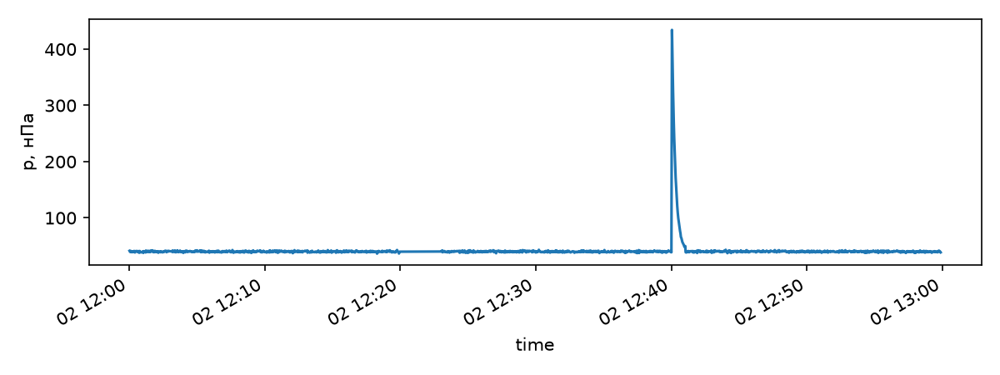
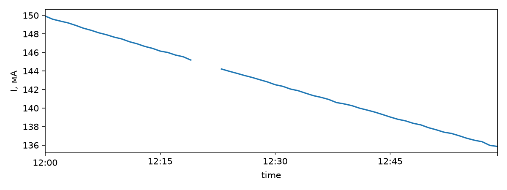

# NumPy и pandas

Физик обращается к языку программирования ради данных, поэтому начать целесообразно с инструментов, приспособленных для быстрых вычислений над ними. В настоящей главе рассматриваются две библиотеки: NumPy, предоставляющая многомерный массив чисел одного типа, и pandas, предоставляющая таблицу с именованными столбцами разных типов. Все примеры выполнены в IPython на одной машине — виртуальной машине с двумя ядрами под Python 3.12 с NumPy 2.5 и pandas 3.0, на которой записаны демонстрации лекции «NumPy, pandas и SciPy».

> **Слайды к главе.** Устройство массива, индексация, векторные операции, типы элементов и чтение файлов изложены также в первых трёх частях лекции «NumPy, pandas и SciPy» с демонстрациями в терминале; слайды лекции доступны [на сайте книги](https://phys-dev.github.io/soft-dev-book/slides/lecture-10.html#/sec-arr) и [в PDF](https://github.com/phys-dev/soft-dev-book/releases/latest/download/soft-dev-book-lecture-10.pdf).

<iframe src="../../slides/lecture-10.html#/sec-arr" title="Слайды лекции «NumPy, pandas и SciPy»: массив NumPy" loading="lazy" allowfullscreen style="width:100%; aspect-ratio:16/10; border:0; border-radius:6px"></iframe>

## NumPy

Python поначалу разочаровывает: список из миллиона чисел занимает десятки мегабайт, а цикл по нему выполняется очень долго. Причины, рассмотренные в главе про объекты и память, сводятся к одному: каждое число в списке является отдельным объектом со своей обёрткой, размещённым где-то в куче.

Решением является **NumPy**. Идея заключается в том, чтобы хранить числа так, как их хранит C, то есть подряд, одного типа, без обёрток, а операции над ними передавать скомпилированному коду, работающему сразу над всем массивом. Выигрыш достигает сотен раз. На NumPy построен научный стек: SciPy, pandas, scikit-learn и библиотеки машинного обучения используют массивы NumPy.

Полная документация: [numpy.org/doc](https://numpy.org/doc/stable/).

NumPy решает две задачи:
* хранить многомерные массивы (в том числе матрицы);
* быстро считать математические функции сразу от всего массива.

Основой библиотеки является один объект, [ndarray](https://numpy.org/doc/stable/reference/generated/numpy.ndarray.html).

Отличия массива от списка:
* длина массива, заданная в момент создания, остаётся неизменной, тогда как список растёт динамически;
* все элементы массива одного типа;
* операции пишутся сразу над массивом целиком, без цикла.

Отсюда следуют две сильные стороны NumPy: векторизация и broadcasting.


```python
import sys

import numpy as np

lst = [float(i) for i in range(10**6)]
print(sys.getsizeof(lst) + sum(sys.getsizeof(v) for v in lst))
print(np.array(lst).nbytes)
```

    32448728
    8000000


Список из миллиона вещественных чисел вместе с объектами-числами занимает около 32,4 МБ: 8,4 МБ приходится на массив ссылок самого списка, 24 МБ — на объекты float по 24 байта. Массив NumPy хранит те же числа подряд, по 8 байт на число, и занимает ровно 8 МБ.

### Устройство массива

Массив состоит из буфера данных и заголовка, описывающего, как этот буфер читать: тип элементов `dtype`, форму `shape` — длину по каждой оси — и шаги `strides`, то есть сдвиги в байтах при увеличении индекса по каждой оси на единицу.


```python
m = np.arange(12.0).reshape(3, 4)
print(m.dtype, m.shape, m.ndim, m.strides, m.itemsize, m.nbytes)
t = m.T
print(t.shape, t.strides, np.shares_memory(m, t))
```

    float64 (3, 4) 2 (32, 8) 8 96
    (4, 3) (8, 32) True


Матрица 3×4 из float64 записана по строкам: переход к следующему столбцу сдвигает адрес на 8 байт, к следующей строке — на 32 байта, поэтому адрес элемента `m[i, j]` равен началу буфера плюс 32·i плюс 8·j. Транспонирование не переставляет числа в памяти, а меняет шаги местами и возвращает представление — новый заголовок над тем же буфером. Метод `reshape` тоже возвращает представление, если новую форму можно описать шагами над тем же буфером, а иначе копирует данные:


```python
np.shares_memory(m.reshape(2, 6), m), np.shares_memory(m.T.reshape(12), m)
```

    (True, False)


Столбцы матрицы `m` не лежат в буфере подряд, поэтому вытянуть транспонированную матрицу в вектор без копирования нельзя.

### Способы создания массивов

Массив может быть получен тремя способами: преобразованием из обычной структуры Python, генерацией встроенной функцией или чтением с диска. Все три способа встречаются примерно одинаково часто.


### Конвертация из структур Python


```python
np.array([1, 2, 3, 4, 5])
```

    array([1, 2, 3, 4, 5])


При конвертации можно задавать тип данных с помощью аргумента [dtype](https://numpy.org/doc/stable/reference/arrays.dtypes.html):


```python
np.array([1, 2, 3, 4, 5], dtype=np.float32)
```

    array([1., 2., 3., 4., 5.], dtype=float32)


Аналогичное преобразование:


```python
np.float32([1, 2, 3, 4, 5])
```

    array([1., 2., 3., 4., 5.], dtype=float32)


### Генерация массивов

* [arange](https://numpy.org/doc/stable/reference/generated/numpy.arange.html) работает как аналог range из Python, но принимает и нецелочисленный шаг;
* [linspace](https://numpy.org/doc/stable/reference/generated/numpy.linspace.html) равномерно разбивает отрезок на n − 1 интервал, включая оба конца;
* [logspace](https://numpy.org/doc/stable/reference/generated/numpy.logspace.html) разбивает отрезок по логарифмической шкале;
* [zeros](https://numpy.org/doc/stable/reference/generated/numpy.zeros.html) создаёт массив заданной размерности, заполненный нулями;
* [ones](https://numpy.org/doc/stable/reference/generated/numpy.ones.html) создаёт массив заданной размерности, заполненный единицами;
* [empty](https://numpy.org/doc/stable/reference/generated/numpy.empty.html) создаёт массив заданной размерности, не инициализированный никаким значением, то есть заполненный прежним содержимым памяти.


```python
np.arange(0, 5, 0.5)
```

    array([0. , 0.5, 1. , 1.5, 2. , 2.5, 3. , 3.5, 4. , 4.5])


```python
np.linspace(0, 5, 11)
```

    array([0. , 0.5, 1. , 1.5, 2. , 2.5, 3. , 3.5, 4. , 4.5, 5. ])


```python
np.logspace(0, 9, 10, base=2)
```

    array([  1.,   2.,   4.,   8.,  16.,  32.,  64., 128., 256., 512.])


```python
np.zeros((2, 2))
```


    array([[0., 0.],
           [0., 0.]])


```python
np.ones((2, 2))
```


    array([[1., 1.],
           [1., 1.]])


```python
np.empty((2, 2))
```


    array([[1., 1.],
           [1., 1.]])


Значения в массиве `np.empty` — то, что осталось в выделенной памяти; здесь это единицы из только что освобождённого массива. Пользоваться таким массивом можно лишь при немедленной записи всех его элементов.


```python
np.diag([1, 2, 3])
```


    array([[1, 0, 0],
           [0, 2, 0],
           [0, 0, 3]])


С дробным шагом число точек `arange` зависит от округления. Число точек равно округлённому вверх частному (0,8 − 0,5) / 0,1, которое из-за двоичного округления чуть больше трёх, поэтому сетка содержит четыре точки, а последняя из них чуть меньше 0,8 и печатается как 0.8:


```python
print(np.arange(0.5, 0.8, 0.1))
print(np.arange(0.5, 0.8, 0.1)[-1], np.linspace(0.5, 0.8, 4)[-1])
```

    [0.5 0.6 0.7 0.8]
    0.7999999999999999 0.8


Правую границу, которую `arange` по определению исключает, сетка фактически содержит. Когда известно число точек, сетку на отрезке строят функцией `linspace`: она включает обе границы точно.

Случайные числа даёт генератор `np.random.default_rng`. Зерно, переданное явно, делает расчёт воспроизводимым, а методы генератора `normal`, `uniform`, `integers` задают распределение. Функции `np.random.rand` и `np.random.seed` относятся к старому интерфейсу с глобальным состоянием и сохранены для совместимости.


```python
rng = np.random.default_rng(42)
rng.normal(0.0, 1.0, size=3)
```

    array([ 0.30471708, -1.03998411,  0.7504512 ])


Размеры массива хранятся в поле **shape**, а число измерений — в поле **ndim**.


```python
array = np.ones((2, 3))
print(f"форма {array.shape}, число измерений {array.ndim}")
array
```

    форма (2, 3), число измерений 2

    array([[1., 1., 1.],
           [1., 1., 1.]])


```python
# диагональная матрица 3×3 и куб 5×5×5
print(np.diag([1, 2, 3]).shape, np.diag([1, 2, 3]).ndim)
print(np.zeros((5, 5, 5)).shape, np.zeros((5, 5, 5)).ndim)
```

    (3, 3) 2
    (5, 5, 5) 3


Метод [reshape](https://numpy.org/doc/stable/reference/generated/numpy.reshape.html) изменяет форму массива, не изменяя самих данных.


```python
array = np.arange(0, 6, 0.5)
array = array.reshape((2, 6))
array
```


    array([[0. , 0.5, 1. , 1.5, 2. , 2.5],
           [3. , 3.5, 4. , 4.5, 5. , 5.5]])


Многомерный массив разворачивается в вектор функцией [ravel](https://numpy.org/doc/stable/reference/generated/numpy.ravel.html).


```python
array = np.ravel(array)
array
```

    array([0. , 0.5, 1. , 1.5, 2. , 2.5, 3. , 3.5, 4. , 4.5, 5. , 5.5])


```python
# ravel вытягивает матрицу в вектор, reshape задаёт форму (1, 4)
print(np.ravel(np.diag([1, 2])))
print(np.reshape(np.diag([1, 2]), [1, 4]))
```

    [1 0 0 2]
    [[1 0 0 2]]


### Индексация

В NumPy применяется привычная индексация Python, включая отрицательные индексы и срезы, записываемые так же, как для списка.


```python
print(array[0])
print(array[-1])
print(array[1:-1])
print(array[1:-1:2])
print(array[::-1])
```

    0.0
    5.5
    [0.5 1.  1.5 2.  2.5 3.  3.5 4.  4.5 5. ]
    [0.5 1.5 2.5 3.5 4.5]
    [5.5 5.  4.5 4.  3.5 3.  2.5 2.  1.5 1.  0.5 0. ]


```python
print(array.shape)
```

    (12,)


`None`, или `np.newaxis`, вставляет новую ось длины 1:


```python
print(array[None, 0:, None].ndim, array[None, 0:, None].shape)
```

    3 (1, 12, 1)


Индексы многомерного массива перечисляются через запятую в одних квадратных скобках: вместо `matrix[i][j]` пишут `matrix[i, j]`. Запись `matrix[i][j]` тоже работает, но сначала создаёт промежуточный массив-строку.

Массив, подставленный вместо индекса, может быть и списком номеров, и булевой маской:


```python
array[[0, 2, 4, 6, 8, 10]]
```

    array([0., 1., 2., 3., 4., 5.])


```python
array[[True, False, True, False, True, False, True, False, True, False, True, False]]
```

    array([0., 1., 2., 3., 4., 5.])


```python
# массив формы (1, 3) и вектор формы (3,) равны лишь после добавления оси
x = np.array([[1, 2, 3]])
y = np.array([1, 2, 3])

print(x.shape, y.shape)
print(np.array_equal(x, y))
print(np.array_equal(x, y[None, :]))
```

    (1, 3) (3,)
    False
    True


Условия соединяются поэлементными операторами `&`, `|` и `~` и заключаются в скобки: слова `and`, `or` и `not` требуют одного логического значения и к массивам не применяются.


```python
x = np.arange(10)
x[(x % 2 == 0) & (x > 5)]
```

    array([6, 8])


```python
y = x[x > 5]
y *= 2
print(y)
print(x)
x[x > 5] *= 2
print(x)
```

    [12 14 16 18]
    [0 1 2 3 4 5 6 7 8 9]
    [ 0  1  2  3  4  5 12 14 16 18]


Срез массива в NumPy является представлением тех же данных, а не их копией: изменение среза наподобие `x[2:5]` приводит к изменению исходного массива. Отбор по маске или по списку индексов всегда возвращает копию, и изменение отобранного исходный массив не затрагивает. Присваивание по маске `x[x > 5] *= 2`, напротив, записывает прямо в исходный массив. Общую память двух массивов проверяет функция `np.shares_memory`; когда требуются собственные данные, применяется метод `copy`.


```python
x = np.arange(10)
np.shares_memory(x, x[::2]), np.shares_memory(x, x[[0, 2]]), np.shares_memory(x, x.copy())
```

    (True, False, False)


### Сохранение и чтение массивов в бинарном формате

Функция `np.save` записывает массив в файл `.npy`: заголовок с типом и формой, затем содержимое буфера без потери точности. `np.load` читает его обратно, а с аргументом `mmap_mode="r"` не загружает файл целиком, а отображает его в память, так что с диска читаются только нужные части. Несколько массивов сохраняются в архив `.npz` функциями `np.savez` и `np.savez_compressed`.


```python
np.save("out.npy", x)

with open("out.npy", "rb") as f:
    print(f.read(64))

y = np.load("out.npy")
print(y)
```

    b"\x93NUMPY\x01\x00v\x00{'descr': '<i8', 'fortran_order': False, 'shape': (10,"
    [0 1 2 3 4 5 6 7 8 9]


### Чтение текстовых файлов

Текстовые таблицы читают функции [loadtxt](https://numpy.org/doc/stable/reference/generated/numpy.loadtxt.html) и [genfromtxt](https://numpy.org/doc/stable/reference/generated/numpy.genfromtxt.html). Для примера записывается короткий журнал измерений: время t, напряжение U и ток I, причём два показания пропущены.


```python
with open("log.csv", "w") as f:
    f.write("t,U,I\n0.0,1.02,0.51\n0.5,,0.49\n1.0,1.05,\n1.5,1.03,0.50\n")
```


`loadtxt` ожидает полные строки и на пропущенном значении останавливается с ошибкой:


```python
try:
    np.loadtxt("log.csv", delimiter=",", skiprows=1)
except ValueError as err:
    print("ValueError:", err)
```

    ValueError: could not convert string '' to float64 at row 1, column 2.


`genfromtxt` подставляет на место пропусков `nan`, а с `names=True` берёт имена столбцов из первой строки и возвращает структурированный массив, в котором строка запрашивается по номеру, а столбец — по названию.


```python
log = np.genfromtxt("log.csv", delimiter=",", names=True)
log
```


    array([(0. , 1.02, 0.51), (0.5,  nan, 0.49), (1. , 1.05,  nan),
           (1.5, 1.03, 0.5 )],
          dtype=[('t', '<f8'), ('U', '<f8'), ('I', '<f8')])


```python
print(log["U"])
print(log[0])
```

    [1.02  nan 1.05 1.03]
    (0.0, 1.02, 0.51)


Строки в начале и в конце файла пропускаются аргументами **skip_header** и **skip_footer**, а столбцы отбираются через **usecols**.


```python
np.genfromtxt("log.csv", delimiter=",", skip_header=1, usecols=(1, 2))
```


    array([[1.02, 0.51],
           [ nan, 0.49],
           [1.05,  nan],
           [1.03, 0.5 ]])


Операции в NumPy производятся над массивами одинаковой формы целиком, без цикла. Мощность в каждый момент времени — поэлементное произведение двух столбцов:


```python
P = log["U"] * log["I"]
print(P)
print(np.mean(P), np.nanmean(P))
```

    [0.5202    nan    nan 0.515 ]
    nan 0.5176000000000001


Пропуск в любом из сомножителей даёт `nan` в произведении, а `np.mean` от массива с `nan` тоже равна `nan`; функции с приставкой nan — `nanmean`, `nansum`, `nanmax` — пропуски не учитывают.

### [Broadcasting](https://numpy.org/doc/stable/user/basics.broadcasting.html)

Broadcasting снимает требование одинаковой формы и разрешает арифметику над массивами разных, но согласованных между собой размерностей. Простейшим случаем является умножение вектора на число.


```python
2 * np.arange(1, 4)
```

    array([2, 4, 6])


Правило согласования размерностей:

> In order to broadcast, the size of the trailing axes for both arrays in an operation must either be the same size or one of them must be one.

Таким образом, длины осей, отсчитываемых с конца, должны либо совпадать, либо одна из них должна быть равна единице, и тогда ось длины 1 растягивается до длины другого операнда без копирования данных. Если количество размерностей не совпадает, к массиву меньшей размерности слева дописываются оси длины 1, не занимающие памяти:

| Операнды | Результат |
|---|---|
| (4, 3) и (3,) | (4, 3) |
| (4, 1) и (3,) | (4, 3) |
| (2, 3, 4) и (4,) | (2, 3, 4) |
| (4, 3) и (4,) | ошибка |

К каждой строке матрицы прибавляется один и тот же вектор:


```python
np.array([[0, 0, 0], [10, 10, 10], [20, 20, 20], [30, 30, 30]]) + np.arange(3)
```


    array([[ 0,  1,  2],
           [10, 11, 12],
           [20, 21, 22],
           [30, 31, 32]])


Со столбцами такой приём не работает: вектор из четырёх элементов не согласуется с матрицей по последней оси. Поэтому вектору сначала добавляется ось:


```python
np.arange(4)[:, np.newaxis]
```


    array([[0],
           [1],
           [2],
           [3]])


После этого он прибавляется к каждому столбцу:


```python
np.arange(4)[:, np.newaxis] + np.array([[0, 0, 0], [10, 10, 10], [20, 20, 20], [30, 30, 30]])
```


    array([[ 0,  0,  0],
           [11, 11, 11],
           [22, 22, 22],
           [33, 33, 33]])


Тот же приём даёт попарные разности координат N частиц: `r[:, None, :] - r[None, :, :]` имеет форму (N, N, 3), и матрица попарных расстояний вычисляется без цикла.


```python
r = np.random.default_rng(0).random((4, 3))   # координаты четырёх частиц
d = r[:, None, :] - r[None, :, :]             # форма (4, 4, 3)
dist = np.sqrt((d**2).sum(axis=-1))
dist.round(3)
```


    array([[0.   , 1.2  , 0.682, 0.623],
           [1.2  , 0.   , 0.701, 1.293],
           [0.682, 0.701, 0.   , 0.639],
           [0.623, 1.293, 0.639, 0.   ]])


Операнды broadcasting не копируются, но результат и промежуточные массивы занимают полную форму: массив разностей формы (N, N, 3) из float64 при N = 10 000 занимает 2,2 ГиБ. Такие расчёты разбивают на блоки или переписывают через матричное произведение.

Кроме того, в NumPy имеются сводные операции над массивами: [np.min](https://numpy.org/doc/stable/reference/generated/numpy.min.html), [np.max](https://numpy.org/doc/stable/reference/generated/numpy.max.html), [np.sum](https://numpy.org/doc/stable/reference/generated/numpy.sum.html), [np.mean](https://numpy.org/doc/stable/reference/generated/numpy.mean.html) и другие. Для примера генерируется тысяча измерений трёх каналов: средние каналов 1, 5 и −2, нормальный шум с отклонением 0,1.


```python
rng = np.random.default_rng(42)
data = rng.normal([1.0, 5.0, -2.0], 0.1, size=(1000, 3))
print(data.mean())
print(data.mean(axis=0))
print(data.std(axis=0, ddof=1))
```

    1.330781043301899
    [ 0.99917285  4.99693758 -2.0037673 ]
    [0.10139425 0.09984559 0.10112884]


Среднее без аргумента сворачивает весь массив в одно число, а `axis=0` сворачивает измерения и даёт по числу на канал; аргумент `ddof=1` делает отклонение выборочным.

### Операции

Почти каждая сводная операция имеет аргумент `axis`, задающий номер оси, вдоль которой она вычисляется. Без него операция обрабатывает весь массив целиком и возвращает одно число, а с ним сворачивает только указанную ось, оставляя остальные нетронутыми.

```python
x = np.arange(40).reshape(5, 2, 4)
print(x)
```

    [[[ 0  1  2  3]
      [ 4  5  6  7]]

     [[ 8  9 10 11]
      [12 13 14 15]]

     [[16 17 18 19]
      [20 21 22 23]]

     [[24 25 26 27]
      [28 29 30 31]]

     [[32 33 34 35]
      [36 37 38 39]]]


```python
print(x.mean())
print(np.mean(x))
```

    19.5
    19.5


```python
x.mean(axis=0)
```


    array([[16., 17., 18., 19.],
           [20., 21., 22., 23.]])


```python
x.mean(axis=1)
```


    array([[ 2.,  3.,  4.,  5.],
           [10., 11., 12., 13.],
           [18., 19., 20., 21.],
           [26., 27., 28., 29.],
           [34., 35., 36., 37.]])


```python
x.mean(axis=2)
```


    array([[ 1.5,  5.5],
           [ 9.5, 13.5],
           [17.5, 21.5],
           [25.5, 29.5],
           [33.5, 37.5]])


```python
x.mean(axis=(0, 2))
```

    array([17.5, 21.5])


```python
x.mean(axis=(0, 1, 2))
```

    np.float64(19.5)


### Конкатенация многомерных массивов

Объединение массивов выполняют функции **np.concatenate, np.hstack, np.vstack, np.dstack**, различающиеся только осью объединения.


```python
x = np.arange(10).reshape(5, 2)
y = np.arange(100, 120).reshape(5, 4)
np.hstack((x, y))
```


    array([[  0,   1, 100, 101, 102, 103],
           [  2,   3, 104, 105, 106, 107],
           [  4,   5, 108, 109, 110, 111],
           [  6,   7, 112, 113, 114, 115],
           [  8,   9, 116, 117, 118, 119]])


Массивы объединяются, только если их формы совпадают по всем осям, кроме оси объединения: матрицы 2×3 и 2×2 складываются по горизонтали, но не по вертикали.


```python
x = np.ones([2, 3])
y = np.zeros([2, 2])
print(np.hstack((x, y)).shape)
try:
    np.vstack((x, y))
except ValueError as err:
    print("ValueError:", err)
```

    (2, 5)
    ValueError: all the input array dimensions except for the concatenation axis must match exactly, but along dimension 1, the array at index 0 has size 3 and the array at index 1 has size 2


```python
p = np.arange(1).reshape([1, 1, 1, 1])
print("vstack: ", np.vstack((p, p)).shape)
print("hstack: ", np.hstack((p, p)).shape)
print("dstack: ", np.dstack((p, p)).shape)
print("concatenate: ", np.concatenate((p, p), axis=3).shape)
```

    vstack:  (2, 1, 1, 1)
    hstack:  (1, 2, 1, 1)
    dstack:  (1, 1, 2, 1)
    concatenate:  (1, 1, 1, 2)


### Типы

От типа массива зависят и занимаемая память, и диапазон представимых значений. С версии 2.0 NumPy отвергает число Python, не помещающееся в тип, уже в конструкторе массива, но явное приведение `astype` и арифметика над целыми массивами переполняются без сообщений; такое переполнение является классическим источником неверных результатов.


```python
x = [1, 2, 70000]
np.array(x, dtype=np.float32)
```

    array([1.e+00, 2.e+00, 7.e+04], dtype=float32)


```python
try:
    np.array(x, dtype=np.uint16)
except OverflowError as err:
    print("OverflowError:", err)
```

    OverflowError: Python integer 70000 out of bounds for uint16


```python
np.array(70000).astype(np.uint16)
```

    array(4464, dtype=uint16)


`uint16` хранит остаток по модулю \\( 2^{16} \\), а \\( 70000 - 65536 = 4464 \\). Так же ведёт себя арифметика: сумма массива `uint8` и числа 100 остаётся `uint8`, и 200 + 100 превращается в 44.


```python
np.array([200, 250], dtype=np.uint8) + 100
```

    array([44, 94], dtype=uint8)


Ни одна из этих ошибок не приводит к исключению и ничего не выводит. Вещественные числа ограничены точностью: мантисса float32 содержит 24 двоичных разряда, поэтому \\( 2^{24} + 1 \\) во float32 непредставимо.


```python
np.float32(16777216) + np.float32(1)
```

    np.float32(1.6777216e+07)


При смешении строк и чисел массив получает строковый тип:


```python
np.array(x, dtype=np.str_)
```

    array(['1', '2', '70000'], dtype='<U5')


### Функциональное программирование

NumPy предоставляет несколько способов поэлементного применения обычной функции Python к массиву, и разница в скорости между ними поучительна.

```python
def f(value):
    return np.sqrt(value)
```


```python
print(np.apply_along_axis(f, 0, np.arange(10)))
```

    [0.         1.         1.41421356 1.73205081 2.         2.23606798
     2.44948974 2.64575131 2.82842712 3.        ]


```python
vf = np.vectorize(f)
```


```python
%%timeit
vf(np.arange(100000))
```

    51.6 ms ± 2.52 ms per loop (mean ± std. dev. of 7 runs, 10 loops each)


```python
%%timeit
np.apply_along_axis(f, 0, np.arange(100000))
```

    93.8 μs ± 1.06 μs per loop (mean ± std. dev. of 7 runs, 10,000 loops each)


```python
%%timeit
np.array([f(v) for v in np.arange(100000)])
```

    55 ms ± 1.53 ms per loop (mean ± std. dev. of 7 runs, 10 loops each)


Разница в сотни раз выглядит убедительно, однако выводы из неё были бы поспешными. `np.vectorize` и списковое включение вызывают `f` сто тысяч раз, и их время составляет стоимость ста тысяч вызовов функции Python. В то же время `apply_along_axis` с `axis=0` на одномерном массиве вызывает `f` один раз, передавая в неё весь массив целиком, так что измерен здесь один векторный `np.sqrt`, а не поэлементный обход.

Прежде чем доверять отношению времён, необходимо разобраться, что делает каждая из сравниваемых версий. `np.vectorize` не векторизует, а лишь оборачивает цикл, и ускорения от него ожидать не приходится.

## Pandas

[pandas.pydata.org/docs/](https://pandas.pydata.org/docs/)

Pandas читает данные, приводит их в порядок, вычисляет по ним сводки и строит графики. Если NumPy предоставляет массив чисел, то pandas предоставляет таблицу с именованными столбцами и индексом, размечающим строки. Каждый столбец хранится отдельным массивом NumPy или, для строк, массивом Arrow, поэтому операции над столбцом выполняются векторно.

> **Слайды к главе.** Таблицы pandas, отбор строк и копирование при записи, группировка и объединение таблиц, пропуски и временные ряды изложены также в четвёртой и пятой частях лекции «NumPy, pandas и SciPy» с демонстрациями в терминале; слайды лекции доступны [на сайте книги](https://phys-dev.github.io/soft-dev-book/slides/lecture-10.html#/sec-pd) и [в PDF](https://github.com/phys-dev/soft-dev-book/releases/latest/download/soft-dev-book-lecture-10.pdf).

<iframe src="../../slides/lecture-10.html#/sec-pd" title="Слайды лекции «NumPy, pandas и SciPy»: таблицы pandas" loading="lazy" allowfullscreen style="width:100%; aspect-ratio:16/10; border:0; border-radius:6px"></iframe>


```python
import pandas as pd

df = pd.read_csv("titanic.csv")
df.shape
```

    (891, 12)


Файл titanic.csv взят из учебника pandas для начинающих (каталог doc/data репозитория pandas-dev/pandas): 891 пассажир «Титаника», 12 столбцов, разделитель — запятая. Файлы, сохранённые в русской локали, обычно записаны с разделителем «;» и десятичной запятой и читаются с аргументами `sep=";"` и `decimal=","`; без второго числовые столбцы окажутся строковыми.


```python
df[["Survived", "Pclass", "Sex", "Age", "Fare"]].head(3)
```


       Survived  Pclass     Sex   Age     Fare
    0         0       3    male  22.0   7.2500
    1         1       1  female  38.0  71.2833
    2         1       3  female  26.0   7.9250


```python
df.info()
```

    <class 'pandas.DataFrame'>
    RangeIndex: 891 entries, 0 to 890
    Data columns (total 12 columns):
     #   Column       Non-Null Count  Dtype  
    ---  ------       --------------  -----  
     0   PassengerId  891 non-null    int64  
     1   Survived     891 non-null    int64  
     2   Pclass       891 non-null    int64  
     3   Name         891 non-null    str    
     4   Sex          891 non-null    str    
     5   Age          714 non-null    float64
     6   SibSp        891 non-null    int64  
     7   Parch        891 non-null    int64  
     8   Ticket       891 non-null    str    
     9   Fare         891 non-null    float64
     10  Cabin        204 non-null    str    
     11  Embarked     889 non-null    str    
    dtypes: float64(2), int64(5), str(5)
    memory usage: 118.7 KB


Метод `info` перечисляет столбцы с числом непустых значений и типом. Строковые столбцы pandas 3.0 хранит в отдельном типе `str`, а не в `object`, как прежние версии. Из числа непустых значений сразу видны пропуски: возраст известен у 714 пассажиров, номер каюты — у 204, порт посадки — у 889.

### Отбор строк и столбцов

Строки отбираются маской, как в NumPy: сравнение столбца даёт Series из значений bool, условия соединяются операторами `&` и `|` и заключаются в скобки.


```python
mask = (df["Sex"] == "female") & (df["Age"] > 30)
mask.sum()
```

    np.int64(103)


```python
women = df[mask]
women[["Name", "Age", "Pclass"]].head(3)
```


                                                     Name   Age  Pclass
    1   Cumings, Mrs. John Bradley (Florence Briggs Th...  38.0       1
    3        Futrelle, Mrs. Jacques Heath (Lily May Peel)  35.0       1
    11                            Bonnell, Miss Elizabeth  58.0       1


Индексатор `loc` обращается к строке по метке индекса:


```python
df.loc[78]
```


    PassengerId                              79
    Survived                                  1
    Pclass                                    2
    Name           Caldwell, Master Alden Gates
    Sex                                    male
    Age                                    0.83
    SibSp                                     0
    Parch                                     2
    Ticket                               248738
    Fare                                   29.0
    Cabin                                   NaN
    Embarked                                  S
    Name: 78, dtype: object


Метод `describe` даёт сводку по числовым столбцам, а для строковых — число значений, число различных, самое частое и его частоту.


```python
df[["Age", "SibSp", "Parch", "Fare"]].describe().round(2)
```


              Age   SibSp   Parch    Fare
    count  714.00  891.00  891.00  891.00
    mean    29.70    0.52    0.38   32.20
    std     14.53    1.10    0.81   49.69
    min      0.42    0.00    0.00    0.00
    25%     20.12    0.00    0.00    7.91
    50%     28.00    0.00    0.00   14.45
    75%     38.00    1.00    0.00   31.00
    max     80.00    8.00    6.00  512.33


```python
df[["Sex", "Cabin"]].describe()
```


             Sex Cabin
    count    891   204
    unique     2   147
    top     male    G6
    freq     577     4


### Индексация

Для отбора строк есть два индексатора. `loc` работает с метками индекса и именами столбцов, и срез по меткам включает правую границу; `iloc` работает с номерами позиций, как индексация NumPy, и правая граница среза не включается. После сортировки метка, приписанная строке, сохраняется и перестаёт совпадать с её номером по порядку.


```python
s = df.sort_values("Age")
s[["Name", "Age"]].head(3)
```


                                   Name   Age
    803  Thomas, Master Assad Alexander  0.42
    755        Hamalainen, Master Viljo  0.67
    644           Baclini, Miss Eugenie  0.75


```python
s.loc[78, "Age"], s.iloc[78]["Age"]
```

    (np.float64(0.83), np.float64(15.0))


После сортировки по возрасту `s.loc[78]` по-прежнему обращается к пассажиру с меткой 78, а `s.iloc[78]` — к семьдесят девятой по возрасту строке. Метод `reset_index` перенумеровывает строки заново.


```python
df.loc[[78, 79, 100], ["Age", "Cabin"]]
```


           Age Cabin
    78    0.83   NaN
    79   30.00   NaN
    100  28.00   NaN


Метод `query` принимает условие строкой, в которой допускаются `and` и `or`:


```python
df.query("Pclass == 1 and Age < 18").shape
```

    (12, 12)


### Копирование при записи

До версии 3.0 результат индексации в pandas был то представлением, то копией в зависимости от операции, и запись в него то меняла исходную таблицу, то нет; pandas предупреждал об этом `SettingWithCopyWarning`. С версии 3.0 действует единое правило копирования при записи (Copy-on-Write): любой объект, полученный индексацией или методом, ведёт себя как копия, а изменить таблицу можно только операцией над ней самой.


```python
sub = df.loc[[78, 79, 100], ["Age", "Fare"]]
sub["Age"] = 3
sub
```


         Age     Fare
    78     3  29.0000
    79     3  12.4750
    100    3   7.8958


```python
df.loc[[78, 79, 100], ["Age", "Fare"]]
```


           Age     Fare
    78    0.83  29.0000
    79   30.00  12.4750
    100  28.00   7.8958


Запись в `sub` исходную таблицу не изменила, и защитный вызов `.copy()` для этого не требуется. Цепочка присваиваний `df[маска]["Fare"] = 0` никогда не меняет таблицу: первый шаг создаёт новый объект, и запись идёт в него. Обнаружив такую цепочку, pandas выдаёт предупреждение `ChainedAssignmentError`. Пример выполняется на копии таблицы `t`, чтобы не изменять `df`:


```python
t = df.copy()
t[t["Age"] > 60]["Fare"] = 0
(t.loc[t["Age"] > 60, "Fare"] == 0).sum()
```

    <ipython-input-79-652a0f7e26bc>:2: ChainedAssignmentError: A value is being set on a copy of a DataFrame or Series through chained assignment.
    Such chained assignment never works to update the original DataFrame or Series, because the intermediate object on which we are setting values always behaves as a copy (due to Copy-on-Write).

    Try using '.loc[row_indexer, col_indexer] = value' instead, to perform the assignment in a single step.

    See the documentation for a more detailed explanation: https://pandas.pydata.org/pandas-docs/stable/user_guide/copy_on_write.html#chained-assignment
      t[t["Age"] > 60]["Fare"] = 0
    np.int64(0)


```python
t.loc[t["Age"] > 60, "Fare"] = 0
(t.loc[t["Age"] > 60, "Fare"] == 0).sum()
```

    np.int64(22)


Та же запись одной операцией `t.loc[маска, "Fare"] = 0` изменяет таблицу: нулями стали все 22 значения. Для старого кода существен обратный порядок шагов: запись `df["Fare"][маска] = 0` до версии 3.0 меняла таблицу, а теперь, как и любая цепочка, её не меняет.

Выборка по маске, как и в NumPy, сразу копирует строки. Результаты операций, которые прежде возвращали представление, — столбец `df["Fare"]`, срез строк `df[:10]`, `reset_index`, `rename` — данные заранее не копируют: новый объект использует память исходного, пока в один из них не выполнена запись, и только тогда копируются затронутые данные.

Столбцы отбираются названием или списком названий в `[]`. Если передаётся название одного столбца, то возвращается объект класса [pandas.Series](https://pandas.pydata.org/docs/reference/api/pandas.Series.html), а если список названий столбцов, то [pandas.DataFrame](https://pandas.pydata.org/docs/reference/api/pandas.DataFrame.html). `Series` и `DataFrame` имеют много общих методов, работающих одинаково в обоих случаях.


```python
df["Age"].head(5)
```


    0    22.0
    1    38.0
    2    26.0
    3    35.0
    4    35.0
    Name: Age, dtype: float64


```python
df[["Age"]].head(5)
```


        Age
    0  22.0
    1  38.0
    2  26.0
    3  35.0
    4  35.0


### pd.Series

Одномерный срез таблицы является `pd.Series`, столбцом значений, снабжённым индексом. Массив NumPy из него даёт метод `to_numpy()`; атрибут `values` у строкового столбца в pandas 3.0 возвращает не массив NumPy, а массив Arrow. Обычно извлекать массив не требуется: вместе с ним теряется индекс.


```python
df["Age"].head(5).to_numpy()
```

    array([22., 38., 26., 35., 35.])


Индекс извлекается отдельно:


```python
df["Age"].head(5).index
```

    RangeIndex(start=0, stop=5, step=1)


Создаётся `Series` так же, как `np.array`, только индекс задаётся явно.


```python
pd.Series([1, 2, 3], index=["Red", "Green", "Blue"])
```


    Red      1
    Green    2
    Blue     3
    dtype: int64


```python
pd.Series(1, index=["Red", "Green", "Blue"])
```


    Red      1
    Green    1
    Blue     1
    dtype: int64


`Series` разворачивается обратно в `DataFrame`:


```python
s = pd.Series([1, 2, 3], index=["Red", "Green", "Blue"])
s.to_frame("Values")
```


           Values
    Red         1
    Green       2
    Blue        3


```python
s.loc["Red"], s.iloc[0]
```

    (np.int64(1), np.int64(1))


### [Объединение таблиц](https://pandas.pydata.org/docs/user_guide/merging.html)

Метод `merge` объединяет две таблицы по значениям ключевых столбцов, как соединение в SQL. Аргумент `how` задаёт, какие строки попадут в результат: `inner` — только строки, ключ которых есть в обеих таблицах, `left` — все строки левой таблицы, а там, где пары нет, столбцы правой заполняются NaN, `right` и `outer` — все строки правой и обеих. К пассажирам по коду порта посадки присоединяется справочник портов:


```python
ports = pd.DataFrame({"Embarked": ["C", "Q", "S"],
                      "Port": ["Cherbourg", "Queenstown", "Southampton"]})
m = df.merge(ports, on="Embarked", how="left", validate="m:1", indicator=True)
m["_merge"].value_counts()
```


    _merge
    both          889
    left_only       2
    right_only      0
    Name: count, dtype: int64


```python
m.loc[m["_merge"] == "left_only", ["PassengerId", "Name", "Port"]]
```


         PassengerId                                       Name Port
    61            62                         Icard, Miss Amelie  NaN
    829          830  Stone, Mrs. George Nelson (Martha Evelyn)  NaN


Аргумент `validate="m:1"` проверяет, что ключ в правой таблице уникален: при дубликате `merge` завершается ошибкой `MergeError` вместо того, чтобы без предупреждения размножить строки. Аргумент `indicator=True` добавляет столбец `_merge`, показывающий источник строки: у двух пассажиров порт посадки не указан, и пары в справочнике у них нет.

Метод `join` объединяет таблицы по индексу:


```python
df1 = df[["Age", "Parch"]]
df2 = df[["Ticket", "Fare"]]
df1.join(df2).head(3)
```


        Age  Parch            Ticket     Fare
    0  22.0      0         A/5 21171   7.2500
    1  38.0      0          PC 17599  71.2833
    2  26.0      0  STON/O2. 3101282   7.9250


`pd.concat` склеивает таблицы одинаковой структуры, например результаты двух серий измерений, одну под другой:


```python
pd.concat([df.head(2), df.tail(2)])[["PassengerId", "Name"]]
```


         PassengerId                                               Name
    0              1                            Braund, Mr. Owen Harris
    1              2  Cumings, Mrs. John Bradley (Florence Briggs Th...
    889          890                              Behr, Mr. Karl Howell
    890          891                                Dooley, Mr. Patrick


### Группировка

Средний возраст пассажира по классам каюты может быть вычислен напрямую тремя почти одинаковыми строками. Такой подход не рекомендуется: классов может оказаться тридцать. Для этой задачи предназначен `groupby`, разбивающий таблицу на группы.

```python
print("Pclass 1: ", df[df["Pclass"] == 1]["Age"].mean())
print("Pclass 2: ", df[df["Pclass"] == 2]["Age"].mean())
print("Pclass 3: ", df[df["Pclass"] == 3]["Age"].mean())
```

    Pclass 1:  38.233440860215055
    Pclass 2:  29.87763005780347
    Pclass 3:  25.14061971830986


```python
df.groupby("Pclass")[["Age"]].mean()
```


                  Age
    Pclass           
    1       38.233441
    2       29.877630
    3       25.140620


Группировка устроена по схеме «разбиение — применение — объединение». Сам по себе `groupby` ничего не вычисляет, а возвращает объект `DataFrameGroupBy`, хранящий разбиение и ожидающий сводной операции; результаты операции для групп объединяются в таблицу, индексом которой служат значения ключа.


```python
df.groupby(["Survived", "Pclass"])["PassengerId"].count()
```


    Survived  Pclass
    0         1          80
              2          97
              3         372
    1         1         136
              2          87
              3         119
    Name: PassengerId, dtype: int64


```python
df.groupby(["Survived", "Pclass"])[["PassengerId", "Cabin"]].count()
```


                     PassengerId  Cabin
    Survived Pclass                    
    0        1                80     59
             2                97      3
             3               372      6
    1        1               136    117
             2                87     13
             3               119      6


Метод `count` считает непустые значения столбца, поэтому для Cabin счётчики меньше: каюта известна в основном у пассажиров первого класса. Число строк группы независимо от пропусков даёт метод `size`. Метод `agg` применяет к группам несколько сводных функций сразу:


```python
df.groupby("Pclass")["Fare"].agg(["mean", "median", "max"]).round(2)
```


             mean  median     max
    Pclass                       
    1       84.15   60.29  512.33
    2       20.66   14.25   73.50
    3       13.68    8.05   69.55


Сводная таблица `pivot_table` раскладывает свёртку по двум ключам — по строкам и по столбцам, а функция `pd.cut` разбивает непрерывную величину на интервалы, которые затем служат ключом группировки:


```python
df.pivot_table(values="Survived", index="Sex", columns="Pclass").round(2)
```


    Pclass     1     2     3
    Sex                     
    female  0.97  0.92  0.50
    male    0.37  0.16  0.14


```python
age = pd.cut(df["Age"], [0, 12, 18, 40, 80])
df.groupby(age)["Survived"].agg(["mean", "size"]).round(2)
```


              mean  size
    Age                 
    (0, 12]   0.58    69
    (12, 18]  0.43    70
    (18, 40]  0.39   425
    (40, 80]  0.37   150


Метод `transform` возвращает результат свёртки для каждой строки исходной таблицы; так пропущенный возраст заполняют медианой группы:


```python
med = df.groupby("Pclass")["Age"].transform("median")
df["Age"].isna().sum(), df["Age"].fillna(med).isna().sum()
```

    (np.int64(177), np.int64(0))


### Временные ряды

Показания приборов почти всегда поступают с меткой времени, проставленной системой сбора. Для примера генерируется синтетический журнал установки за один час: давление p в нанопаскалях и ток пучка I в миллиамперах, опрос с шагом от 1,5 до 2,5 с, всплеск давления в 12:40, около процента пропущенных показаний тока и трёхминутная пауза записи с 12:20.


```python
rng = np.random.default_rng(7)
dt = rng.uniform(1.5, 2.5, 1800)                        # шаг опроса, с
time = pd.Timestamp("2026-10-02 12:00:00") + pd.to_timedelta(np.cumsum(dt), unit="s")
sec = (time - time[0]).total_seconds().to_numpy()
p = 40 + 1.0 * rng.standard_normal(time.size)           # фон 40 нПа
burst = (sec > 2400) & (sec < 2460)                     # всплеск давления
p[burst] += 400 * np.exp(-(sec[burst] - 2400) / 15)
I = 150 * np.exp(-sec / 36000) + 0.2 * rng.standard_normal(time.size)
I[rng.random(time.size) < 0.01] = np.nan                # пропущенные показания
raw = pd.DataFrame({"time": time, "p": p.round(2), "I": I.round(2)})
gap = (raw["time"] >= "2026-10-02 12:20:00") & (raw["time"] < "2026-10-02 12:23:00")
raw[~gap].to_csv("vacuum.csv", index=False, date_format="%Y-%m-%d %H:%M:%S.%f")
```


Если при чтении указать столбец времени в `parse_dates` и сделать его индексом, таблица получает индекс `DatetimeIndex` и операции, недоступные обычным числам.


```python
log = pd.read_csv("vacuum.csv", parse_dates=["time"], index_col="time")
log.head(3)
```


                                    p       I
    time                                     
    2026-10-02 12:00:02.125095  41.38  149.88
    2026-10-02 12:00:04.522309  39.51  150.28
    2026-10-02 12:00:06.797994  39.23  150.05


```python
log.index.dtype, log.index.to_series().diff().max()
```

    (dtype('<M8[us]'), Timedelta('0 days 00:03:04.381713'))


В pandas 3.0 даты, прочитанные из строк, по умолчанию хранятся с микросекундным разрешением. Разность соседних меток показывает самую длинную паузу записи — около трёх минут. Срез по строкам дат выбирает интервал времени и, как всякий срез по меткам, включает правую границу целиком: строка "2026-10-02 12:30" обозначает всю минуту.


```python
log.loc["2026-10-02 12:30":"2026-10-02 12:30"].shape
```

    (29, 2)


Метод `resample` пересчитывает ряд на равномерную сетку с заданным шагом и сворачивает значения внутри каждого интервала, причём для разных столбцов свёртки могут быть разными. Псевдонимы интервалов месяца, квартала и года записываются в pandas 3.0 как ME, QE и YE; прежние M, Q и Y вызывают ошибку.


```python
log.resample("10min").agg({"p": "max", "I": "mean"}).round(1)
```


                             p      I
    time                             
    2026-10-02 12:00:00   42.7  148.8
    2026-10-02 12:10:00   42.8  146.3
    2026-10-02 12:20:00   42.6  143.5
    2026-10-02 12:30:00   43.2  141.5
    2026-10-02 12:40:00  434.2  139.2
    2026-10-02 12:50:00   42.4  136.9


Всплеск давления виден в интервале с 12:40, а ток убывает со временем жизни пучка.

### Скользящие окна

Скользящее окно (rolling) сглаживает зашумлённый ряд: для каждой точки вычисляется среднее (сумма, максимум) по окну из неё самой и предшествующих показаний. Окно задаётся числом точек или длительностью, например "1min", и тогда неравномерный шаг показаний учитывается автоматически. Поэтому сглаженный ряд запаздывает относительно исходного на половину окна; аргумент `center=True` располагает окно симметрично вокруг точки.


```python
roll = log["p"].rolling("1min").mean()
roll.idxmax(), log["p"].rolling("1min", center=True).mean().idxmax()
```


    (Timestamp('2026-10-02 12:41:01.270118'),
     Timestamp('2026-10-02 12:40:30.310722'))


Максимум правостороннего минутного среднего приходится на момент, когда в окне оказывается весь всплеск, почти через минуту после его начала, а максимум центрированного — на середину всплеска. Для журнала установки это разница в моменте события после сглаживания.

### Работа со строками

Строковые столбцы имеют аксессор `.str`, через который к каждому элементу применяются строковые методы и регулярные выражения. Ниже из полного имени пассажира извлекаются обращение (Mr, Mrs, Miss, Master…) и личное имя; в файле pandas после обращения точка стоит не всегда, поэтому она в выражении необязательна.


```python
parts = df["Name"].str.extract(r",\s*(?:the\s+)?(?P<title>[^\s.]+)\.?\s+(?P<name>.*)")
parts.head(3)
```


      title                                   name
    0    Mr                            Owen Harris
    1   Mrs  John Bradley (Florence Briggs Thayer)
    2  Miss                                  Laina


```python
parts["title"].value_counts().head(5)
```


    title
    Mr        517
    Miss      182
    Mrs       125
    Master     40
    Dr          7
    Name: count, dtype: int64


### Пропущенные значения

В реальных данных пропуски присутствуют всегда: прибор не сработал, поле анкеты осталось пустым. Pandas обозначает их как `NaN` в вещественных и строковых столбцах, `pd.NA` — в целых и логических столбцах с поддержкой пропусков (`Int64`, `boolean`), `NaT` — в датах.


```python
df.isna().sum()
```


    PassengerId      0
    Survived         0
    Pclass           0
    Name             0
    Sex              0
    Age            177
    SibSp            0
    Parch            0
    Ticket           0
    Fare             0
    Cabin          687
    Embarked         2
    dtype: int64


Строки с пропуском удаляются методом `dropna`, а пропуски заполняются значением методом `fillna`:


```python
df["Cabin"].fillna("unknown").head(5)
```


    0    unknown
    1        C85
    2    unknown
    3       C123
    4    unknown
    Name: Cabin, dtype: str


```python
df.dropna(subset=["Age"]).shape
```

    (714, 12)


Сводные операции по умолчанию пропускают NaN: средний возраст вычисляется по 714 известным значениям, а не по 891 пассажиру. Это удобно, но скрывает масштаб пропусков. Удаление строк с пропуском смещает выборку, если пропуски связаны с другими признаками, как здесь — с классом каюты:


```python
df["Age"].isna().groupby(df["Pclass"]).mean().round(3)
```


    Pclass
    1    0.139
    2    0.060
    3    0.277
    Name: Age, dtype: float64


Методы `ffill` и `bfill` переносят соседнее значение вперёд или назад, а `interpolate` заполняет пропуск по соседним точкам; они предназначены для упорядоченных рядов, таких как журнал установки. С `method="time"` интерполяция учитывает неравномерный шаг меток времени.


```python
print(log["I"].isna().sum())
print(log["I"].ffill().isna().sum(), log["I"].interpolate(method="time").isna().sum())
```

    17
    0 0


### Функция apply

Когда готовой векторной операции не нашлось, остаётся `apply`, применяющий заданную функцию к каждой строке (`axis=1`) или к каждому столбцу. Внутри работает обычный цикл Python со всеми издержками, рассмотренными в главе про производительность, поэтому перед написанием `apply` следует ещё раз поискать векторное решение. Размер семьи пассажира вычисляется обоими способами:


```python
def family_size(row):
    return row["SibSp"] + row["Parch"] + 1

(df.apply(family_size, axis=1) == df["SibSp"] + df["Parch"] + 1).all()
```

    np.True_


```python
%timeit df.apply(family_size, axis=1)
```

    2 ms ± 45.7 μs per loop (mean ± std. dev. of 7 runs, 1,000 loops each)


```python
%timeit df["SibSp"] + df["Parch"] + 1
```

    36.6 μs ± 655 ns per loop (mean ± std. dev. of 7 runs, 10,000 loops each)


Повторяющиеся строковые значения экономнее хранить в типе `category`: столбец содержит целые коды и словарь значений. Формат файла тоже влияет на скорость: CSV — текст без типов, который приходится разбирать при каждом чтении, а Parquet хранит столбцы в двоичном виде с типами и сжатием и позволяет читать только нужные столбцы. На той же виртуальной машине таблица из миллиона строк занимает в CSV 41 МиБ и читается 163 мс, в Parquet — 16 МиБ и 21 мс.

### Визуализация

Метод `plot()` строит ряд как есть, а `resample("1min").mean().plot()` сначала усредняет его по минутным интервалам и даёт сглаженную кривую. Построению графиков посвящена глава «Визуализация на Python».


```python
ax = log["p"].plot(figsize=(8, 3), ylabel="p, нПа")
```




```python
ax = log["I"].resample("1min").mean().plot(figsize=(8, 3), ylabel="I, мА")
```


