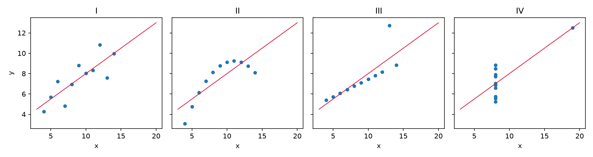
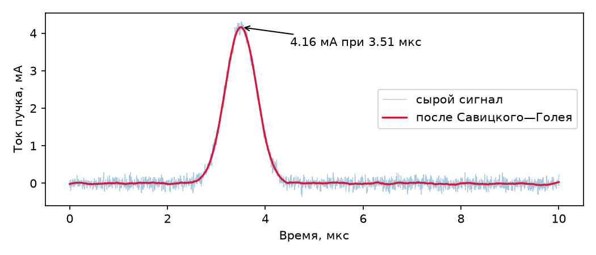
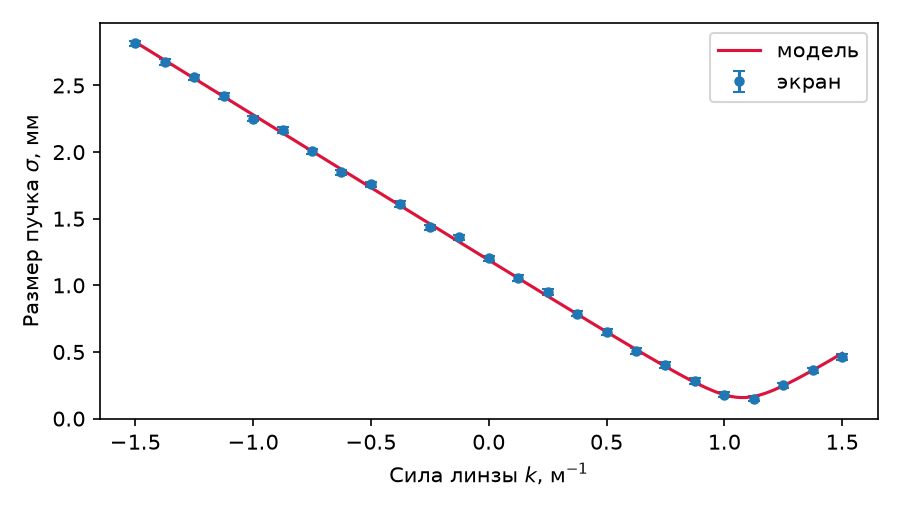
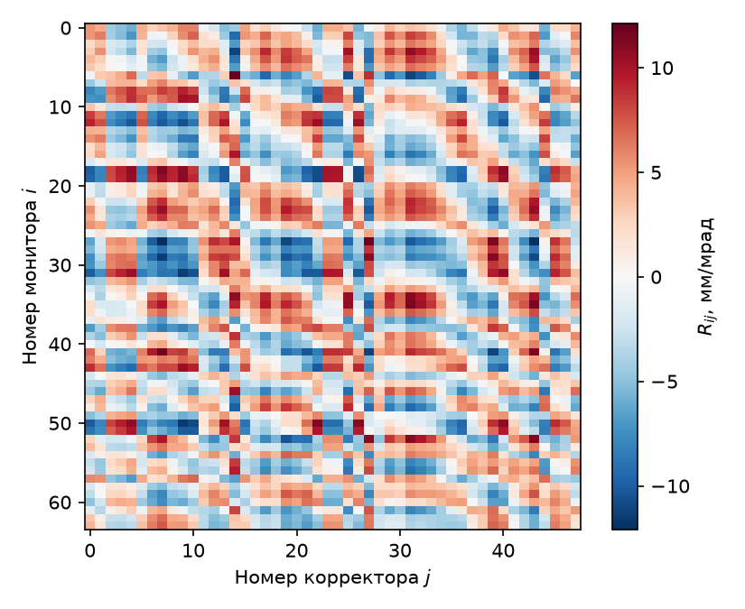
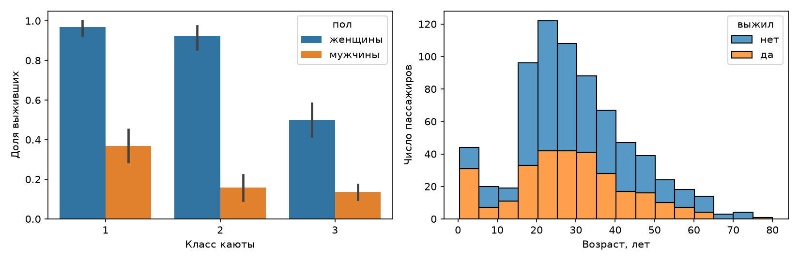
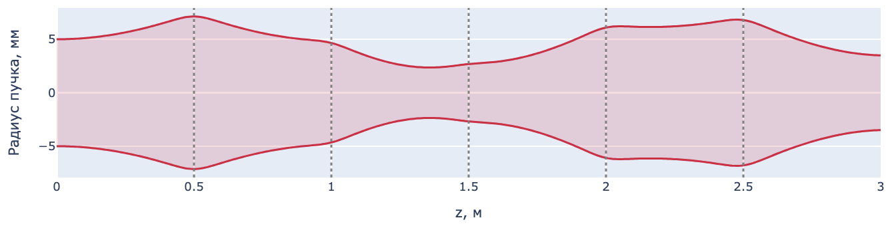
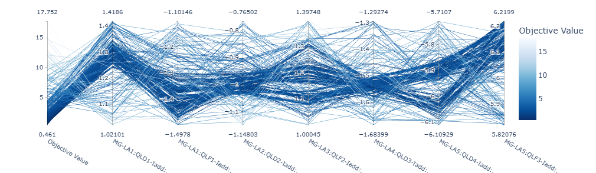
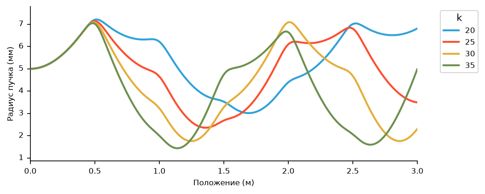

# Визуализация на Python

Массивы NumPy и таблицы pandas хранят измерения, SciPy подгоняет модель и возвращает параметры с погрешностями; следующим шагом является визуальный контроль. Две тысячи отсчётов, выведенные в терминал, не дают представления о сигнале, тогда как на графике сразу видны и искажённый фронт импульса, и наводка от сети, и точка, выпадающая из общего ряда.

В настоящей главе рассматриваются библиотеки, которых физику обычно достаточно. Matplotlib строит статическое изображение для статьи и отчёта. Методы `plot` таблиц pandas и библиотека seaborn строят статистические графики прямо из таблицы. Plotly добавляет интерактивность, ценную при разборе сырых данных: подсказку с точными числами при наведении курсора, масштабирование, много измерений на одном полотне. HoloViews предлагает описывать данные вместо того, чтобы строить график.

Все данные, показанные ниже, вычислены непосредственно в листингах, так что код главы выполняется подряд, от первой строки до последней. Листинги выполнены на одной машине — виртуальной машине под Python 3.12 с Matplotlib 3.11, seaborn 0.13, Plotly 7.1 и HoloViews 1.23, на которой записаны демонстрации лекции «Визуализация данных на Python». Рисунки главы построены этими листингами, а страницы Plotly сняты в браузере.

> **Слайды к главе.** Назначение графика, устройство фигуры Matplotlib, оформление рисунков для статьи, поля и палитры, статистические графики и интерактивные графики Plotly и HoloViews изложены также в лекции «Визуализация данных на Python» с демонстрациями в терминале; слайды лекции доступны [на сайте книги](https://phys-dev.github.io/soft-dev-book/slides/lecture-11.html#/cover) и [в PDF](https://github.com/phys-dev/soft-dev-book/releases/latest/download/soft-dev-book-lecture-11.pdf).

<iframe src="../../slides/lecture-11.html#/cover" title="Слайды лекции «Визуализация данных на Python»" loading="lazy" allowfullscreen style="width:100%; aspect-ratio:16/10; border:0; border-radius:6px"></iframe>

## Назначение графика

Сводные статистики не заменяют взгляда на данные. Это наглядно показал статистик Ф. Энскомб в 1973 году: четыре набора по 11 точек с одинаковыми средними, дисперсиями, корреляцией и прямой регрессии устроены совершенно по-разному.

```python
import numpy as np
import matplotlib.pyplot as plt

x = np.array([10, 8, 13, 9, 11, 14, 6, 4, 12, 7, 5], dtype=float)
x4 = np.array([8, 8, 8, 8, 8, 8, 8, 19, 8, 8, 8], dtype=float)
ys = {'I': [8.04, 6.95, 7.58, 8.81, 8.33, 9.96, 7.24, 4.26, 10.84, 4.82, 5.68],
      'II': [9.14, 8.14, 8.74, 8.77, 9.26, 8.10, 6.13, 3.10, 9.13, 7.26, 4.74],
      'III': [7.46, 6.77, 12.74, 7.11, 7.81, 8.84, 6.08, 5.39, 8.15, 6.42, 5.73],
      'IV': [6.58, 5.76, 7.71, 8.84, 8.47, 7.04, 5.25, 12.50, 5.56, 7.91, 6.89]}

fig, axes = plt.subplots(1, 4, figsize=(12, 3.2), sharey=True)
print('набор  ср. x  ср. y  дисп. x  дисп. y  корр.  наклон  сдвиг')
for ax, (name, y) in zip(axes, ys.items()):
    xs, y = (x4 if name == 'IV' else x), np.array(y)
    slope, shift = np.polyfit(xs, y, 1)
    r = np.corrcoef(xs, y)[0, 1]
    print(f'{name:>5} {xs.mean():6.2f} {y.mean():6.2f} {xs.var(ddof=1):8.2f} '
          f'{y.var(ddof=1):8.2f} {r:6.3f} {slope:7.3f} {shift:6.2f}')
    ax.scatter(xs, y, s=18)
    grid = np.array([3.0, 20.0])
    ax.plot(grid, slope * grid + shift, color='crimson', lw=1)
    ax.set_title(name)
    ax.set_xlabel('x')
axes[0].set_ylabel('y')
fig.tight_layout()
fig.savefig('anscombe.png', dpi=150)
```

    набор  ср. x  ср. y  дисп. x  дисп. y  корр.  наклон  сдвиг
        I   9.00   7.50    11.00     4.13  0.816   0.500   3.00
       II   9.00   7.50    11.00     4.13  0.816   0.500   3.00
      III   9.00   7.50    11.00     4.12  0.816   0.500   3.00
       IV   9.00   7.50    11.00     4.12  0.817   0.500   3.00



У всех четырёх наборов совпадают средние 9,00 и 7,50, дисперсия x, равная 11,00, наклон 0,500 и сдвиг 3,00; дисперсия y равна 4,12–4,13, корреляция — 0,816–0,817. Рисунок же показывает четыре разные картины. В первом наборе — линейная зависимость с шумом, во втором — гладкая нелинейная кривая. В третьем десять точек из одиннадцати лежат точно на прямой с меньшим наклоном, около 0,35, а одиннадцатая, при x = 13, отстоит от неё вверх и смещает к себе прямую регрессии. В четвёртом наклон задаёт единственная точка. В 2017 году Дж. Мэтейка и Дж. Фицморис построили набор Datasaurus Dozen, где облака точек самой разной формы, вплоть до рисунка динозавра, имеют одинаковые до сотых средние, стандартные отклонения и корреляцию. Поэтому график является первым шагом анализа, а не последним: он показывает, какие статистики имеют смысл.

Вид графика выбирается по задаче.

| Задача | Вид графика | Функция |
|---|---|---|
| распределение величины | гистограмма, ящик с усами | `hist`, `boxplot` |
| зависимость y(x) | линия | `plot` |
| связь двух величин | точечная диаграмма | `scatter` |
| измерения с погрешностью | точки с отрезками погрешностей | `errorbar` |
| поле на сетке | цветовая карта, изолинии | `imshow`, `contour` |
| много параметров | параллельные координаты | Plotly |

Несколько правил делают график честным. Ось подписывается величиной и единицами измерения: «Ток пучка, мА». Масштаб выбирается по смыслу: логарифмический — для величин, меняющихся на порядки, например для спектров и профилей пучка, линейный — для остальных; ось столбцовой диаграммы начинается с нуля, поскольку длина столбца и есть величина, а обрезанная ось преувеличивает разницу в разы. Панели, которые сравнивают между собой, получают общие шкалы. Две величины с разными единицами, например давление и ток, строят на двух осях одна под другой с общей шкалой времени, а не на двух шкалах y одних осей: соотношение независимых шкал выбирается произвольно и может создать видимость связи. Круговые и объёмные диаграммы сравнивать трудно, поскольку длину глаз оценивает точнее, чем угол и площадь. Наконец, на графике нет ничего, что не несёт данных: объём, тени и лишние рамки отвлекают и искажают. Э. Тафти называет это отношением «чернил данных» ко всем чернилам рисунка, которое должно быть возможно большим.

## Matplotlib

Matplotlib имеет два интерфейса. Первый из них, `pyplot`, унаследованный от MATLAB, хранит скрытую «текущую фигуру», в которую и добавляют команды наподобие `plt.plot`. Второй представляет фигуру и оси явными объектами, названными в коде своими именами. Предпочтителен второй: в нём видно, к каким осям относится каждый вызов, и код, растущий вместе с задачей, не нарушается, когда фигур становится несколько.

Фигура `Figure` — весь холст с полями и общим заголовком; именно она записывается в файл. Оси `Axes` — прямоугольник с координатами, отведённый под сам график, и на одной фигуре их может быть несколько. Шкалы `XAxis` и `YAxis` отвечают за пределы, деления и подписи. Всё нарисованное — линии, текст, прямоугольники — является художниками (`Artist`), и каждый метод осей возвращает созданный объект для последующей настройки.

Первый пример — осциллограмма, записанная с цилиндра Фарадея, то есть импульс тока пучка на фоне шума оцифровки.

```python
rng = np.random.default_rng(42)

t = np.linspace(0, 10, 2000)                        # время, мкс
current = 4.2 * np.exp(-((t - 3.5) / 0.45) ** 2)    # импульс тока пучка, мА
current += rng.normal(0, 0.10, t.size)              # шум оцифровки

fig, ax = plt.subplots(figsize=(7, 3))
ax.plot(t, current, lw=0.8)
ax.set_xlabel('Время, мкс')
ax.set_ylabel('Ток пучка, мА')
ax.grid(alpha=0.3)
fig.tight_layout()
fig.savefig('waveform.png', dpi=300)
```

`subplots` возвращает пару из фигуры и осей. Построение выполняется в осях, сохранение — для фигуры. Вызов `tight_layout` подбирает поля так, чтобы подписи у осей не срезались краем. `savefig` записывает файл, а `plt.show()` открывает окно и блокирует скрипт до его закрытия. Если нужно и то и другое, `savefig` вызывается раньше `show`: после закрытия окна pyplot забывает фигуру, и `plt.savefig` записывает уже новую, пустую. На машине без экрана, например на сервере или в контейнере, Matplotlib выбирает бэкенд Agg: `plt.show()` там ничего не покажет, и графики сохраняются в файлы.

Сырой сигнал редко показывают отдельно: рядом помещают сглаженную кривую, а найденный максимум подписывают стрелкой.

```python
from scipy.signal import savgol_filter

smooth = savgol_filter(current, 101, 3)   # окно 101 отсчёт, полином 3-й степени
top = smooth.argmax()

fig, ax = plt.subplots(figsize=(7, 3))
ax.plot(t, current, lw=0.6, alpha=0.4, label='сырой сигнал')
ax.plot(t, smooth, lw=1.6, color='crimson', label='после Савицкого—Голея')
ax.annotate(f'{smooth[top]:.2f} мА при {t[top]:.2f} мкс',
            xy=(t[top], smooth[top]), xytext=(t[top] + 1.0, smooth[top] - 0.5),
            arrowprops={'arrowstyle': '->'})
ax.set_xlabel('Время, мкс')
ax.set_ylabel('Ток пучка, мА')
ax.legend(loc='center right')
fig.tight_layout()
fig.savefig('waveform-smooth.png', dpi=300)
```



Две кривые, наложенные в одних осях, различают толщиной, прозрачностью и цветом, а метод `legend` собирает подписи, переданные параметром `label`. Метод `annotate` размещает надпись со стрелкой, протянутой от точки `xytext` к точке `xy` на самом графике.

### Форматы файлов

Формат файла определяется расширением имени. PNG — растр: число точек равно размеру фигуры в дюймах, умноженному на плотность `dpi`, и фигура 7 × 3 дюйма при 300 точках на дюйм даёт 2100 × 900 точек; для слайдов и веба достаточно 150–300 точек на дюйм. SVG и PDF — векторные форматы, не теряющие чёткости при увеличении; PDF вставляется в статью, в том числе в LaTeX. По умолчанию Matplotlib записывает текст в SVG кривыми, и подписи правятся в редакторе как текст только при `rcParams['svg.fonttype'] = 'none'`; в PDF встраиваются шрифты Type 3, а для издательств, требующих шрифтов TrueType, задают `rcParams['pdf.fonttype'] = 42`. Шумная кривая из двух тысяч отсчётов в векторном файле хранится как две тысячи вершин, и с ростом числа точек векторный файл быстро растёт. Плотное облако точек растеризуют аргументом `rasterized=True`: точки сохраняются растром, а оси и подписи остаются векторными, и PDF со ста тысячами точек уменьшается в десятки раз.

### Подписи с формулами и погрешности

Следующий пример — скан по параметру. Изменяя оптическую силу квадрупольной линзы k = 1/f перед экраном, снимают размер пучка, а по параболе, восстановленной подгонкой, вычисляют эмиттанс; сам метод рассмотрен в главе про SciPy. Измерения, снабжённые погрешностями, изображает `errorbar`.

```python
l = 1.2                                        # расстояние «линза — экран», м
eps, beta0, alpha0 = 0.12e-6, 6.94, -1.69      # эмиттанс, м·рад, и параметры Твисса
gamma0 = (1 + alpha0 ** 2) / beta0

def beam_size(k):
    """Размер пучка на экране, м, при оптической силе тонкой линзы k = 1/f."""
    R11, R12 = 1 - k * l, l
    return np.sqrt(eps * (R11**2 * beta0 - 2*R11*R12*alpha0 + R12**2*gamma0))

k = np.linspace(-1.5, 1.5, 25)                 # сила линзы в скане, 1/м
meas = beam_size(k) + rng.normal(0, 20e-6, k.size)   # ошибка измерения 20 мкм
kk = np.linspace(-1.5, 1.5, 301)               # плотная сетка для кривой модели

fig, ax = plt.subplots(figsize=(6, 3.4))
ax.errorbar(k, meas * 1e3, yerr=0.02, fmt='o', ms=4, capsize=3, label='экран')
ax.plot(kk, beam_size(kk) * 1e3, color='crimson', label='модель')
ax.set_xlabel(r'Сила линзы $k$, м$^{-1}$')
ax.set_ylabel(r'Размер пучка $\sigma$, мм')
ax.legend()
fig.tight_layout()
fig.savefig('quadscan.png', dpi=300)

i = beam_size(kk).argmin()
print(f'минимум модели: {beam_size(kk)[i] * 1e3:.3f} мм при k = {kk[i]:.2f} 1/м')
```

    минимум модели: 0.158 мм при k = 1.08 1/м



Подписи осей поддерживают подмножество TeX, заключённое в знаки доллара. Его набирает mathtext, встроенный в Matplotlib и не требующий установленного LaTeX, поэтому индексы, степени и греческие буквы записываются привычным образом. Строку с формулой помечают префиксом `r`, иначе обратный слеш будет обработан Python раньше Matplotlib. Полный LaTeX включает параметр `text.usetex`, но тогда на машине должен быть установлен TeX, а для русских подписей в `text.latex.preamble` подключают пакеты `fontenc` с кодировкой T2A, `inputenc` и `babel`: с преамбулой по умолчанию LaTeX кириллицу не обрабатывает, и сохранение завершается ошибкой.

Параметр `yerr` задаёт половину отрезка погрешности, `fmt` — маркер без соединяющей линии, `capsize` — поперечные засечки. Отрезок может означать стандартное отклонение, стандартную ошибку среднего или доверительный интервал, поэтому подпись рисунка в статье называет, что именно изображено. Модель рисуется по плотной сетке: кривая через 25 точек скана была бы ломаной, а её наименьшая точка — лишь ближайшим к минимуму узлом. Минимум модели, 0,158 мм при k ≈ 1,08 1/м, лежит между узлами скана, взятыми с шагом 0,125 1/м, и потому эмиттанс восстанавливают подгонкой параболы, а не по наименьшему измерению.

В русскоязычной статье десятичный разделитель на осях — запятая, а Matplotlib по умолчанию ставит точку, как и рисунки этой главы. Запятую ставит параметр `axes.formatter.use_locale = True` после установки русской локали вызовом `locale.setlocale(locale.LC_NUMERIC, 'ru_RU.UTF-8')`; локаль при этом должна быть установлена в системе.

### Поля и палитры

Двумерный массив отображает `imshow`, окрашивающий каждую ячейку по её значению. Пример — матрица отклика замкнутой орбиты из главы о коррекции орбиты: элемент матрицы определяется бета-функциями в мониторе и корректоре и разностью их бетатронных фаз.

```python
n_bpm, n_cor, nu = 64, 48, 8.42
phi_b = np.sort(rng.uniform(0, 2 * np.pi * nu, n_bpm))   # фазы мониторов
phi_c = np.sort(rng.uniform(0, 2 * np.pi * nu, n_cor))   # фазы корректоров
beta_b = rng.uniform(4.0, 24.0, n_bpm)                   # бета-функция, м
beta_c = rng.uniform(4.0, 24.0, n_cor)

dphi = np.abs(phi_b[:, None] - phi_c[None, :])
R = (np.sqrt(beta_b[:, None] * beta_c[None, :]) / (2 * np.sin(np.pi * nu))
     * np.cos(dphi - np.pi * nu))
print(R.shape)

lim = np.abs(R).max()
fig, ax = plt.subplots(figsize=(5.5, 4.5))
im = ax.imshow(R, cmap='RdBu_r', vmin=-lim, vmax=lim, aspect='auto')
fig.colorbar(im, ax=ax, label=r'$R_{ij}$, мм/мрад')
ax.set_xlabel('Номер корректора $j$')
ax.set_ylabel('Номер монитора $i$')
fig.tight_layout()
fig.savefig('response.png', dpi=300)
```

    (64, 48)



Палитру выбирают по смыслу величины. Для знакопостоянной величины подходит последовательная палитра, светлота которой меняется монотонно: `viridis`, принятая в Matplotlib по умолчанию с версии 2.0, `magma` или `cividis`. Такие палитры различимы и в чёрно-белой печати, и людьми с нарушениями цветового зрения. Для величины, меняющей знак, как элементы матрицы отклика, подходит расходящаяся палитра со светлым центром, такая как `RdBu_r`, и границы `vmin` и `vmax` задаются симметричными, иначе светлый центр сместится с нуля и изображение будет вводить в заблуждение. Симметричные границы задаёт и нормировка `CenteredNorm`, а `TwoSlopeNorm(vcenter=0)` помещает ноль в центр палитры и при несимметричном диапазоне. Категории без порядка кодируют качественной палитрой, например `tab10`. Радужная палитра `jet`, унаследованная от старых пакетов, неравномерна по светлоте: светлее всего в ней промежуточные значения, окрашенные голубым и жёлтым, а не наибольшие, поэтому на плавно меняющейся величине появляются ложные границы, а настоящие перепады теряются. Величины с большим динамическим диапазоном — профили пучка, спектры — показывают с логарифмической нормировкой `LogNorm`.

Ячейки у `imshow` равны между собой, а физическая сетка часто неравномерна, и для неё применяют `pcolormesh`, принимающий сами координаты узлов. Физические границы изображения задаются параметром `extent`, и номера пикселей на осях сменяются метрами, а `origin='lower'` помещает начало координат внизу, как принято в физике. Изолинии и заполненные уровни строят `contour` и `contourf`, векторное поле — `quiver` и `streamplot`. Цветовая шкала `colorbar` с подписью величины и единиц обязательна: без неё цвет не переводится в число.

### Рисунок для статьи

Фигуру для статьи строят сразу в размере колонки журнала, например 8,6 см, или 3,4 дюйма, в журналах Американского физического общества, со шрифтом, близким к шрифту текста: большая фигура, уменьшенная при вёрстке, превращает подписи в нечитаемо мелкие. Повторяющиеся настройки выносятся в `rcParams` один раз на весь скрипт, в файл стиля, подключаемый `plt.style.use`, или в контекст `plt.rc_context`, действующий внутри одного блока.

```python
style = {
    'figure.figsize': (3.4, 2.4),   # колонка журнала APS, 8,6 см
    'font.size': 9,
    'axes.grid': True,
    'grid.alpha': 0.3,
    'savefig.dpi': 300,
}

with plt.rc_context(style):         # на весь скрипт: plt.rcParams.update(style)
    fig, (up, down) = plt.subplots(2, 1, sharex=True, figsize=(3.4, 4),
                                   layout='constrained')
    up.plot(t, current, lw=0.6)
    up.set_ylabel('Ток, мА')
    down.plot(t, smooth, color='crimson')
    down.set_ylabel('Сглажено, мА')
    down.set_xlabel('Время, мкс')
    fig.align_ylabels()
    fig.savefig('report.pdf')       # вектор, не теряющий чёткости при печати
```

Параметр `sharex=True` связывает оси подграфиков, и подписи по времени печатаются только под нижним. Параметр `layout='constrained'` раскладывает оси и подписи без наложений и в пределах фигуры, а `align_ylabels` выравнивает подписи соседних осей. Обрезка полей `bbox_inches='tight'` здесь не нужна: она сохраняет прямоугольник, охватывающий элементы фигуры, с полем 0,1 дюйма, и размер файла перестаёт совпадать с заданным — фигура шириной 3,4 дюйма с раскладкой `constrained` сохраняется шириной около 3,52 дюйма, и при вставке в колонку рисунок вместе со шрифтом уменьшается на 3 %. Для печати сохраняют векторный формат, PDF или SVG; растровый PNG с плотностью 300 точек на дюйм предназначен для слайдов и веба. Все рисунки статьи удобнее строить одним скриптом: правка стиля тогда обновляет весь набор сразу.

### Анимация

Matplotlib строит и анимацию. `FuncAnimation` вызывает функцию для каждого кадра; функция меняет данные уже созданных художников — `set_ydata` у линии, `set_data` у точек, `set_array` у изображения, — что намного быстрее, чем строить график заново. Готовая анимация сохраняется методом `save`: GIF записывает библиотека Pillow, устанавливаемая вместе с Matplotlib, а MP4 — программа ffmpeg, которую устанавливают отдельно.

```python
from matplotlib.animation import FuncAnimation

xg = np.linspace(-10, 10, 400)

def packet(x, s):
    """Гауссов волновой пакет, смещённый на s."""
    return np.exp(-((x - s) / 2) ** 2) * np.cos(3 * (x - s))

fig, ax = plt.subplots(figsize=(6, 2.5))
line, = ax.plot(xg, packet(xg, -5.0))
ax.set_xlabel('Координата x, мкм')
ax.set_ylabel('Амплитуда, отн. ед.')

def update(i):
    line.set_ydata(packet(xg, -5.0 + 0.25 * i))
    return (line,)

anim = FuncAnimation(fig, update, frames=40, interval=50)
anim.save('packet.gif', writer='pillow', fps=20)
```

`ax.plot` возвращает список линий, отсюда запятая в `line, =`. В блокноте Jupyter анимацию показывает вызов `HTML(anim.to_jshtml())` из модуля `IPython.display` или параметр `rcParams['animation.html'] = 'jshtml'`; без них при бэкенде inline, принятом в Jupyter по умолчанию, под ячейкой выводится только неподвижный кадр. Для физика анимация — способ показать эволюцию: волновой пакет во времени, огибающую пучка вдоль тракта, распределение частиц по шагам расчёта.

## Статистические графики

Методы `plot` таблиц и столбцов pandas вызывают Matplotlib и возвращают его оси, поэтому дальнейшее оформление — логарифмический масштаб, подписи, пределы — выполняется методами этих осей. Пример — пассажиры «Титаника» из файла titanic.csv, рассмотренного в главе «NumPy и pandas».

```python
import pandas as pd

df = pd.read_csv('titanic.csv')
ax = df.plot.scatter(x='Age', y='Fare', s=8, alpha=0.5, figsize=(6, 3))
ax.set_yscale('log')
ax.set_xlabel('Возраст, лет')
ax.set_ylabel('Плата за проезд, £')
print((df['Fare'] == 0).sum(), ((df['Fare'] == 0) & df['Age'].notna()).sum())
```

    15 7

На логарифмической оси нулевые значения не изображаются: у 15 пассажиров плата за проезд равна нулю, и точки семи из них, с известным возрастом, исчезают с графика без предупреждения. То же происходит с нулевыми каналами спектра, построенного в логарифмическом масштабе.

Библиотека [seaborn](https://seaborn.pydata.org) строит статистические графики поверх Matplotlib прямо из таблицы: столбцы задаются именами, а аргумент `hue` разбивает данные на группы по ещё одному столбцу и сам строит легенду.

```bash
pip install seaborn
```

```python
import seaborn as sns

print(df.pivot_table(values='Survived', index='Sex', columns='Pclass').round(2))
data = df.assign(пол=df['Sex'].map({'female': 'женщины', 'male': 'мужчины'}),
                 выжил=df['Survived'].map({0: 'нет', 1: 'да'}))

fig, (left, right) = plt.subplots(1, 2, figsize=(11, 3.6))
sns.barplot(data, x='Pclass', y='Survived', hue='пол',
            errorbar=('ci', 95), seed=0, ax=left)
sns.histplot(data, x='Age', hue='выжил', multiple='stack', bins=16, ax=right)
left.set(xlabel='Класс каюты', ylabel='Доля выживших')
right.set(xlabel='Возраст, лет', ylabel='Число пассажиров')
fig.tight_layout()
fig.savefig('titanic.png', dpi=150)
```

    Pclass     1     2     3
    Sex                     
    female  0.97  0.92  0.50
    male    0.37  0.16  0.14



Функция `barplot` по умолчанию показывает среднее с 95-процентным доверительным интервалом, вычисленным бутстрепом по 1000 повторных выборок; аргумент `seed` делает интервал воспроизводимым. Слева видно, что выжили 97 % женщин первого класса и 14 % мужчин третьего, а самый широкий интервал — у женщин третьего класса. Справа — гистограмма возраста, разбитая по исходу: в первом интервале, от 0,42 до 5,4 года, то есть среди детей не старше пяти лет, выжил 31 из 44, а больше всего пассажиров в возрасте 20–25 лет. Средствами одного Matplotlib те же графики потребовали бы группировки, расчёта интервалов и легенды вручную. Распределения seaborn строит функциями `histplot`, `kdeplot`, `boxplot` и `violinplot`, связь двух величин — `scatterplot` и `regplot`; `heatmap` показывает матрицу, например корреляций, а `pairplot` — все пары столбцов таблицы.

## Plotly

При самостоятельном разборе данных требуется подвести курсор и прочитать точное число, выделить рамкой фрагмент и увеличить его, скрыть лишнюю кривую щелчком по легенде. Эти возможности предоставляет [Plotly](https://plotly.com/python/), строящий график в браузере поверх библиотеки plotly.js.

> **Слайды к главе.** Plotly, HoloViews, анимация и выбор инструмента изложены также в шестой части лекции «Визуализация данных на Python» с демонстрацией в терминале; слайды лекции доступны [на сайте книги](https://phys-dev.github.io/soft-dev-book/slides/lecture-11.html#/sec-inter) и [в PDF](https://github.com/phys-dev/soft-dev-book/releases/latest/download/soft-dev-book-lecture-11.pdf).

<iframe src="../../slides/lecture-11.html#/sec-inter" title="Слайды лекции «Визуализация данных на Python»: интерактивность" loading="lazy" allowfullscreen style="width:100%; aspect-ratio:16/10; border:0; border-radius:6px"></iframe>

```bash
pip install plotly
```

Пример — огибающая пучка, вычисленная вдоль тракта. Данные даёт уравнение Капчинского—Владимирского, выведенное в отдельной главе, а тракт состоит из пяти соленоидов, расставленных через полметра.

```python
import numpy as np
from scipy.integrate import solve_ivp

gamma = 1 + 2.0 / 0.511                            # пучок 2 МэВ
beta = np.sqrt(1 - gamma ** -2)
perv = 2 * 100.0 / (17045 * (beta * gamma) ** 3)   # первеанс при токе 100 А
eps = 1e-6                                         # эмиттанс, м·рад

z_lens = np.arange(0.5, 3.0, 0.5)                  # пять соленоидов через 0.5 м
z = np.linspace(0, 3, 400)                         # сетка вдоль тракта, м

def envelope(k):
    """Радиус пучка a(z), м, при жёсткостях соленоидов k."""
    def rhs(s, y):
        ks = (k * np.exp(-((s - z_lens) / 0.06) ** 2)).sum()
        a, ap = y
        return [ap, -ks * a + perv / a + eps ** 2 / a ** 3]
    return solve_ivp(rhs, (0, 3), [5e-3, 0.0], t_eval=z, max_step=0.005).y[0]

a = envelope(np.full(5, 25.0)) * 1e3               # огибающая, мм
print(f'{a.min():.2f} {a.max():.2f}')
```

    2.36 7.13

Первое изображение собирается вручную из объектов `graph_objects`, дающих полный контроль над каждой линией.

```python
import plotly.graph_objects as go

fig = go.Figure()
fig.add_scatter(x=z, y=a, name='верх', line={'color': 'crimson', 'simplify': False},
                hovertemplate='z = %{x:.2f} м<br>a = %{y:.2f} мм<extra></extra>')
fig.add_scatter(x=z, y=-a, name='низ', line={'color': 'crimson', 'simplify': False},
                fill='tonexty', fillcolor='rgba(220,20,60,0.15)',
                hoverinfo='skip')
for zi in z_lens:
    fig.add_vline(x=zi, line_dash='dot', line_color='gray')
fig.update_layout(xaxis_title='z, м', yaxis_title='Радиус пучка, мм',
                  showlegend=False, height=350)
fig.write_html('envelope.html', include_plotlyjs='cdn')
```



Параметр `simplify` линии отключает её упрощение: по умолчанию plotly.js при отрисовке выбрасывает точки, почти лежащие на одной прямой, и плавная огибающая из четырёхсот точек становится заметно ломаной. Параметр `hovertemplate` задаёт содержимое всплывающей подсказки: `%{x}` и `%{y}` подставляют координаты точки, а `<extra></extra>` убирает служебную рамку с именем кривой. Метод `write_html` создаёт рядом самодостаточный файл, открываемый в любом браузере без Python. С ключом `include_plotlyjs='cdn'` страница загружает plotly.js из сети и занимает десятки килобайт, а со значением `True` библиотека встраивается внутрь, и файл разрастается до нескольких мегабайт, зато открывается без сети. В браузере при наведении курсора всплывает подсказка с положением и радиусом, прямоугольник, выделенный курсором, растягивается на всё поле, а двойной щелчок возвращает исходный масштаб. Масштабирование колесом мыши у двумерных графиков Plotly по умолчанию выключено и включается аргументом `config={'scrollZoom': True}` метода `write_html`. Статичный PNG или PDF из фигуры Plotly сохраняет метод `write_image`; в Plotly 7 он требует пакета kaleido версии 1 и установленного браузера Chrome.

Скан по параметру удобно показывать картой, поэтому расчёт выполняется для сорока одной жёсткости соленоидов, а полученные огибающие объединяются в один двумерный массив.

```python
k_grid = np.linspace(15.0, 35.0, 41)
scan = np.array([envelope(np.full(5, k)) for k in k_grid]) * 1e3

heat = go.Figure(go.Heatmap(
    x=z, y=k_grid, z=scan, colorscale='Viridis',
    colorbar={'title': 'a, мм'},
    hovertemplate='z = %{x:.2f} м<br>k = %{y:.1f} 1/м²'
                  '<br>a = %{z:.2f} мм<extra></extra>'))
heat.update_layout(xaxis_title='z, м',
                   yaxis_title='Жёсткость соленоидов k, 1/м²', height=380)
heat.write_html('scan.html', include_plotlyjs='cdn')
```

При наведении курсора на точку карты читаются три числа: положение вдоль тракта, жёсткость линз и радиус пучка; в Matplotlib для того же пришлось бы обращаться к массиву по индексам. Изображение, сохранённое в HTML, остаётся интерактивным и после закрытия Python, и такими картами удобно искать рабочую точку установки.

Миллион точек Plotly отрисовывает медленно: обычный `Scatter` рисуется в SVG, и каждая точка становится отдельным элементом страницы. Для больших массивов предусмотрен `Scattergl`, рисующий точки растром средствами WebGL на видеокарте; `px.scatter` сам переходит на него, когда точек больше тысячи.

Когда осей требуется больше трёх, применяют параллельные координаты, где каждая переменная получает свою вертикальную ось, а один опыт превращается в ломаную, пересекающую все оси сразу. Пример — триста случайных настроек тракта, каждая из которых оценивается по среднеквадратичному отклонению радиуса от целевых четырёх миллиметров.

```python
import pandas as pd
import plotly.express as px

rng = np.random.default_rng(1)
trials = rng.uniform(18.0, 32.0, size=(300, 5))     # 300 случайных настроек
loss = np.array([np.sqrt(np.mean((envelope(k) - 4e-3) ** 2)) * 1e3
                 for k in trials])                  # отклонение от 4 мм, мм

runs = pd.DataFrame(trials, columns=[f'k{i}' for i in range(1, 6)])
runs['loss'] = loss

labels = {f'k{i}': f'k{i}, 1/м²' for i in range(1, 6)} | {'loss': 'отклонение, мм'}
par = px.parallel_coordinates(runs, color='loss', labels=labels,
                              color_continuous_scale='Blues_r')
par.write_html('parallel.html', include_plotlyjs='cdn')
print(f'лучшая настройка: {loss.min():.2f} мм, худшая: {loss.max():.2f} мм')
```

    лучшая настройка: 1.18 мм, худшая: 3.18 мм

Изображение ниже построено теми же параллельными координатами Plotly на настоящей задаче: тысяча прогонов оптимизации оптики линейного ускорителя инжектора ЦКП «СКИФ».



Тысяча строк по восемь чисел в виде таблицы нечитаема, а на параллельных координатах читается. Подписи оставлены такими, какими их вывела программа оптимизации. Крайняя левая ось, Objective Value, несёт значение целевой функции, заключённое между 0,461 и 17,752, а остальные отведены под добавки к токам квадруполей — каналы `MG-LA1:QLD1-Iadd`, `MG-LA1:QLF1-Iadd`, `MG-LA2:QLD2-Iadd` и так далее. Цветом закодирована та же целевая функция, и тёмные линии отмечают удачные прогоны. Там, где жгут линий сливается в узкую полосу, параметр является определяющим, и в эту полосу необходимо попасть. Там, где линии распределены по оси равномерно, параметр на результат почти не влияет, и его отдают оптимизатору целиком. Удачные сочетания видны, поскольку тёмные ломаные идут пучком. В браузере оси перетаскиваются курсором, а по каждой выделяется диапазон, и на экране остаются только прогоны, прошедшие отбор.

## HoloViews

Matplotlib строит то, что ему указано, и потому требует расписывать каждый шаг, от подписи оси до заданного вручную цвета.

[HoloViews](https://holoviews.org) построен на принципе «аннотировать данные, а не строить график». Пользователь описывает семантику данных, то есть что является аргументом, что значением и в каких они единицах, а библиотека сама выбирает представление. Один и тот же объект, собранный однажды, отрисовывается разными бэкендами: интерактивным `bokeh`, `matplotlib` или `plotly`.

```bash
pip install holoviews bokeh
```

Основой является элемент, контейнер с данными, знающий свой тип визуализации. `hv.Curve` задаёт непрерывную зависимость, `hv.Scatter` показывает дискретные измерения, `hv.Image` отображает величину на регулярной сетке. Измерениям задают удобочитаемые подписи и единицы, попадающие затем на оси и во всплывающие подсказки.

```python
import numpy as np
import holoviews as hv

hv.extension('bokeh', 'matplotlib')     # первый бэкенд — основной

rng = np.random.default_rng(42)
t = np.linspace(0, 10, 2000)
current = 4.2 * np.exp(-((t - 3.5) / 0.45) ** 2) + rng.normal(0, 0.10, t.size)

dim_t = hv.Dimension('t', label='Время', unit='мкс')
dim_i = hv.Dimension('I', label='Ток пучка', unit='мА')

wave = hv.Curve((t, current), dim_t, dim_i)
wave
```

В Jupyter объект, возвращённый последней строкой ячейки, отображается автоматически, так что вызывать функцию построения не требуется. С бэкендом `bokeh` панорамирование, масштабирование и подсказки доступны сразу, и подозрительный выброс, замеченный на графике, рассматривается вблизи без перестроения изображения.

`hv.Points` внешне похож на `Scatter`, однако семантика у него иная: обе координаты выступают независимыми измерениями, а точки просто располагаются на плоскости, как частицы на фазовой плоскости. Готовые элементы комбинируются операторами, из которых `+` размещает графики рядом, а `*` накладывает их в одних осях.

```python
x = rng.normal(0, 1.0, 2000)        # координата частиц, мм
xp = rng.normal(0, 0.3, 2000)       # угол, мрад
phase = hv.Points((x, xp), ['x', "x'"])

grid = np.linspace(-3, 3, 200)
xx, yy = np.meshgrid(grid, grid)
spot = hv.Image(np.exp(-2 * (xx ** 2 + yy ** 2) / 1.2 ** 2),   # пятно на экране
                bounds=(-3, -3, 3, 3), kdims=['x', 'y'], vdims='I')

sparse = hv.Scatter((t[::200], current[::200]), dim_t, dim_i)
overlay = wave * sparse                       # в одних осях
layout = (wave + phase + spot).cols(3)        # рядом, в три колонки
```

Совмещение работает благодаря тому, что каждый элемент самодостаточен: HoloViews определяет, что измерения у `wave` и `sparse` совпали, и сам выравнивает оси, подписи и легенду. Число колонок в компоновке задаёт метод `.cols()`, вызываемый на готовом объекте.

В Matplotlib скан по параметру превращается в цикл, объединяющий десяток подграфиков в одну фигуру, а `HoloMap` превращает тот же параметр в слайдер. Он принимает словарь, где каждому значению параметра сопоставлен элемент HoloViews, а не массив.

```python
# модель тракта (z_lens, perv, eps, z) взята из раздела про Plotly
dim_z = hv.Dimension('z', label='Положение', unit='м')
dim_a = hv.Dimension('a', label='Радиус пучка', unit='мм')

def curve(k):
    """Огибающая пучка при жёсткости всех соленоидов k."""
    def rhs(s, y):
        ks = (k * np.exp(-((s - z_lens) / 0.06) ** 2)).sum()
        a, ap = y
        return [ap, -ks * a + perv / a + eps ** 2 / a ** 3]
    a = solve_ivp(rhs, (0, 3), [5e-3, 0.0], t_eval=z, max_step=0.005).y[0]
    return hv.Curve((z, a * 1e3), dim_z, dim_a)

hmap = hv.HoloMap({k: curve(k) for k in [20, 25, 30, 35]}, kdims='k')
hv.save(hmap, 'envelope-scan.html')     # слайдер работает и без Python

static = hmap.overlay('k').opts(fig_inches=(8, 3.2), aspect=2.5, fontscale=0.8,
                                legend_position='right', backend='matplotlib')
hv.save(static, 'envelope-hv.png', backend='matplotlib', dpi=150)

dmap = hv.DynamicMap(curve, kdims='k').redim.range(k=(15.0, 35.0))
```



`HoloMap` вычисляет все кадры заранее и хранит их в памяти, зато сохраняется в самодостаточный HTML, который можно передать коллеге; библиотеки BokehJS и Panel страница загружает из сети. Метод `overlay('k')` накладывает кадры в одних осях, и тот же объект через бэкенд `matplotlib` сохраняется статичным рисунком; подписи «Положение (м)» и «Радиус пучка (мм)» HoloViews составил сам из описания измерений. `DynamicMap` вычисляет кадр по движению слайдера, что необходимо, когда параметр непрерывен или каждый расчёт дорог. Однако пересчёт кадра требует запущенного ядра Python: `hv.save` записывает в файл лишь несколько заранее вычисленных кадров, по умолчанию три значения параметра.

Оформление отделено от семантики и задаётся методом `.opts()` поверх готового объекта.

```python
overlay.opts(
    hv.opts.Curve(width=650, height=280, color='black'),
    hv.opts.Scatter(size=7, color='crimson'),
)

# logz — логарифмическая шкала цвета, нужная пучкам и спектрам
# с большим динамическим диапазоном
spot.opts(width=380, height=340, cmap='inferno', colorbar=True, logz=True)
```

Часть опций зависит от бэкенда: ширина `width` и высота `height` заданы в пикселях у `bokeh`, а у `matplotlib` вместо них используются `fig_inches` и `aspect`. Полный список опций элемента выводит `hv.help(hv.Curve)`.

Вокруг HoloViews сформировалась экосистема [HoloViz](https://holoviz.org). Пакет [hvPlot](https://hvplot.holoviz.org) после одного импорта добавляет к таблицам pandas метод `.hvplot`, заменяющий встроенный `df.plot()`; возвращает он обычные объекты HoloViews со всеми слайдерами и наложениями. Для десятков миллионов точек, например макрочастиц расчёта, служит пакет Datashader: операция `rasterize` агрегирует изображение в Python, и в браузер передаётся только растр. Библиотека [Panel](https://panel.holoviz.org) связывает графики, виджеты и текст в единый интерфейс, превращаемый командой `panel serve app.py` в веб-приложение, и мониторинг установки становится страницей в браузере без единой строки JavaScript.

## Выбор инструмента

| Задача | Инструмент |
|---|---|
| рисунок для статьи | Matplotlib |
| статистика из таблицы | seaborn, методы `plot` pandas |
| разбор сырых данных | Plotly, HoloViews в Jupyter |
| скан по параметру | HoloMap, DynamicMap |
| таблица pandas в браузере | hvPlot: `df.hvplot()` |
| панель мониторинга установки | Panel: `panel serve app.py` |

Таким образом, для статьи и отчёта рисунок строится в Matplotlib сразу в размере колонки, с подписями величин и единиц и в векторном формате; статистические сводки по таблице быстрее получить средствами seaborn; для разбора сырых данных и передачи коллегам служат интерактивные страницы Plotly и HoloViews. Во всех случаях вид графика, масштаб осей и палитра выбираются по смыслу данных.

## Полезные ссылки

- [Галерея matplotlib](https://matplotlib.org/stable/gallery/), где изображение подбирается визуально, а код берётся готовым;
- [Scientific Visualization: Python + Matplotlib](https://github.com/rougier/scientific-visualization-book) Николя Ружье, книга про графики, предназначенные для научных статей;
- [seaborn.pydata.org](https://seaborn.pydata.org), руководство и галерея статистических графиков;
- [plotly.com/python](https://plotly.com/python/), справочник по типам графиков с разобранными примерами;
- [holoviews.org](https://holoviews.org) и [holoviz.org](https://holoviz.org), документация HoloViews и обзор всей экосистемы;
- F. J. Anscombe. [Graphs in Statistical Analysis](https://doi.org/10.1080/00031305.1973.10478966) // The American Statistician, 1973, т. 27, № 1 — статья с квартетом Энскомба;
- F. Crameri, G. E. Shephard, P. J. Heron. [The misuse of colour in science communication](https://doi.org/10.1038/s41467-020-19160-7) // Nature Communications, 2020, т. 11 — о радужных палитрах и выборе палитры по смыслу величины;
- [Уравнение огибающей](../../examples/kenv.md) и [коррекция орбиты](../../examples/orbit-correction.md), главы этой книги, откуда взяты данные для примеров.
