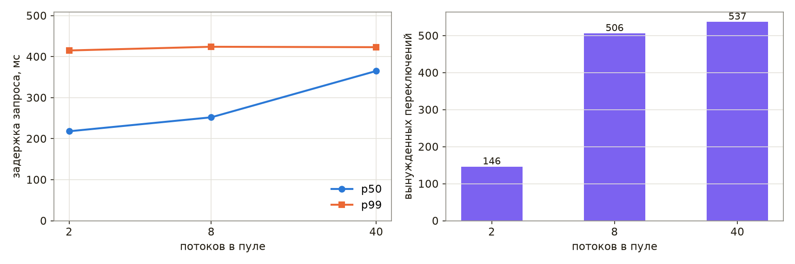
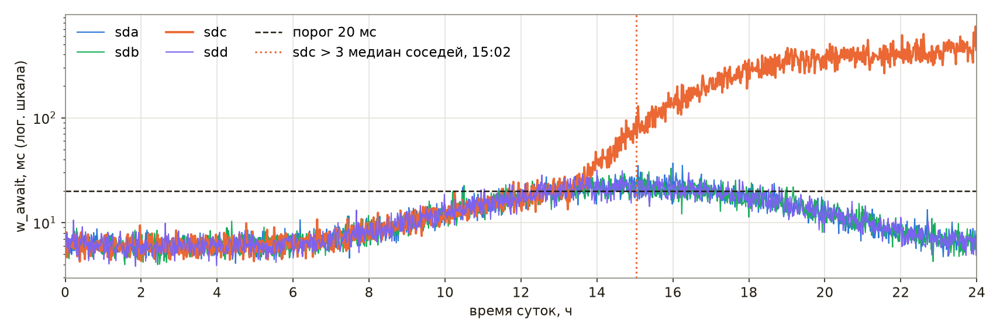
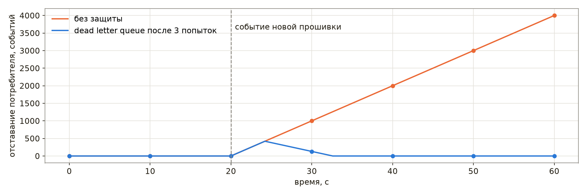

# Поиск неисправностей

Отказ уже произошёл: архив отвечает ошибками, ночная обработка не завершилась, память службы растёт с каждым часом. Средства наблюдения, рассмотренные в главе [«Наблюдаемость»](./observability.md), сообщили о симптоме, и теперь необходимо найти причину и восстановить работу, причём восстановить по возможности раньше, чем причина будет найдена. **Поиск неисправностей** представляет собой процесс выявления и устранения причины, по которой система ведёт себя не так, как ожидается. В распределённой системе он осложняется тем, что частей много, отказывают они по отдельности, а их часы показывают разное время.

Поиск неисправностей нередко считают врождённым талантом, однако книга Google SRE рассматривает его как навык, которому можно научиться и научить [23]. Та же книга выделяет две его составляющие: общий метод, по которому выдвигаются и проверяются гипотезы, и знание устройства конкретной системы. К ним добавляются инструменты, позволяющие проверить гипотезу на работающей системе. В настоящей главе последовательно рассмотрены особенности отказов распределённых систем, метод поиска, инструменты для работающего процесса на Python и Linux, управление инцидентом и разбор его причин, а в завершение — три учебных случая в формате упражнения «колесо неудачи». Глава опирается на главы [«Инструменты Linux»](../linux/tools.md) (раздел «Диагностика и поиск проблем»), [«Внутреннее устройство Linux»](../linux/structure.md) (процессы и их состояния), [«Причины низкой скорости Python»](./python/optimization.md) (профилировщики) и [«Системный дизайн»](./system-design.md) (тайм-ауты, повторы, очереди).

Листинги и сеансы оболочки главы, если не оговорено иное, выполнены на macOS под Python 3.11. Сеансы и результаты команд Linux — `/proc`, strace, ss, py-spy, perf и systemd — взяты из записей демонстраций к лекции, сделанных на виртуальной машине с Ubuntu 24.04 (процессор ARM64, два ядра, Python 3.12.3, systemd 255); из тех же записей взяты и числа, приведённые со ссылкой на демонстрации к лекции.

> **Слайды к главе.** Отказы распределённых систем, метод поиска, инструменты процесса, управление инцидентом, разбор причин и три учебных случая изложены также в лекции «Поиск неисправностей» с демонстрациями в терминале; слайды лекции доступны [на сайте книги](https://phys-dev.github.io/soft-dev-book/slides/lecture-20.html#/cover) и [в PDF](https://github.com/phys-dev/soft-dev-book/releases/latest/download/soft-dev-book-lecture-20.pdf).

<iframe src="../slides/lecture-20.html#/cover" title="Слайды лекции «Поиск неисправностей»" loading="lazy" allowfullscreen style="width:100%; aspect-ratio:16/10; border:0; border-radius:6px"></iframe>

## Отказы распределённой системы

> **Слайды к главе.** Частичные отказы, расхождение часов и заблуждения о сети изложены также в первой части лекции «Поиск неисправностей» с демонстрациями в терминале; слайды лекции доступны [на сайте книги](https://phys-dev.github.io/soft-dev-book/slides/lecture-20.html#/sec-dist) и [в PDF](https://github.com/phys-dev/soft-dev-book/releases/latest/download/soft-dev-book-lecture-20.pdf).

<iframe src="../slides/lecture-20.html#/sec-dist" title="Слайды лекции «Поиск неисправностей»: распределённые системы" loading="lazy" allowfullscreen style="width:100%; aspect-ratio:16/10; border:0; border-radius:6px"></iframe>

### Частичные отказы и разные часы

Программа на одной машине либо работает, либо нет. Система из многих машин отказывает частично: один экземпляр службы отвечает медленно, одна зона недоступна, одна реплика базы отстала, а остальные части работают. Общего состояния, которое можно было бы рассмотреть целиком, у такой системы нет, и картину отказа собирают из журналов и метрик разных машин.

Сборку картины осложняют часы. Протокол NTP обычно поддерживает время машин с точностью до десятков миллисекунд при синхронизации через интернет и лучше миллисекунды в локальной сети при благоприятных условиях, а асимметричные маршруты и перегрузка сети дают ошибку в 100 мс и более. Протокол PTP (IEEE 1588) с аппаратными метками времени обеспечивает в локальной сети точность лучше микросекунды, а основанная на нём система White Rabbit, разработанная ЦЕРН, GSI и их партнёрами для синхронизации ускорительных комплексов, — доли наносекунды. Поэтому записи разных машин, разделённые миллисекундами, по меткам времени упорядочить нельзя, а машина с неисправной синхронизацией может разойтись с остальными на секунды. Рассмотрим запрос, который проходит шлюз, архив и базу метаданных; часы архива отстают на 1,5 с, а часы базы спешат на 12 мс.

```python
OFFSET = {"gw": 0.000, "archive": -1.500, "db": 0.012}    # насколько часы машины впереди настоящих, с
# настоящее время от начала запроса, с; машина; номер родительского события; текст
EVENTS = [(0.000, "gw", None, "GET /runs/42"),
          (0.004, "archive", 0, "запрос метаданных"),
          (0.010, "db", 1, "SELECT runs: ожидание блокировки"),
          (1.010, "db", 2, "lock timeout, ERROR"),
          (1.013, "archive", 3, "ошибка базы, ответ 500"),
          (1.016, "gw", 4, "ответ 500 пользователю")]

logged = sorted((t + OFFSET[host], host, text) for t, host, parent, text in EVENTS)
print("по меткам журналов:")
for t, host, text in logged:
    print(f"  {t:7.3f}  {host:8} {text}")

order, seen = [], set()
while len(order) < len(EVENTS):                 # событие идёт после своего родителя
    for i, (t, host, parent, text) in enumerate(EVENTS):
        if i not in seen and (parent is None or parent in seen):
            seen.add(i)
            order.append(host)
print("по связям «родитель — потомок»:", " → ".join(order))
```

    по меткам журналов:
       -1.496  archive  запрос метаданных
       -0.487  archive  ошибка базы, ответ 500
        0.000  gw       GET /runs/42
        0.022  db       SELECT runs: ожидание блокировки
        1.016  gw       ответ 500 пользователю
        1.022  db       lock timeout, ERROR
    по связям «родитель — потомок»: gw → archive → db → db → archive → gw

При сортировке по меткам журналов архив обращается к базе за полторы секунды до прихода запроса и отвечает ошибкой раньше, чем база сообщила о превышении времени ожидания блокировки, — причиной отказа кажется архив. Порядок по связям «родитель — потомок», которые записывает трассировка (глава [«Наблюдаемость»](./observability.md)), от часов не зависит и показывает действительную цепочку: база не дождалась блокировки, архив передал ошибку дальше. Таким образом, хронологию инцидента строят по идентификаторам запросов и связям спанов, а метки времени разных машин сравнивают, только зная смещение их часов относительно источника точного времени; в Linux его показывают команды `chronyc tracking` (служба chrony) и `timedatectl timesync-status` (служба systemd-timesyncd).

### Заблуждения о сети

Ошибки проектирования распределённых систем часто сводятся к восьми заблуждениям о сети. Семь из них сформулировал П. Дойч в Sun Microsystems в 1994 году, а восьмое около 1997 года добавил Дж. Гослинг: сеть надёжна; задержка равна нулю; пропускная способность бесконечна; сеть безопасна; топология не меняется; администратор один; передача данных бесплатна; сеть однородна. Заблуждения оставляют следы в коде: запрос без тайм-аута, служба без аутентификации «за межсетевым экраном», передача массивов целиком там, где достаточно выборки, адрес, сохранённый в программе без учёта времени жизни записи DNS.

Рассмотрим первое заблуждение на примере клиента, который отправляет 12 запросов архиву через пул из четырёх потоков. Запросы к запуску 13 зависают на 3 с: архив ждёт недоступную базу.

```python
import threading
import time
import urllib.request
from concurrent.futures import ThreadPoolExecutor
from http.server import BaseHTTPRequestHandler, ThreadingHTTPServer


class Archive(BaseHTTPRequestHandler):
    def do_GET(self):
        time.sleep(3.0 if self.path == "/runs/13" else 0.05)    # запуск 13: база не отвечает
        try:
            self.send_response(200)
            self.end_headers()
        except OSError:                                         # клиент уже ушёл по тайм-ауту
            pass

    def log_message(self, *args):
        pass


server = ThreadingHTTPServer(("127.0.0.1", 8501), Archive)
server.daemon_threads = True
threading.Thread(target=server.serve_forever, daemon=True).start()
paths = ["/runs/13" if i in (1, 3, 5, 7) else f"/runs/{i}" for i in range(12)]


def fetch(path, timeout):
    try:
        urllib.request.urlopen("http://127.0.0.1:8501" + path, timeout=timeout).read()
        return "ok"
    except OSError:                                             # TimeoutError — подкласс OSError
        return "ошибка"


for timeout in (None, 0.5):
    t0 = time.monotonic()
    with ThreadPoolExecutor(4) as pool:                         # четыре рабочих потока
        results = list(pool.map(lambda p: fetch(p, timeout), paths))
    print(f"тайм-аут {timeout}: успешно {results.count('ok')}, ошибок {results.count('ошибка')}, "
          f"всего {time.monotonic() - t0:.1f} с")
server.shutdown()
```

    тайм-аут None: успешно 12, ошибок 0, всего 3.2 с
    тайм-аут 0.5: успешно 8, ошибок 4, всего 0.7 с

Без тайм-аута все запросы в итоге успешны, но четыре зависших запроса занимают все четыре потока пула, и последние быстрые запросы ждут их освобождения: обработка занимает 3,2 с вместо десятых долей секунды. Та же модель в демонстрации к лекции подсчитывает и запросы, завершённые за первую секунду: без тайм-аута их 4 из 12, а с тайм-аутом — все 12. Для службы, которая обращается к архиву по запросам пользователей, это означает, что отказ одной зависимости останавливает обслуживание всех пользователей. С тайм-аутом 0,5 с зависшие запросы завершаются ошибкой, а вся пачка обрабатывается за 0,7 с. Поэтому тайм-аут необходим каждому сетевому вызову; согласование тайм-аутов по цепочке служб и повторы рассмотрены в разделе «Тайм-ауты и дедлайн» главы [«Системный дизайн»](./system-design.md) и в разделе «Тайм-аут и повтор» главы [«Веб-технологии»](./web.md).

## Метод

> **Слайды к главе.** Знание системы, цикл «гипотеза — проверка — вывод», типичные ошибки рассуждения, поиск последнего изменения и деление системы пополам изложены также во второй части лекции «Поиск неисправностей» с демонстрацией в терминале; слайды лекции доступны [на сайте книги](https://phys-dev.github.io/soft-dev-book/slides/lecture-20.html#/sec-method) и [в PDF](https://github.com/phys-dev/soft-dev-book/releases/latest/download/soft-dev-book-lecture-20.pdf).

<iframe src="../slides/lecture-20.html#/sec-method" title="Слайды лекции «Поиск неисправностей»: метод" loading="lazy" allowfullscreen style="width:100%; aspect-ratio:16/10; border:0; border-radius:6px"></iframe>

### Знание системы

Неисправность системы, устройство которой неизвестно, приходится искать перебором. Поэтому подготовка к отказу начинается задолго до него: со схемы системы, на которой показаны все части и интерфейсы между ними, — балансировщики, экземпляры служб в разных зонах, база с репликами, очереди, — и с представления о нормальном поведении каждой части. Графики «как обычно» позволяют сразу заметить, что изменилось. Полезную подготовку дают и мысленные эксперименты: что увидит пользователь, если откажет реплика базы, и какие метрики при этом изменятся. Каждую такую гипотезу проверяют на стенде или на учениях, пока отказа нет.

### Гипотеза, проверка, вывод

В книге Google SRE поиск неисправности описан как цикл [23]. Он начинается с **отчёта о проблеме**: оповещения или сообщения пользователя, в котором описаны ожидаемое и фактическое поведение и, если возможно, способ воспроизведения. Второй этап составляет **сортировка** (triage) — оценка серьёзности и решение, что делать в первую очередь: восстанавливать работу или искать причину. **Исследование** собирает сведения о состоянии системы по метрикам, журналам и трассировкам. **Диагностика** выдвигает гипотезу о причине, а **проверка** подтверждает или опровергает её; цикл повторяется, пока не останется одна причина, после чего наступает этап **устранения**: причину подтверждают, устраняют и описывают в разборе инцидента. По существу это гипотетико-дедуктивный метод, знакомый каждому экспериментатору: из наблюдений выводится гипотеза, из гипотезы — проверяемое следствие, и опыт либо подтверждает следствие, либо отвергает гипотезу.

Гипотезу необходимо формулировать вместе со способом проверки и ожидаемым результатом: «если обработка замедлилась из-за диска, то процессорное время программы заметно меньше реального, и это покажет команда `time`». Без ожидаемого результата любое вмешательство — перезапуск, увеличение пула, смена параметра — превращается в попытку наугад, а его исход ничего не доказывает. Отрицательный результат проверки тоже является результатом: опровергнутая гипотеза сужает область поиска. Каждую гипотезу и результат её проверки записывают в документ инцидента, чтобы ни сам дежурный, ни его сменщик не проверяли одно и то же дважды.

### Типичные ошибки рассуждения

Поиск замедляют типичные ошибки, перечисленные в той же книге [23]. Первая состоит во внимании к несущественным симптомам и неверном понимании смысла метрик: график, который выглядит необычно, не обязательно связан с отказом. Вторая — в непонимании того, как изменить систему, её входные данные или окружение, чтобы проверка была безопасной и действительно что-то доказывала. Третья — в маловероятных теориях и в привязке к причинам прошлых отказов: то, что однажды уже случалось, вспоминается первым, но повторяется не всегда. Четвёртая — в поиске ложных корреляций: совпадение двух событий во времени ещё не означает причинной связи, и оба события могут быть следствиями третьего. В примере книги потеря пакетов в кластере и отказы его дисков вызваны общей причиной — перебоем питания, хотя ни одно из этих событий не вызывает другое.

От первых двух ошибок защищают знание системы и опыт, от третьей — напоминание о том, что не все отказы одинаково вероятны и что при прочих равных предпочтительно более простое объяснение. К перечню книги добавляется ещё одна ошибка — одновременные вмешательства: если одновременно изменить два параметра, нельзя установить, какое из изменений подействовало. Та же книга отмечает, что активная проверка сама меняет систему и может исказить результаты следующих проверок, а изменения, внесённые систематически и записанные, позволяют затем вернуть систему в исходное состояние [23].

### Поиск последнего изменения

По наблюдению книги Google SRE, работающая система обладает инерцией: она продолжает работать, пока на неё не подействует внешнее изменение — новая версия, изменённая конфигурация, иной характер нагрузки [23]. По оценке той же книги, около 70 % отказов вызваны изменениями в работающей системе, и основными мерами защиты в ней названы автоматизированные постепенная выкатка, быстрое обнаружение проблем и безопасный откат. Отсюда два следствия. Первое действие при отказе после выкатки — откат, который восстанавливает работу, не дожидаясь понимания причины. Если же последнее изменение неизвестно или изменений много, виновное находят делением пополам. Команда `git bisect` представляет собой двоичный поиск по истории версий: она проверяет середину интервала между заведомо исправной и неисправной версиями и за каждую проверку отбрасывает половину кандидатов.

Рассмотрим репозиторий конфигурации службы реконструкции событий из 32 выпусков. Служба выполняет вычисления и работает на 16-ядерных машинах, поэтому число рабочих потоков больше четырёх на ядро, то есть больше 64, считается ошибкой конфигурации. Проверку выполняет небольшой скрипт `check_config.py`, который возвращает код 0 для годной конфигурации и 1 для ошибочной:

```python
import sys
import tomllib

CORES, PER_CORE = 16, 4                         # машины 16-ядерные, работа ограничена процессором
path = sys.argv[1] if len(sys.argv) > 1 else "reco.toml"
with open(path, "rb") as f:
    cfg = tomllib.load(f)
workers = cfg["workers"]
if not 1 <= workers <= CORES * PER_CORE:
    print(f"{path}: workers = {workers}, допустимо 1…{CORES * PER_CORE} — конфигурация отклонена")
    sys.exit(1)
print(f"{path}: выпуск {cfg['release']}, workers = {workers} — годна")
```

Последний выпуск, 1.32, проверку не проходит, а первый заведомо исправен. Начало поиска задаёт команда `git bisect start` с неисправной и исправной версиями, а команда `git bisect run` сама переключается между версиями и запускает проверку, считая код 0 признаком исправной версии, а коды от 1 до 127, кроме 125, — признаком неисправной; версию с кодом 125, которую проверить нельзя, команда пропускает:

```bash
$ git log --oneline | head -3
00f1569 Release 1.32
11565da Release 1.31
1d9ce96 Release 1.30
$ python3 ../check_config.py; echo "код $?"
reco.toml: workers = 4000, допустимо 1…64 — конфигурация отклонена
код 1
$ git bisect start HEAD HEAD~31
Bisecting: 15 revisions left to test after this (roughly 4 steps)
[57ce2dc841ad9dfe671e4528f1468985159ab417] Release 1.16
$ git bisect run python3 ../check_config.py
running 'python3' '../check_config.py'
reco.toml: выпуск 1.16, workers = 40 — годна
Bisecting: 7 revisions left to test after this (roughly 3 steps)
[cda0ce6ed3870544cb0b07894a3d6e2a5db35707] Release 1.24
running 'python3' '../check_config.py'
reco.toml: workers = 4000, допустимо 1…64 — конфигурация отклонена
Bisecting: 3 revisions left to test after this (roughly 2 steps)
[2ccafe37e136ab909206751fa777073a98150d21] Release 1.20
running 'python3' '../check_config.py'
reco.toml: workers = 4000, допустимо 1…64 — конфигурация отклонена
Bisecting: 1 revision left to test after this (roughly 1 step)
[129c123985b8b95768819daa4a6f83bf24112ddd] Release 1.18
running 'python3' '../check_config.py'
reco.toml: выпуск 1.18, workers = 40 — годна
Bisecting: 0 revisions left to test after this (roughly 0 steps)
[641fd25f60d2d506f44a68f2e6f1f1c3793659ef] Better
running 'python3' '../check_config.py'
reco.toml: workers = 4000, допустимо 1…64 — конфигурация отклонена
641fd25f60d2d506f44a68f2e6f1f1c3793659ef is the first bad commit
commit 641fd25f60d2d506f44a68f2e6f1f1c3793659ef
Author: dev <dev@example.org>
Date:   Thu Jul 9 12:00:00 2026 +0700

    Better

 reco.toml | 4 ++--
 1 file changed, 2 insertions(+), 2 deletions(-)
bisect found first bad commit
$ git bisect reset
Previous HEAD position was 641fd25 Better
Switched to branch 'main'
```

Пять проверок — выпуски 1.16, 1.24, 1.20, 1.18 и 1.19 — находят коммит с сообщением «Better», в котором число потоков стало 4000 вместо 40; последовательный перебор тридцати одного кандидата потребовал бы до тридцати проверок. Рабочую копию к исходной ветке возвращает команда `git bisect reset`. Тот же скрипт, включённый в проверку перед выкаткой, не пропустил бы ошибочную конфигурацию вовсе.

### Поиск сверху вниз и деление пополам

Если изменение не найдено, систему делят на части с чёткими интерфейсами — HTTP, вызов процедуры, запрос к базе — и для каждого интерфейса определяют ожидаемое поведение. Части проверяют последовательно, от одного конца цепочки к другому: сверху вниз, от того, что видит пользователь, к компонентам, а для конвейера данных — по потоку данных, от источника к потребителю. В очень больших системах последовательный обход слишком долог, и применяют деление пополам: проверка середины цепочки сразу отбрасывает половину частей [23].

Каждый уровень проверяют запросом его собственного протокола. Ответ на ping показывает лишь то, что машина отвечает на пакеты ICMP: балансировщик, возвращающий ошибку 500, на ping отвечает исправно. Состояние службы HTTP показывает запрос HTTP с кодом ответа и временем. Три запроса к учебному серверу — к существующему запуску, к несуществующему и к порту, на котором служба не запущена, — дают три разных ответа:

```bash
$ curl -sS -o /dev/null -w '%{http_code} %{time_total}\n' http://127.0.0.1:8405/runs/42
200 0.004133
$ curl -sS -o /dev/null -w '%{http_code} %{time_total}\n' http://127.0.0.1:8405/runs/43
404 0.000965
$ curl -sS -o /dev/null -w '%{http_code} %{time_total}\n' http://127.0.0.1:8406/runs/42
curl: (7) Failed to connect to 127.0.0.1 port 8406 after 0 ms: Couldn't connect to server
000 0.000224
```

Код 200 и время около 4 мс (curl выводит его в секундах) означают, что уровень работает; код 404 — что служба работает, но запрошенного объекта нет; код 000 с ошибкой соединения — что на порту никто не принимает соединений, и поиск продолжают уровнем ниже: запущена ли служба, слушает ли она нужный адрес. Если ошибки идут только из одной зоны или с одного экземпляра, разбиение графиков по зонам и экземплярам позволяет сразу сузить поиск до них.

## Вопросы к работающему процессу

> **Слайды к главе.** Профилирование медленного скрипта и работающей службы, стеки потоков зависшего процесса, снимки памяти, ожидание в ядре и служба, которая не запускается, изложены также в третьей части лекции «Поиск неисправностей» с демонстрациями в терминале; слайды лекции доступны [на сайте книги](https://phys-dev.github.io/soft-dev-book/slides/lecture-20.html#/sec-tools) и [в PDF](https://github.com/phys-dev/soft-dev-book/releases/latest/download/soft-dev-book-lecture-20.pdf).

<iframe src="../slides/lecture-20.html#/sec-tools" title="Слайды лекции «Поиск неисправностей»: инструменты процесса" loading="lazy" allowfullscreen style="width:100%; aspect-ratio:16/10; border:0; border-radius:6px"></iframe>

Когда поиск сузился до одного процесса, гипотезу проверяют вопросом к самому процессу. Вопрос выбирают по симптому:

| Симптом | Гипотеза | Инструмент |
|---|---|---|
| медленная работа при занятом процессоре | алгоритм, лишняя работа | `time`, cProfile, py-spy, perf |
| зависание при свободном процессоре | блокировка, ожидание сети или диска | faulthandler, `py-spy dump`, `/proc/PID/wchan`, strace |
| рост памяти | удержание объектов ссылками | tracemalloc, `/proc/PID/status` |
| отказ при запуске | конфигурация, окружение, права | код возврата, `systemctl`, `journalctl` |

Во всех случаях предпочтительны инструменты, которые не требуют перезапуска: перезапуск уничтожает именно то состояние процесса, которое необходимо исследовать. Если работу всё же приходится восстанавливать перезапуском, стеки потоков и журналы сохраняют до него.

### Медленная работа при занятом процессоре

Ночная обработка, склеивающая события двух файлов детектора и выбрасывающая повторы, по жалобам пользователей стала заметно медленнее. Модель обработки:

```python
import random
import sys
import time


def load(seed, n):
    """Номера событий из файла детектора (модель): часть номеров повторяется."""
    rng = random.Random(seed)
    return [rng.randrange(4 * n) for _ in range(n)]


def dedup_slow(events):
    seen = []
    for e in events:
        if e not in seen:                       # поиск в списке: O(n) на каждое событие
            seen.append(e)
    return seen


def dedup_fast(events):
    seen, out = set(), []
    for e in events:
        if e not in seen:                       # поиск в множестве: O(1) в среднем
            seen.add(e)
            out.append(e)
    return out


t0 = time.perf_counter()
events = load(1, 12000) + load(2, 12000)
dedup = dedup_fast if sys.argv[1:] == ["fast"] else dedup_slow
unique = dedup(events)
print(f"событий {len(events)}, уникальных {len(unique)}, {dedup.__name__}: {time.perf_counter() - t0:.3f} с")
```

Первая гипотеза — медленный диск. Если программа ждёт ввода-вывода, её процессорное время заметно меньше реального, и для проверки достаточно команды `time`; для второй гипотезы, об алгоритме, профиль `cProfile` показывает, в какой функции проходит время. Программа сохранена в файле `slow.py`:

```bash
$ time python3 slow.py
событий 24000, уникальных 18822, dedup_slow: 0.696 с

real	0m0.713s
user	0m0.706s
sys	0m0.005s
$ python3 -m cProfile -s tottime slow.py | head -9
событий 24000, уникальных 18822, dedup_slow: 0.708 с
         148979 function calls (148947 primitive calls) in 0.710 seconds

   Ordered by: internal time

   ncalls  tottime  percall  cumtime  percall filename:lineno(function)
        1    0.693    0.693    0.694    0.694 slow.py:12(dedup_slow)
    24000    0.005    0.000    0.012    0.000 random.py:284(randrange)
    24000    0.005    0.000    0.006    0.000 random.py:235(_randbelow_with_getrandbits)
$ python3 slow.py fast
событий 24000, уникальных 18822, dedup_fast: 0.004 с
```

Время пользователя, 0,706 с, почти равно реальному, 0,713 с: программа вычисляет, а не ждёт, и гипотеза о диске отвергнута. Профиль относит 0,693 с из 0,710 к функции `dedup_slow`, которая для каждого события ищет его в списке уже встреченных. Поиск в списке требует времени, пропорционального длине списка, и вся обработка становится квадратичной по числу событий (глава [«Сложность операций с коллекциями»](./python/o-notation.md)). Множество обеспечивает ту же проверку в среднем за постоянное время, и функция `dedup_fast` обрабатывает те же 24 000 событий за 0,004 с.

Профиль службы, которую нельзя перезапустить, снимают снаружи. Сэмплирующий профилировщик py-spy читает стеки интерпретатора из памяти работающего процесса: команда `py-spy top --pid PID` показывает функции, в которых процесс проводит время, `py-spy record` записывает профиль в виде flame graph, а `py-spy dump --pid PID` печатает текущие стеки всех потоков. Подключение к уже работающему процессу в Linux обычно требует прав root или ослабления ограничения ptrace (параметр ядра `kernel.yama.ptrace_scope`); процесс, запущенный самим py-spy командой вида `py-spy record -- python3 slow.py`, профилируется и без них. Команда `py-spy dump`, выполненная в демонстрации к лекции через 0,3 с после запуска `slow.py`, показала единственный поток в состоянии `active+gil` внутри функции `dedup_slow`, то есть ту же причину, что и профиль `cProfile`.

Системный профилировщик perf видит функции Python начиная с версии 3.12, если интерпретатор запущен с ключом `-X perf` или с переменной окружения `PYTHONPERFSUPPORT=1` либо программа сама включила поддержку вызовом `sys.activate_stack_trampoline("perf")`. Поддержка доступна только в Linux и не для всех архитектур; её наличие показывает переменная `HAVE_PERF_TRAMPOLINE` в выводе `python3 -m sysconfig`. Отчёт `perf report` по записи `perf record -g` той же программы, запущенной с ключом `-X perf`, в демонстрации к лекции содержит кадры `py::dedup_slow` и `py::<module>` с путём к файлу программы. В Python 3.15 в стандартную библиотеку входит сэмплирующий профилировщик `profiling.sampling` (PEP 799), который также подключается к работающему процессу. Применение профилировщиков к ускорению расчётов разобрано в главе [«Причины низкой скорости Python»](./python/optimization.md).

### Зависание при свободном процессоре

Служба перестала отвечать, а процессор она не загружает. Наиболее вероятные гипотезы — взаимная блокировка потоков или ожидание сети без тайм-аута. Проверкой служат стеки всех потоков: модуль `faulthandler` стандартной библиотеки печатает их по сигналу, для чего обработчик необходимо зарегистрировать заранее (в Windows функция `faulthandler.register` недоступна). В модели службы поток архивирования берёт блокировку журнала запусков, а затем калибровок, поток калибровки — в обратном порядке:

```python
import faulthandler
import os
import signal
import sys
import threading
import time

faulthandler.register(signal.SIGUSR1, file=sys.stdout, all_threads=True)   # стеки всех потоков по SIGUSR1
runs_lock, calib_lock = threading.Lock(), threading.Lock()


def archiver():
    with runs_lock:
        time.sleep(0.1)
        with calib_lock:                        # журнал запусков → калибровки
            pass


def calibrator():
    with calib_lock:
        time.sleep(0.1)
        with runs_lock:                         # калибровки → журнал запусков: обратный порядок
            pass


for f in (archiver, calibrator):
    threading.Thread(target=f, name=f.__name__, daemon=True).start()
time.sleep(0.5)
os.kill(os.getpid(), signal.SIGUSR1)            # в работе сигнал посылает администратор: kill -USR1 PID
```

Запуск программы, сохранённой в файле `deadlock.py`, с отбором строк стеков, относящихся к ней (команда `sed` сокращает пути к файлам):

```bash
$ python3 deadlock.py | grep -B1 'deadlock.py' | sed 's#"/.*/#"#'
Thread 0x000000016d213000 (most recent call first):
  File "deadlock.py", line 22 in calibrator
--
Thread 0x000000016c207000 (most recent call first):
  File "deadlock.py", line 15 in archiver
--
Current thread 0x00000001f8372180 (most recent call first):
  File "deadlock.py", line 29 in <module>
```

Поток калибровки ожидает в строке 22 захвата блокировки журнала запусков, поток архивирования — в строке 15 захвата блокировки калибровок, а главный поток находится в строке 29, где он отправил себе сигнал. Каждый из двух потоков удерживает блокировку, которую ждёт другой, и гипотеза о взаимной блокировке подтверждена. Исправление состоит в едином порядке захвата блокировок во всей программе; захват с тайм-аутом (`lock.acquire(timeout=…)`) не устраняет ошибку, но превращает зависание в обнаружимую ошибку.

Если обработчик заранее не зарегистрирован, те же стеки снаружи показывает команда `py-spy dump --pid PID`, которая выводит и имена потоков. В демонстрации к лекции она показала потоки `archiver` и `calibrator` в состоянии `idle` на строках захвата второй блокировки, а главный поток, который в программе демонстрации ожидает завершения обоих потоков, — в методе `join`. Функция `faulthandler.dump_traceback_later` позволяет устроить сторожевой таймер: если операция не завершилась за заданное время, процесс сам печатает стеки, а после успешного завершения операции таймер отменяют функцией `faulthandler.cancel_dump_traceback_later`.

### Рост памяти

Память службы выдачи графиков растёт с каждым часом работы. Утечка памяти в программе на Python обычно представляет собой не потерю памяти, а удержание ненужных объектов ссылками, поэтому гипотеза формулируется так: объекты удерживает код службы, например кеш без ограничения размера. Проверкой служит модуль `tracemalloc`, который запоминает, где выделен каждый блок памяти интерпретатора; разность двух снимков, сделанных с интервалом, показывает, где выделена выросшая память.

```python
import linecache
import random
import tracemalloc

rng = random.Random(6)
_cache = {}


def render(run, channel, window):
    """«График» из 50 точек; в настоящей службе — изображение PNG."""
    return [float(i * run % 97) for i in range(50)]


def plot(run, channel, window):
    key = (run, channel, window)
    if key not in _cache:
        _cache[key] = render(run, channel, window)     # кеш без ограничения размера
    return _cache[key]


def serve(n):
    for _ in range(n):
        plot(rng.randint(1, 5000), rng.randint(1, 40), rng.choice((60, 600, 3600)))


tracemalloc.start(3)                                    # хранить три кадра стека каждого выделения
serve(2000)
before = tracemalloc.take_snapshot()
for r in range(1, 4):
    serve(2000)
    print(f"раунд {r}: выделено {tracemalloc.get_traced_memory()[0] / 2**20:.1f} МиБ")
top = tracemalloc.take_snapshot().compare_to(before, "traceback")[0]
print(f"наибольший прирост {top.size_diff / 2**20:+.1f} МиБ, {top.count_diff:+d} блоков; стек выделения:")
for frame in reversed(top.traceback):                   # от места выделения к вызывающим
    source = linecache.getline(frame.filename, frame.lineno).split("#")[0].strip()
    print(f"  строка {frame.lineno}: {source}")
```

    раунд 1: выделено 6.9 МиБ
    раунд 2: выделено 10.3 МиБ
    раунд 3: выделено 13.7 МиБ
    наибольший прирост +9.5 МиБ, +309764 блоков; стек выделения:
      строка 11: return [float(i * run % 97) for i in range(50)]
      строка 11: return [float(i * run % 97) for i in range(50)]
      строка 17: _cache[key] = render(run, channel, window)

Каждые 2000 запросов добавляют около 3,4 МиБ, и рост не прекращается. Наибольший прирост между снимками, 9,5 МиБ в 309 764 блоках, приходится на функцию `render`, а цепочка вызовов показывает, что эти блоки выделены при заполнении словаря `_cache` в строке 17: их и удерживает кеш. Строка 11 повторяется потому, что в Python 3.11 включение списка выполняется в собственном кадре стека; начиная с версии 3.12 (PEP 709) такой кадр не создаётся, и в демонстрации к лекции под Python 3.12 цепочка состоит из трёх разных строк — выделения в функции `render`, присваивания в кеш и вызова из цикла обслуживания запросов. Ключей вида «запуск, канал, окно» неограниченно много, и кеш растёт вместе с числом различных запросов. Исправление — кеш с ограниченным размером, например `functools.lru_cache(maxsize=1024)`: в демонстрации к лекции с ним объём выделенной памяти остаётся равным 1,9 МиБ во всех раундах. Модуль `tracemalloc` учитывает выделения через распределители памяти Python и те, о которых расширение сообщает само, как NumPy о буферах массивов; память, которую библиотеки на C выделяют без участия интерпретатора, видна лишь в полном объёме памяти процесса (строка `VmRSS` файла `/proc/PID/status`).

### Ожидание ответа

Если стеки показывают, что поток ожидает завершения чтения из сокета или файла, следующий вопрос задают ядру. В Linux файловая система `/proc` позволяет увидеть состояние процесса и место ожидания без какой-либо подготовки. Строка `State` файла `/proc/PID/status` содержит состояние процесса: S — прерываемое ожидание события, D — непрерываемое ожидание, обычно ввода-вывода. Файл `/proc/PID/wchan` содержит имя функции ядра, в которой процесс спит, файл `/proc/PID/syscall` — номер выполняемого системного вызова, его аргументы и значения указателя стека и счётчика команд, а каталог `/proc/PID/fd` — открытые файлы и сокеты. Команда `ss -tnp` показывает соединения TCP вместе с процессами и дескрипторами, которым они принадлежат, а `strace -p PID` — системные вызовы процесса начиная с момента подключения. Состояния процессов и файловая система `/proc` рассмотрены в главе [«Внутреннее устройство Linux»](../linux/structure.md).

Рассмотрим программу `blocked.py` из демонстраций к лекции. Она устроена так же, как листинг в конце раздела, но без тайм-аута: поток той же программы играет роль архива, принимает соединение на порту 8502, читает запрос и не отвечает, а главный поток ждёт ответа в вызове `recv`. Сеанс записан на виртуальной машине с Ubuntu 24.04 и процессором ARM64; команды выполнены от имени root, поскольку чтение `/proc/PID/syscall` и подключение strace требуют права трассировать процесс:

```bash
$ python3 blocked.py & P=$!; sleep 1
[1] 103008
PID 103008: запрос отправлен, жду ответа без тайм-аута
$ grep State /proc/$P/status; cat /proc/$P/wchan; echo
State:  S (sleeping)
wait_woken
$ cat /proc/$P/syscall; ls -l /proc/$P/fd | grep socket
207 0x5 0xa657120 0x400 0x0 0x0 0x0 0xfffff1d70370 0xe9d077d6e428
lrwx------ 1 root root 64 Oct  4 15:57 3 -> socket:[237623]
lrwx------ 1 root root 64 Oct  4 15:57 4 -> socket:[237316]
lrwx------ 1 root root 64 Oct  4 15:57 5 -> socket:[237624]
$ ss -tnp | grep 8502 | tr -s ' '
ESTAB 0 0 127.0.0.1:42790 127.0.0.1:8502 users:(("python3",pid=103008,fd=5))
ESTAB 0 0 127.0.0.1:8502 127.0.0.1:42790 users:(("python3",pid=103008,fd=4))
$ timeout 2 strace -p $P
strace: Process 103008 attached
recvfrom(5, strace: Process 103008 detached
 <detached ...>
```

Процесс находится в состоянии S, обычном для ожидания сети, и спит в функции ядра `wait_woken`: ожидание прерываемо, и процессор не расходуется. Файл `/proc/PID/syscall` начинается с номера вызова 207, которым на архитектуре ARM64 обозначается `recvfrom` (на x86-64 этот вызов имеет номер 45); далее следуют шесть аргументов — дескриптор 5, адрес буфера, длина 0x400, то есть 1024 байта, и три нулевых значения — и значения указателя стека и счётчика команд. Дескрипторы 3, 4 и 5 являются сокетами, а `ss` показывает, что дескриптор 5 — клиентское соединение с портом 8502, второй конец которого, дескриптор 4, принадлежит тому же процессу; дескриптор 3 — слушающий сокет архива. Клиентский сокет создан раньше, чем архив принял соединение, но получил номер 5: ядро Linux резервирует номер дескриптора за будущим соединением уже в момент вызова `accept`, а поток архива вызвал `accept` до создания клиентского сокета. Поэтому принадлежность дескриптора определяют по выводу `ss`, а не по тексту программы. Наконец, strace застаёт процесс внутри незавершённого вызова `recvfrom(5,` и отключается по истечении двух секунд, а `py-spy dump` в той же демонстрации показывает в главном потоке строку программы с вызовом `recv`. Таким образом, процесс ждёт ответа архива на порту 8502 и без тайм-аута будет ждать его неограниченно долго.

Средняя загрузка (load average) в Linux учитывает не только готовые к выполнению задачи, но и задачи в состоянии D: ожидание диска и сетевой файловой системы, а также некоторые блокировки в ядре. Как показал Б. Грегг, это изменение внесено в Linux ещё в 1993 году намеренно, чтобы средняя загрузка отражала спрос на все ресурсы системы, а не только на процессор. Поэтому рост средней загрузки при свободном процессоре указывает на непрерываемые ожидания, а процесс в состоянии S, как в этом примере, её не увеличивает.

Найденную причину — чтение без тайм-аута — устраняют тайм-аутом на каждую сетевую операцию. В листинге служба принимает соединение и не отвечает, а клиент задаёт тайм-аут при создании соединения:

```python
import socket
import threading
import time

server = socket.create_server(("127.0.0.1", 8502))          # служба принимает соединение и не отвечает
accepted = []
threading.Thread(target=lambda: accepted.append(server.accept()), daemon=True).start()

sock = socket.create_connection(("127.0.0.1", 8502), timeout=0.5)   # тайм-аут соединения и каждого чтения
sock.sendall(b"GET /runs/42\n")
t0 = time.monotonic()
try:
    sock.recv(1024)
except TimeoutError:
    print(f"ответа нет {time.monotonic() - t0:.1f} с: TimeoutError")
```

    ответа нет 0.5 с: TimeoutError

Тайм-аут, переданный функции `socket.create_connection`, устанавливается на сокет до соединения и поэтому действует и на установление соединения, и на каждую последующую операцию с сокетом. Без него вызов `recv` ждал бы ответа неограниченно долго, а процесс, как в сеансе выше, находился бы в состоянии S, не загружая процессор.

### Отказ при запуске

Служба, которая не запускается, обычно сообщает причину сама — кодом возврата и последними строками журнала. Для понятного сообщения достаточно проверять конфигурацию при старте, а не при первом запросе, и завершаться с явным кодом:

```python
import logging
import os
import sys

logging.basicConfig(stream=sys.stderr, level=logging.INFO, format="%(levelname)s %(message)s")
log = logging.getLogger("archive")
root = os.environ.get("ARCHIVE_DIR", "/srv/archive")
if not os.path.isdir(root):                     # проверка при старте, а не при первом запросе
    log.error("ARCHIVE_DIR=%s: каталог не найден, служба не запущена", root)
    sys.exit(78)                                # EX_CONFIG из sysexits.h: ошибка конфигурации
runs = sorted(f for f in os.listdir(root) if f.endswith(".h5"))
log.info("каталог %s, запусков %d", root, len(runs))
```

Запуск программы, сохранённой в файле `archive_start.py`, с ошибкой в имени каталога и с правильным каталогом:

```bash
$ ARCHIVE_DIR=/srv/archve python3 archive_start.py; echo "код $?"
ERROR ARCHIVE_DIR=/srv/archve: каталог не найден, служба не запущена
код 78
$ ARCHIVE_DIR=archive python3 archive_start.py; echo "код $?"
INFO каталог archive, запусков 2
код 0
```

Код 78 соответствует константе `EX_CONFIG` из заголовочного файла `sysexits.h` — ошибке конфигурации. Для службы systemd код завершения и состояние юнита выводят команды `systemctl status` и `systemctl show`, а сообщение самой службы — команда `journalctl -u` с именем юнита, поскольку поток ошибок службы попадает в системный журнал. Служба архива с той же проверкой запущена в демонстрации к лекции командой `systemd-run` как временный юнит `l20-archive` с переменной окружения `ARCHIVE_DIR=/tmp/l20rec/archve`:

```bash
$ systemctl show -p ActiveState,Result,ExecMainStatus l20-archive
Result=exit-code
ExecMainStatus=78
ActiveState=failed
$ journalctl -u l20-archive -o cat -S -1min | tail -3
ERROR ARCHIVE_DIR=/tmp/l20rec/archve: каталог не найден, служба не запущена
l20-archive.service: Main process exited, code=exited, status=78/CONFIG
l20-archive.service: Failed with result 'exit-code'.
```

Юнит находится в состоянии `failed` с результатом `exit-code`, а свойство `ExecMainStatus` содержит код завершения главного процесса, 78; в журнале systemd сам расшифровывает его как `78/CONFIG`. Первая строка журнала — сообщение самой службы, и оно сразу указывает на причину. После исправления имени каталога служба запустилась, и запрос `curl` к ней вернул список запусков `["run0041.h5", "run0042.h5"]`. Принцип немедленного отказа (fail fast) превращает отказ при первом запросе пользователя, часы спустя после выкатки, в отказ при запуске, который виден сразу и указывает на причину.

## Управление инцидентом

> **Слайды к главе.** Первые действия при отказе, оценка последствий, роли участников и документ инцидента изложены также в четвёртой части лекции «Поиск неисправностей»; слайды лекции доступны [на сайте книги](https://phys-dev.github.io/soft-dev-book/slides/lecture-20.html#/sec-incident) и [в PDF](https://github.com/phys-dev/soft-dev-book/releases/latest/download/soft-dev-book-lecture-20.pdf).

<iframe src="../slides/lecture-20.html#/sec-incident" title="Слайды лекции «Поиск неисправностей»: инцидент" loading="lazy" allowfullscreen style="width:100%; aspect-ratio:16/10; border:0; border-radius:6px"></iframe>

**Инцидент** представляет собой отказ, для устранения которого недостаточно действий одного дежурного: требуются согласованная работа нескольких человек, сообщения пользователям и запись хода работ. Метод и инструменты предыдущих разделов при этом остаются прежними, но добавляются вопросы организации: кто принимает решения, кто сообщает пользователям о ходе работ, где записываются действия.

### Первые минуты

Первое побуждение при крупном отказе — начать искать причину. Книга Google SRE рекомендует ему не следовать и сначала восстановить работу системы настолько, насколько это возможно в сложившихся обстоятельствах: перевести запросы с отказавшего кластера на исправные, сбросить часть запросов, чтобы не допустить каскадного отказа, или отключить отдельные подсистемы и тем снизить нагрузку [23]. Поиск причины может занять часы, а пользователи всё это время остаются без обслуживания; кроме того, поспешные действия в состоянии тревоги порождают новые ошибки. Восстановление, как отмечает та же книга, не отменяет сохранения свидетельств: журналы, стеки потоков и снимки состояния снимают до перезапуска, иначе причину придётся устанавливать по памяти участников. Если отказ последовал за выкаткой, первым действием является откат. Откат невозможен, если новая версия необратимо изменила данные, например схему базы; поэтому изменения схемы проводят в два этапа — сначала расширение, совместимое со старой и новой версиями программы, и лишь после выкатки удаление старого, — и тогда откат программы остаётся безопасным. Необратимые действия во время инцидента, такие как удаление данных, выполняют только после создания копии.

### Масштаб последствий

Одновременно с восстановлением оценивают масштаб: сколько пользователей и какие функции затронуты, все ли зоны отказали или одна. Масштаб определяет срочность и подсказывает меры, которые снимают последствия до того, как найдена причина: вывести отказавшую зону из балансировки, отключить функцию, переключить запросы на резервную площадку, добавить экземпляры. Те же сведения позже определяют, нужен ли подробный разбор инцидента.

### Роли

При инциденте, в котором участвуют несколько человек, книга Google SRE выделяет четыре роли [23]. **Командир инцидента** владеет общей картиной, распределяет задачи по необходимости и приоритету и ведёт живой документ инцидента, что книга называет его важнейшей обязанностью; роли, которые он никому не передал, командир исполняет сам. **Операционная работа** — изменения в системе, причём во время инцидента систему изменяет только эта группа. **Коммуникации** — регулярные сообщения участникам и заинтересованным лицам о ходе работ, а при необходимости и поддержание документа инцидента. **Планирование** — поддержка остальных: заявки на последующие задачи, смена дежурных, учёт того, чем система отклонилась от обычного состояния, чтобы после инцидента вернуть её обратно. Командование передаётся явно, с подтверждением принявшего.

Объявлять инцидент та же книга рекомендует рано: лучше быстро найти простое исправление и закрыть уже объявленный инцидент, чем запускать процедуру через несколько часов после начала разрастающейся проблемы. Событие считается инцидентом, если выполнено хотя бы одно из условий: для устранения необходимо привлечь вторую команду; отказ заметен пользователям; проблема не решена после часа сосредоточенного анализа. В группе из трёх человек роли совмещаются, но совмещаются явно: должно быть известно, кто принимает решения и кто сообщает о ходе работ.

### Документ инцидента

Все действия записываются по ходу работы в общий документ, доступный участникам: время, кто, что сделал и что увидел, выдвинутые гипотезы и результаты их проверки. Документ позволяет новому участнику войти в работу без дополнительных вопросов к остальным, предотвращает повторные проверки и является основой последующего разбора. Подойдёт любой общий документ или канал в мессенджере: любая форма записи лучше её отсутствия. Образец документа приведён в приложении «Example Incident State Document» книги Google SRE [23]; кроме хронологии, в нём записаны распределение ролей, текущее состояние и критерии завершения инцидента. Пример начала документа для отказа архива из главы «Наблюдаемость»:

```text
Инцидент: архив отвечает ошибкой 500 на выдачу запусков
Командир: А.; изменения в системе: Б.; сообщения смене: В.
Начало: 02:00 (по графику ошибок); объявлен: 02:43 (оповещение о бюджете ошибок)
Последствия: 2 % запросов с ошибкой, смена не открывает запуски 41–42
Критерий завершения: ошибок меньше 0,1 % запросов в течение 30 мин
Хронология:
  02:43  оповещение ArchiveErrorBudgetBurnFast, дежурный подтвердил
  02:47  ошибки только в зоне B; гипотеза: отказ экземпляров зоны B
  03:00  зона B выведена из балансировки, ошибок нет
  03:01  оповещение снято
Гипотезы: реплика базы зоны B отстала — проверяется (отставание WAL)
Задачи после инцидента: —
```

### Инцидент на установке

Смена ускорительного комплекса действует по тем же правилам. Роль командира исполняет начальник смены, документом инцидента служит электронный журнал смены, а сообщения экспериментаторам о ходе работ соответствуют роли коммуникаций. Правила, выработанные эксплуатацией установок, — сначала перевести установку в безопасное состояние, затем искать причину; не менять два параметра одновременно; записывать каждое действие с временем — совпадают с правилами эксплуатации программ. Ту же аналогию из авиации приводит книга Google SRE: первая обязанность пилота при отказе — продолжать управлять самолётом и благополучно посадить его, а поиск неисправности вторичен [23]. Программная служба установки, отказавшая во время сеанса, разбирается теми же людьми и по тому же журналу, что и отказ оборудования.

## Разбор инцидента

> **Слайды к главе.** Разбор инцидента без поиска виноватых, структура отчёта и измерение инцидентов изложены также в пятой части лекции «Поиск неисправностей»; слайды лекции доступны [на сайте книги](https://phys-dev.github.io/soft-dev-book/slides/lecture-20.html#/sec-postmortem) и [в PDF](https://github.com/phys-dev/soft-dev-book/releases/latest/download/soft-dev-book-lecture-20.pdf).

<iframe src="../slides/lecture-20.html#/sec-postmortem" title="Слайды лекции «Поиск неисправностей»: разбор инцидента" loading="lazy" allowfullscreen style="width:100%; aspect-ratio:16/10; border:0; border-radius:6px"></iframe>

### Разбор без поиска виноватых

**Разбор инцидента** (postmortem) представляет собой письменный отчёт об инциденте: его последствиях, действиях по их смягчению и устранению, корневых причинах и задачах, предотвращающих повторение. Книга Google SRE называет безобвинительный разбор основой культуры SRE: он выявляет способствующие причины инцидента, не обвиняя человека или команду, и исходит из того, что каждый участник действовал с добрыми намерениями и правильно в меру тех сведений, которые у него были [23]. Обоснование практическое: если за ошибку наказывают, участники скрывают подробности, и организация лишается сведений, необходимых для исправления системы. Такой подход пришёл из здравоохранения и авиации, где ошибка может стоить жизни. Ошибка человека рассматривается в нём как следствие устройства системы — отсутствия проверки, неудобного интерфейса, непротестированной процедуры: изменить людей нельзя, а изменить системы и процессы можно.

Случаи, в которых разбор обязателен, книга советует определить заранее и приводит типичные поводы: простой или ухудшение обслуживания, заметные пользователям, сверх установленного порога; потеря данных любого объёма; вмешательство дежурного (откат, переключение запросов); время устранения сверх порога; отказ мониторинга, когда проблема обнаружена вручную. Кроме того, разбор может запросить любой заинтересованный участник [23].

### Структура отчёта

Шаблон разбора, приведённый в книге Google SRE, содержит краткое описание, последствия, корневые причины, триггер, способ устранения, способ обнаружения, задачи с типом, владельцем и номером заявки, уроки и хронологию [23]. Различие корневой причины и триггера существенно: причина — скрытый дефект, существовавший до инцидента, триггер — событие, которое его проявило; в примере книги триггером скрытой ошибки стал внезапный рост трафика. В первом учебном случае ниже триггером стал небольшой рост нагрузки, а причиной — число потоков 4000 вместо 40 в конфигурации, выкаченной двумя неделями раньше. Устранение триггера ничего не исправляет: следующий рост нагрузки приведёт к тому же отказу. Уроки записывают в трёх разделах: что прошло хорошо, что прошло плохо и где повезло. Последний раздел предназначен для случаев, когда худшего исхода удалось избежать лишь благодаря случайности, на которую в следующий раз рассчитывать нельзя. Хронологию разбора составляют по документу инцидента, дополняя её другими событиями.

По каждому инциденту записывают также время обнаружения и локализации и источник обнаружения — оповещение или сообщение пользователя. Как показано в главе [«Наблюдаемость»](./observability.md), средние значения этих отрезков за квартал при малом числе инцидентов не позволяют судить о тренде [54]; полезнее разбирать каждый случай отдельно и следить, чтобы отказы обнаруживались мониторингом, а не пользователями.

## Тренировка: «колесо неудачи»

> **Слайды к главе.** Правила упражнения и три учебных случая с демонстрациями изложены также в шестой части лекции «Поиск неисправностей»; слайды лекции доступны [на сайте книги](https://phys-dev.github.io/soft-dev-book/slides/lecture-20.html#/sec-wheel) и [в PDF](https://github.com/phys-dev/soft-dev-book/releases/latest/download/soft-dev-book-lecture-20.pdf).

<iframe src="../slides/lecture-20.html#/sec-wheel" title="Слайды лекции «Поиск неисправностей»: колесо неудачи" loading="lazy" allowfullscreen style="width:100%; aspect-ratio:16/10; border:0; border-radius:6px"></iframe>

Навык поиска неисправностей тренируют до настоящего отказа. Для этого в книге Google SRE описано регулярное, нередко еженедельное упражнение «колесо неудачи» (Wheel of Misfortune), которое представляет собой ролевой разбор аварии [23]. Ведущий заранее готовит сценарий — часто по прошлому отказу, а иногда по возможному отказу новой функции — и назначает двух участников основным и запасным дежурными. В рамках упражнения ведущий объявляет оповещение, дежурные говорят, что сделали бы для восстановления работы и поиска причины, и запрашивают графики, журналы и результаты команд, а ведущий сообщает, что эти графики и команды показали бы; остальные участники наблюдают. В течение 30–60 минут дежурные ищут причину, а ведущий при необходимости возвращает их от ложных следов к существу дела. Упражнение проверяет не знание правильного ответа, а порядок действий: восстановление, сужение поиска, гипотезы с ожидаемым результатом. Для группы физиков сценарием служит отказ собственной установки или её программ. Ниже разобраны три случая; в каждом гипотезы проверялись по порядку, и каждый закончился уроками для системы, а не для людей.

### Случай 1: ошибки после выкатки

Служба реконструкции событий выполняет вычисления по запросам, работает на 16-ядерных машинах в трёх зонах и обслуживает каждый запрос отдельным потоком из пула. Пользователи получают ошибку 500 от балансировщика. Журнал балансировщика показывает, что ошибки отдают экземпляры одной зоны, на которую недавно выкатился новый выпуск; выпуск откатывают, и ошибок становится меньше, но их доля остаётся выше цели. Зону выводят из балансировки, однако её нагрузка переходит на две другие зоны, и ошибки растут и там, хотя новый выпуск на них не выкатывался. Метрики пула показывают, что заняты все 4000 потоков. Следующее действие — увеличение пула до 16 000 потоков — только ухудшает положение: средняя загрузка растёт, все 16 процессорных ядер заняты, причём в основном системным временем, то есть работой ядра операционной системы, а не кодом службы. Уменьшение пула до 8000 потоков улучшает положение, а до 16, по числу ядер, снижает долю ошибок ниже цели.

Работа службы ограничена процессором, и ядер не прибавилось: пропускная способность определяется шестнадцатью ядрами и от числа потоков не зависит. Оценим последствия по закону Литтла из главы [«Системный дизайн»](./system-design.md): среднее число запросов, одновременно находящихся в обработке, равно произведению пропускной способности на среднее время пребывания запроса в службе. При неизменной пропускной способности увеличение числа одновременно обрабатываемых запросов в той же пропорции увеличивает время каждого из них, а планирование и переключение тысяч потоков отнимает у полезной работы ещё и процессорное время.

Рассмотрим поведение пула при вычислительной нагрузке на демонстрации к лекции. Пачка из 40 запросов, каждый из которых около 20 мс процессорного времени вычисляет хеши SHA-256, приходит одновременно и обрабатывается на двух ядрах пулами из 2, 8 и 40 потоков; модуль hashlib освобождает GIL при хешировании больших буферов, поэтому потоки вычисляют параллельно. Во всех трёх случаях пачка обработана за 0,41–0,42 с, и 99-й перцентиль задержки запроса остался на уровне 415–424 мс, но медиана задержки выросла с 218 до 252 и 365 мс, а число вынужденных переключений контекста — со 146 до 506 и 537.



При числе потоков, равном числу ядер, запросы обслуживаются по очереди, и половина из них завершается в первой половине пачки; при потоке на запрос все запросы делят процессор и почти все завершаются к её концу. Системное время в модели остаётся пренебрежимо малым: переключения сорока потоков обходятся дёшево, а в разобранном случае потоков было в сотни раз больше. Если служба в основном ждёт сеть или диск, процессор не ограничивает пропускную способность, и необходимое число исполнителей оценивают по тому же закону Литтла как произведение потока запросов на время обработки.

Разбор показал, что две недели назад в конфигурацию вместо 40 потоков попало число 4000, а автор изменения сам одобрил свой запрос на слияние с сообщением «Better». Триггером отказа стал небольшой рост нагрузки, корневой причиной — ошибка в конфигурации, которую никто не проверял. Уроки случая: проверка конфигурации с пределами перед выкаткой (скрипт `check_config.py` из раздела «Поиск последнего изменения»); обязательное ревью другим разработчиком; постепенная выкатка, при которой рост системного времени заметен уже на первых машинах; системное время процессора по зонам — на панели, а не в оповещении, поскольку дежурного вызывают по симптому, доле ошибок. Решение увеличить пул вчетверо было принято без формулировки ожидаемого результата и без указания, на какие графики смотреть, то есть без гипотезы.

### Случай 2: отказ в доступе из одной зоны

Служба выдачи доступа к данным эксперимента проверяет короткоживущие токены пользователей. Новые токены записываются на главный сервер базы, а проверяются по реплике той зоны, в которой обслуживается запрос; если реплика отстала, свежего токена на ней ещё нет, и служба отвечает 403. Пользователи получают ответ 403, хотя выпусков за неделю не было, а сеть исправна. Графики по зонам, построенные после первого случая, показывают, что доля ответов 403 растёт только в одной зоне, и эту зону выводят из балансировки: последствия сняты, хотя причина не найдена. В базе этой зоны отставание воспроизведения журнала WAL на реплике растёт линейно, а на соседней реплике близко к нулю. На сервере реплики процессор и память свободны, места на диске достаточно, чтение быстрое, а запись идёт медленно. Массив RAID 10 из четырёх дисков пишет каждый блок данных на оба диска зеркальной пары и ждёт медленного из них, а чтение может обслужить исправный диск, поэтому деградирующий диск проявляется именно при записи. Для самого массива столбец `%util` утилиты iostat предела не показывает: по справочной странице iostat(1), для устройств, обслуживающих запросы параллельно, таких как RAID-массивы и современные SSD, это число не отражает предела производительности. Показательнее среднее время записи `w_await` каждого диска массива: у трёх дисков оно составляет 5–10 мс, у четвёртого — 800 мс. Диск выводят из массива, и реплика догоняет главный сервер.

Оповещение по абсолютному порогу времени записи здесь бесполезно: у шпиндельных дисков это время растёт под любой дневной нагрузкой. Модель из демонстраций к лекции воспроизводит сутки записи четырёх дисков массива, один из которых с 13:00 деградирует. Порог 20 мс, превышенный пять минут подряд, срабатывает днём на всех четырёх дисках, между 12:46 и 13:50, а на трёх исправных дисках за сутки насчитывается 262 пересечения порога снизу вверх. Правило «время записи диска больше трёх медиан его соседей по массиву в течение пяти минут» позволяет отличить деградацию от дневного роста нагрузки и срабатывает только для деградирующего диска, в 15:02; в 15:00 его время записи составляло 80,9 мс против 17,2–21,1 мс у соседей.



Показатели SMART такой отказ могут и не выдать: в исследовании более ста тысяч дисков, проведённом в Google, более чем у 36 % отказавших дисков все показатели SMART, кроме температуры, оставались нулевыми, и авторы заключили, что построить по одним показателям SMART модель, предсказывающую отказ отдельного диска, вряд ли удастся [55]. Сравнение с соседями знакомо физикам по одинаковым датчикам одного участка: показание вакуумметра, отличающееся от соседних в несколько раз, подозрительнее показания, превысившего абсолютный порог вместе со всеми. Уроки случая: оповещение об отставании реплики; правило аномалии дисков относительно соседей; сквозная проверка пользовательского сценария — вход и получение данных, — которая обнаружила бы ответы 403 до обращений пользователей; приложение, которое не читает из отставшей реплики.

### Случай 3: отравленное сообщение

Конвейер обработки событий устроен так: события оцифровщиков поступают в очередь Kafka, потребитель разбирает заголовок каждого события, записывает событие в поисковый индекс и фиксирует смещение (offset) прочитанного. Смена сообщает, что новые события в индексе не находятся. Запись в индекс снизилась почти до нуля, а запись в очередь продолжается, следовательно, проблема находится между ними. Потребитель загружает процессор: он завершается с ошибкой разбора, перезапускается с последнего зафиксированного смещения и снова завершается на том же событии. Журнал потребителя содержит ошибку разбора незнакомого поля заголовка: оцифровщик с новой прошивкой прислал событие нового формата. Такое сообщение, которое потребитель не может обработать и на котором останавливается вся очередь, называют отравленным (poison message). Исправить разбор может только разработчик, который недоступен, поэтому проблемное событие сохраняют, а смещение потребителя сдвигают вручную на одно сообщение, и отставание начинает сокращаться.

Масштаб отказа показывает модель из демонстраций к лекции. События поступают со скоростью 100 в секунду, потребитель способен обрабатывать до 150 событий в секунду, перезапуск занимает 2 с, а событие нового формата приходит на 20-й секунде. Без защиты потребитель перезапускается 20 раз за 40 с, не продвигаясь, и отставание растёт на 1000 событий каждые 10 с, достигая 4000 к 60-й секунде. Если событие после трёх неудачных попыток откладывается в отдельную очередь недоставленных сообщений (dead letter queue), потребитель перезапускается дважды; отставание достигает 420 событий на 24-й секунде и к 33-й секунде исчезает.



Схема обработки с ограниченным числом попыток умещается в несколько строк:

```python
import json

queue = [json.dumps({"fw": 2, "event": i}) for i in range(6)]
queue.insert(3, json.dumps({"fw": 3, "event": 0}))      # событие оцифровщика с новой прошивкой
MAX_ATTEMPTS = 3


def parse(raw):
    msg = json.loads(raw)
    if msg["fw"] != 2:
        raise ValueError(f"неизвестный формат заголовка fw={msg['fw']}")
    return msg["event"]


offset, attempts, indexed, dlq = 0, 0, [], []
while offset < len(queue):
    try:
        indexed.append(parse(queue[offset]))
    except ValueError as e:
        attempts += 1
        print(f"смещение {offset}, попытка {attempts}: {e}")
        if attempts < MAX_ATTEMPTS:
            continue                                     # повтор того же сообщения
        dlq.append(queue[offset])                        # отложить для разбора человеком
    offset, attempts = offset + 1, 0                     # зафиксировать смещение
print("проиндексировано:", indexed)
print("в очереди недоставленных:", dlq)
```

    смещение 3, попытка 1: неизвестный формат заголовка fw=3
    смещение 3, попытка 2: неизвестный формат заголовка fw=3
    смещение 3, попытка 3: неизвестный формат заголовка fw=3
    проиндексировано: [0, 1, 2, 3, 4, 5]
    в очереди недоставленных: ['{"fw": 3, "event": 0}']

В Amazon SQS очередь недоставленных сообщений задаётся политикой повторной доставки (redrive policy): сообщение, полученное потребителями больше заданного числа раз (`maxReceiveCount`), переносится в неё. В Kafka для обычных групп потребителей такую очередь реализует код потребителя, коннекторы-приёмники Kafka Connect или, начиная с версии 4.2, обработчики исключений Kafka Streams. Группы с разделяемым чтением (share groups, KIP-932), готовые к промышленному использованию с той же версии, сами ведут счётчик доставок каждой записи и после пяти неудачных попыток (значение по умолчанию) перестают выдавать её потребителям. Уроки случая: очередь недоставленных сообщений и оповещение о её росте; оповещение об отставании потребителя; индикатор свежести, которым является время последней записи в индекс по каждому шарду; запасной план, проверяемый на учениях, иначе в момент отказа он не сработает.

### Упражнения

1. Провести в группе упражнение «колесо неудачи» по сценарию отказа своей установки или программы: ведущий, основной и запасной дежурные, 30 минут.
2. Найти и исправить взаимную блокировку, утечку памяти и ожидание без тайм-аута в программах этой главы, сформулировав для каждой гипотезу, способ проверки и ожидаемый результат.
3. Написать разбор учебного инцидента по шаблону книги Google SRE, используя хронологию из раздела «Частичные отказы и разные часы».
4. Добавить в свою службу обработчик `faulthandler` по сигналу SIGUSR1 и проверку конфигурации при старте с кодом завершения 78.

## Резюме

Поиск неисправностей является методом, а не искусством: каждая гипотеза о причине формулируется вместе со способом проверки и ожидаемым результатом, отрицательный результат сужает поиск, а одновременно меняется только один параметр. Отказ распределённой системы частичен, и хронологию собирают по идентификаторам запросов и связям спанов, а не по часам разных машин. Около 70 % отказов, по оценке книги Google SRE, вызваны изменениями, поэтому первым действием служит откат, а среди многих изменений виновное находит деление пополам. Работающий процесс отвечает на вопросы без перезапуска: профиль показывает, где тратится процессорное время, стеки потоков — где процесс ждёт, снимки tracemalloc — где выделена удерживаемая память, `/proc` и strace — чего процесс ждёт от ядра, а код возврата и журнал — почему служба не запустилась.

Таким образом, при инциденте сначала восстанавливают работу и снимают последствия, затем ищут причину; роли командира, исполнителей и коммуникаций распределяют явно, а действия записывают в общий документ. Безобвинительный разбор отделяет корневую причину от триггера и превращает инцидент в задачи, которые исправляют систему, а упражнение «колесо неудачи» позволяет отработать порядок действий до настоящего отказа.

## Полезные ссылки

- [Site Reliability Engineering](https://sre.google/sre-book/table-of-contents/), главы «Effective Troubleshooting», «Emergency Response», «Managing Incidents», «Postmortem Culture: Learning from Failure», «Accelerating SREs to On-Call and Beyond» и приложения «Example Incident State Document» и «Example Postmortem» [23];
- [Fallacies of distributed computing](https://en.wikipedia.org/wiki/Fallacies_of_distributed_computing) — восемь заблуждений о сети;
- документация Python: [faulthandler](https://docs.python.org/3/library/faulthandler.html), [tracemalloc](https://docs.python.org/3/library/tracemalloc.html), [профилировщики](https://docs.python.org/3/library/profile.html) и [поддержка perf](https://docs.python.org/3/howto/perf_profiling.html);
- [py-spy](https://github.com/benfred/py-spy) — сэмплирующий профилировщик для работающих процессов Python;
- [git bisect](https://git-scm.com/docs/git-bisect) — поиск изменения делением пополам;
- B. Gregg. [Linux Load Averages: Solving the Mystery](https://www.brendangregg.com/blog/2017-08-08/linux-load-averages.html) — что учитывает средняя загрузка в Linux;
- справочные страницы [iostat(1)](https://man7.org/linux/man-pages/man1/iostat.1.html), [strace(1)](https://man7.org/linux/man-pages/man1/strace.1.html), [ss(8)](https://man7.org/linux/man-pages/man8/ss.8.html) и [proc(5)](https://man7.org/linux/man-pages/man5/proc.5.html);
- [Amazon SQS: dead-letter queues](https://docs.aws.amazon.com/AWSSimpleQueueService/latest/SQSDeveloperGuide/sqs-dead-letter-queues.html) и [KIP-932: Queues for Kafka](https://cwiki.apache.org/confluence/display/KAFKA/KIP-932%3A+Queues+for+Kafka) — очереди недоставленных сообщений и счётчик доставок;
- E. Pinheiro, W.-D. Weber, L. A. Barroso. [Failure Trends in a Large Disk Drive Population](https://research.google/pubs/failure-trends-in-a-large-disk-drive-population/) — статистика отказов дисков и показателей SMART [55].
