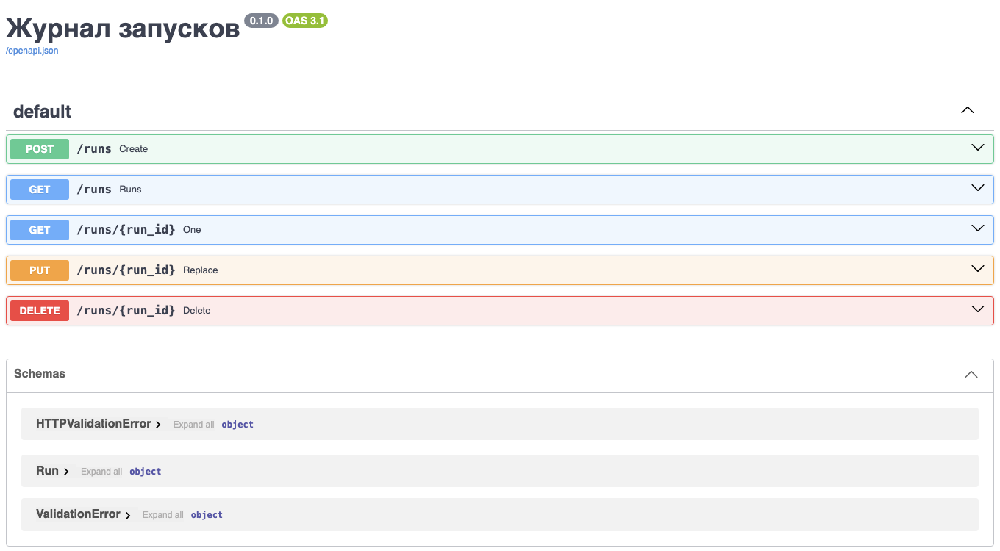

# Веб-технологии

Почти всё сетевое взаимодействие программ в работе физика происходит на прикладном уровне. Каталог наблюдений и база публикаций отвечают на запросы HTTP данными в JSON, таблица параметров установки нередко существует только как веб-страница, а журнал запусков удобно открыть коллегам в виде небольшого веб-сервиса, к которому они обращаются из своих скриптов.

В настоящей главе рассматриваются прикладные протоколы — система доменных имён, HTTP и TLS — и работа с ними из Python: сокет, библиотеки requests и httpx, скрапинг страниц и обращение к API, а также собственный веб-сервис на FastAPI, перед которым работает nginx. Адреса, маршруты, порты и протокол TCP, поверх которых работают эти протоколы, рассмотрены в главе [«Компьютерные сети»](./net.md).

Листинги главы выполнены на той же машине, что и листинги главы «Компьютерные сети», — виртуальной машине под Ubuntu 24.04 с Python 3.12, requests 2.34, httpx 0.28, FastAPI 0.142, uvicorn 0.54, curl 8.5 и nginx 1.31, на которой записаны демонстрации лекции «Введение в веб»; выводы повтора запроса и асинхронных запросов взяты из этих записей. Серверы слушают петлевой адрес 127.0.0.1, поэтому на другой машине выводы те же, кроме времени и случайных номеров портов, а также ответов серверов в интернете. Пример с публичным API INSPIRE-HEP выполнен на рабочем компьютере под Python 3.11 с той же версией requests.

## Прикладной уровень

> **Слайды к главе.** DNS и DNS поверх HTTPS, устройство URL, запрос и ответ HTTP, методы и коды состояния, TLS и собственный сертификат изложены также в четвёртой части лекции «Введение в веб» с демонстрациями в терминале; слайды лекции доступны [на сайте книги](https://phys-dev.github.io/soft-dev-book/slides/lecture-12.html#/sec-http) и [в PDF](https://github.com/phys-dev/soft-dev-book/releases/latest/download/soft-dev-book-lecture-12.pdf).

<iframe src="../slides/lecture-12.html#/sec-http" title="Слайды лекции «Введение в веб»: DNS, HTTP и TLS" loading="lazy" allowfullscreen style="width:100%; aspect-ratio:16/10; border:0; border-radius:6px"></iframe>

На прикладном уровне работают сами программы и их протоколы: DNS переводит имена в адреса, HTTP переносит данные, TLS их шифрует.

### DNS: из имён в адреса

Компьютеры адресуют друг друга числами, а люди — именами. Связь между ними обеспечивает **система доменных имён** (DNS), представляющая собой распределённую базу с иерархией зон. Рассмотрим путь запроса: программа обращается к рекурсивному резолверу: провайдера, институтскому или публичному, например `1.1.1.1`. Тот при необходимости опрашивает корневой сервер, получает от него адреса серверов зоны `com`, от них — адреса серверов домена `example.com`, и уже авторитетный сервер домена сообщает искомую запись. Ответ кешируется на время TTL, указанное в записи, поэтому повторный запрос резолвер обслуживает из кеша, а изменение записи распространяется не мгновенно, а по мере истечения TTL в кешах.

```text
программа ──► рекурсивный резолвер ──► корневой сервер    : серверы зоны com
              (кеш на время TTL)   ──► сервер зоны com    : серверы example.com
                                   ──► сервер example.com : запись A
```

Чаще всего встречаются следующие типы записей.

| Тип | Что содержит |
|---|---|
| `A` / `AAAA` | адрес IPv4 / IPv6 для имени |
| `CNAME` | псевдоним, отсылающий к другому имени |
| `MX` | почтовые серверы домена с приоритетами |
| `TXT` | произвольный текст; используется для проверки владения доменом и правил почты SPF |

DNS является самым частым источником жалоб «ничего не работает». Прежде чем искать ошибку в собственной программе, необходимо проверить командой `dig example.com` или `nslookup example.com`, разрешается ли имя.

Обычные запросы DNS идут по UDP открытым текстом, и любой узел на пути может их прочитать или подменить. DNS поверх HTTPS (DoH) передаёт тот же вопрос внутри HTTPS. Стандартный вид, который используют браузеры, описан в RFC 8484: запрос и ответ передаются двоичным сообщением DNS с типом `application/dns-message`. Резолверы Cloudflare и Google предлагают, кроме того, собственный формат с ответом в JSON, удобный для программ; воспользуемся им из Python.

```python
import requests

DOH = 'https://1.1.1.1/dns-query'
TYPES = {1: 'A', 5: 'CNAME', 15: 'MX', 28: 'AAAA'}

for name, rtype in [('example.com', 'A'), ('www.github.com', 'A'), ('gmail.com', 'MX')]:
    r = requests.get(DOH, params={'name': name, 'type': rtype},
                     headers={'Accept': 'application/dns-json'}, timeout=5)
    r.raise_for_status()
    for rec in r.json()['Answer']:
        print(rec['name'], rec['TTL'], TYPES[rec['type']], rec['data'])
```

    example.com 252 A 104.20.23.154
    example.com 252 A 172.66.147.243
    www.github.com 3569 CNAME github.com.
    github.com 29 A 140.82.121.4
    gmail.com 277 MX 10 alt1.gmail-smtp-in.l.google.com.
    gmail.com 277 MX 40 alt4.gmail-smtp-in.l.google.com.
    gmail.com 277 MX 20 alt2.gmail-smtp-in.l.google.com.
    gmail.com 277 MX 5 gmail-smtp-in.l.google.com.
    gmail.com 277 MX 30 alt3.gmail-smtp-in.l.google.com.

В каждой строке — имя, оставшееся время жизни записи в кеше резолвера в секундах, тип и значение. Имя `www.github.com` оказалось псевдонимом: запись CNAME указывает на `github.com`, и резолвер сразу добавил его адрес. У `gmail.com` пять почтовых серверов с приоритетами от 5 до 40; отправитель почты пробует сначала сервер с наименьшим числом.

Сама программа разрешает имя функцией `socket.getaddrinfo`, которая пользуется тем же механизмом, что и все программы системы: файлом `/etc/hosts` и резолвером. В отличие от `socket.gethostbyname`, работающей только с IPv4, она возвращает адреса обоих семейств. В стандартной установке Ubuntu файл `/etc/hosts` сопоставляет имени `localhost` только адрес 127.0.0.1, а петлевой адрес IPv6 записан под именем `ip6-localhost`:

```python
import socket

for name in ('localhost', 'ip6-localhost'):
    for family, _, _, _, addr in socket.getaddrinfo(name, 8000, proto=socket.IPPROTO_TCP):
        print(name, family.name, addr)
```

    localhost AF_INET ('127.0.0.1', 8000)
    ip6-localhost AF_INET6 ('::1', 8000, 0, 0)

### URL: адрес ресурса

Адрес, вводимый в браузер, устроен по единой схеме (RFC 3986).

```text
схема://хост:порт/путь?запрос#фрагмент
https://api.example.org:443/v1/runs?limit=10#top
```

Каждая часть предназначена своему уровню. Схема `https` означает HTTP поверх TLS. Имя хоста DNS превращает в IP-адрес. Порт указывает транспортному уровню программу, слушающую на сервере, и обычно опускается: для `https` подразумевается 443, для `http` — 80. Путь и параметры запроса адресуют конкретный ресурс и передаются серверу. Фрагмент после решётки на сервер не отправляется и нужен только браузеру, чтобы прокрутить страницу к нужному месту. Первая часть называется схемой, а не протоколом, потому что не все адреса относятся к вебу: `ftp://ftp.example.org/files`, `mailto:user@example.org`, `file:///home/user/data.csv`.

Символы, недопустимые в адресе, кодируются процентами: байт записывается знаком `%` и двумя шестнадцатеричными цифрами, пробел — как `%20`, а кириллица — байтами своей кодировки UTF-8. В параметрах запроса, собранных по правилам HTML-форм, пробел записывается знаком `+`; так поступает и requests. Разбор и сборку адресов обеспечивает модуль `urllib.parse`.

```python
from urllib.parse import quote, urlsplit

import requests

u = urlsplit('https://api.example.org:443/v1/runs?limit=10#top')
print(u.scheme, u.hostname, u.port, u.path, u.query, u.fragment)
print(quote('/data/ток 1.csv'))
req = requests.Request('GET', 'https://api.example.org/v1/runs',
                       params={'q': 'beam current', 'limit': 10}).prepare()
print(req.url)
```

    https api.example.org 443 /v1/runs limit=10 top
    /data/%D1%82%D0%BE%D0%BA%201.csv
    https://api.example.org/v1/runs?q=beam+current&limit=10

### HTTP: обмен с сервером

На HTTP основано почти всё сетевое взаимодействие программ. Клиент отправляет запрос, сервер отвечает. Состояния между запросами протокол не хранит, каждый запрос самодостаточен. В HTTP/1.1 запрос и ответ представляют собой текст; HTTP/2 (RFC 9113) и HTTP/3 (RFC 9114) передают те же поля в двоичных кадрах, а смысл сообщений у всех версий общий (RFC 9110).

#### HTTP-запрос и ответ

Запрос состоит из стартовой строки с методом, путём и версией протокола, заголовков вида «имя: значение», пустой строки и необязательного тела. Строки разделяются парой символов CR LF, которые `cat -A` показывает как `^M$`. В HTTP/1.1 обязателен заголовок `Host`: на одном адресе работает много сайтов, и сервер выбирает нужный по имени. Именно так устроен файл `req.txt`, созданный командой `printf` при разборе рукопожатия TCP в главе [«Компьютерные сети»](./net.md); отправим его тому же серверу, который раздаёт каталог `www` с файлом `hello.txt` и запущен там же командой `python3 -m http.server 8000 --bind 127.0.0.1 --directory www`. Утилита `nc` открывает TCP-соединение с портом 8000 и передаёт файл как есть.

```bash
$ cat -A req.txt
GET /hello.txt HTTP/1.1^M$
Host: localhost^M$
^M$
$ nc 127.0.0.1 8000 < req.txt
HTTP/1.0 200 OK
Server: SimpleHTTP/0.6 Python/3.12.3
Date: Sat, 03 Oct 2026 03:51:39 GMT
Content-type: text/plain
Content-Length: 13
Last-Modified: Sat, 03 Oct 2026 03:51:23 GMT

pulse 4.2 mA
```

Ответ устроен так же: статусная строка с версией и кодом, заголовки, пустая строка и тело, длину которого задаёт `Content-Length`, здесь — 13 байт. Встроенный сервер отвечает версией HTTP/1.0 на запрос HTTP/1.1 и после ответа закрывает соединение. Ключ `-v` утилиты `curl` показывает обмен с обеих сторон: строки со знаком `>` — отправленный запрос, со знаком `<` — полученный ответ.

```bash
$ curl -sv http://127.0.0.1:8000/nope 2>&1 | grep -E '^[<>] '
> GET /nope HTTP/1.1
> Host: 127.0.0.1:8000
> User-Agent: curl/8.5.0
> Accept: */*
>
< HTTP/1.0 404 File not found
< Server: SimpleHTTP/0.6 Python/3.12.3
< Date: Sat, 03 Oct 2026 03:51:39 GMT
< Connection: close
< Content-Type: text/html;charset=utf-8
< Content-Length: 335
<
```

#### Методы

Первое слово запроса — **метод**, он сообщает серверу, что требуется сделать с ресурсом.

| Метод | Действие | Безопасный | Идемпотентный |
|---|---|---|---|
| `GET` | получить ресурс | да | да |
| `HEAD` | получить только заголовки | да | да |
| `POST` | отправить данные, создать ресурс | нет | нет |
| `PUT` | создать или заменить ресурс целиком | нет | да |
| `PATCH` | изменить часть ресурса | нет | не обязательно |
| `DELETE` | удалить ресурс | нет | да |

Безопасный метод не меняет состояния сервера, поэтому `GET` и `HEAD` можно выполнять без опасений, а их ответы разрешено кешировать. Идемпотентный метод при повторе оставляет сервер в том же состоянии, что и один запрос, хотя ответ может отличаться: повторный `DELETE` того же ресурса получает `404`, потому что ресурса уже нет. Поэтому клиенты и посредники автоматически повторяют после обрыва связи только идемпотентные запросы (RFC 9110, разд. 9.2.2). С `POST` так поступать нельзя: повторённый запрос создаст вторую запись. `PATCH` идемпотентен, только если так устроен сервер.

#### Коды состояния

Самым информативным в ответе является трёхзначный код в статусной строке. Достаточно помнить значение первой цифры:

| Код | Смысл | Типичные представители |
|---|---|---|
| `1xx` | информационные | 100 Continue |
| `2xx` | успех | 200 OK, 201 Created, 204 No Content |
| `3xx` | перенаправление или указание взять сохранённую копию | 301 Moved Permanently, 302 Found, 304 Not Modified |
| `4xx` | ошибка клиента | 400 Bad Request, 401 Unauthorized, 403 Forbidden, 404 Not Found, 408 Request Timeout, 422 Unprocessable Content, 429 Too Many Requests |
| `5xx` | ошибка сервера | 500 Internal Server Error, 502 Bad Gateway, 503 Service Unavailable, 504 Gateway Timeout |

Отметим смысл наиболее частых кодов. Код `201` сообщает, что ресурс создан, `204` — что запрос выполнен и тела в ответе нет. При перенаправлении клиент идёт по адресу из заголовка `Location`, а `304` не перенаправляет: он отвечает на условный запрос и сообщает, что копия, сохранённая у клиента, ещё действительна. Код `401` означает, что требуется аутентификация, а `403` — что доступ запрещён, даже если клиент предъявил свои данные. Код `422` (прежнее название — Unprocessable Entity) означает, что запрос понят, но данные не прошли проверку. Коды `502` и `504` возвращает промежуточный сервер, когда сервер за ним ответил некорректно или не ответил вовсе.

Повтор имеет смысл при временных ошибках — `408`, `429`, `502`, `503`, `504` и обрыве соединения — и только для идемпотентных запросов либо запросов с ключом идемпотентности, по которому сервер распознаёт повторённый запрос. Пауза перед повтором растёт экспоненциально и со случайным разбросом, чтобы клиенты, получившие отказ одновременно, не повторяли запросы тоже одновременно, а число попыток ограничено; при `429` и `503` выжидают столько, сколько сервер указал в заголовке `Retry-After`. Остальные коды `4xx` и `5xx`, например `400`, `404`, `422`, `500` и `501`, требуют исправить запрос или сервер: повтор того же запроса их не устранит. Повторы, ключи идемпотентности и выбор пауз подробно рассматриваются в главе [«Системный дизайн»](./system-design.md).

### TLS: буква S в HTTPS

Обычный HTTP передаёт всё открытым текстом, включая пароли и токены, и любой узел на пути видит и может изменить содержимое. Протокол **TLS**, являющийся преемником SSL, обеспечивает шифрование соединения и проверку подлинности сервера по сертификату. Сертификат связывает имя сайта с открытым ключом и подписан удостоверяющим центром. Клиент проверяет подписи по цепочке промежуточных сертификатов до корневого, которому он доверяет; список доверенных корневых сертификатов поставляется с операционной системой или с библиотекой. Так клиент убеждается, что взаимодействует именно с тем сервером, за который тот себя выдаёт.

Версии SSL 2.0 и 3.0 запрещены (RFC 6176, RFC 7568), TLS 1.0 и 1.1 выведены из употребления в 2021 году (RFC 8996); применяются TLS 1.2 и 1.3. Версия 1.3 (RFC 8446) устанавливает защищённый канал за одно время туда и обратно. Удостоверяющий центр Let's Encrypt выдаёт сертификаты бесплатно и автоматически по протоколу ACME (RFC 8555), поэтому HTTPS стал нормой и для небольших сервисов.

Поверх TLS работают и новые версии HTTP. HTTP/2 передаёт много запросов одновременно в одном соединении, каждый в своём потоке, тогда как HTTP/1.1 в постоянном соединении передаёт их только по очереди. Однако все потоки HTTP/2 идут по одному соединению TCP, и потеря одного сегмента задерживает выдачу приложению всех следующих за ним данных. HTTP/3 работает поверх QUIC на UDP: потоки в нём доставляются независимо друг от друга, а установление соединения совмещено с рукопожатием TLS.

#### Собственный сертификат

Внутренний сервис лаборатории часто работает с сертификатом, не подписанным публичным центром: самоподписанным или выданным центром сертификации организации. Покажем работу с таким сертификатом на примере: скрипт `mkcert.sh` создаёт ключ на эллиптической кривой P-256 и самоподписанный сертификат для имени `localhost` сроком на сутки; владелец и издатель такого сертификата совпадают.

```bash
$ cat mkcert.sh
# Самоподписанный сертификат для localhost на сутки
openssl req -x509 -newkey ec -pkeyopt ec_paramgen_curve:P-256 -nodes -days 1 \
    -subj /CN=localhost -addext subjectAltName=DNS:localhost \
    -keyout key.pem -out cert.pem 2>/dev/null
$ sh mkcert.sh
$ openssl x509 -in cert.pem -noout -subject -issuer -enddate
subject=CN = localhost
issuer=CN = localhost
notAfter=Oct  4 03:48:39 2026 GMT
```

Команда `openssl s_server` поднимает TLS-сервер на порту 8443 с простой страницей состояния. Запрос `curl` без дополнительных параметров завершается с кодом выхода 60: сертификат не подписан ни одним доверенным центром, и проверка подлинности не проходит. Ключ `--cacert` указывает файл с сертификатом, которому клиент доверяет, и соединение устанавливается: в журнале `curl` видны версия TLSv1.3, шифр TLS_AES_256_GCM_SHA384, обмен ключами X25519 и владелец сертификата `CN=localhost`.

```bash
$ openssl s_server -accept 8443 -cert cert.pem -key key.pem -www -quiet &
$ curl -s https://localhost:8443/; echo "код выхода $?"
код выхода 60
$ curl -sv --cacert cert.pem https://localhost:8443/ -o /dev/null 2>&1 | grep -E 'SSL connection|subject:|^< HTTP'
* SSL connection using TLSv1.3 / TLS_AES_256_GCM_SHA384 / X25519 / id-ecPublicKey
*  subject: CN=localhost
< HTTP/1.0 200 ok
```

Из Python шифрование добавляется обёрткой поверх обычного сокета. Контекст `ssl.create_default_context` включает проверку сертификата и имени сервера, а аргумент `cafile` добавляет к доверенным свой сертификат.

```python
import socket
import ssl

context = ssl.create_default_context(cafile='cert.pem')
with socket.create_connection(('localhost', 8443)) as sock:
    with context.wrap_socket(sock, server_hostname='localhost') as tls:
        print(tls.version(), tls.cipher()[0])
        tls.sendall(b'GET / HTTP/1.1\r\nHost: localhost\r\nConnection: close\r\n\r\n')
        reply = b''
        while chunk := tls.recv(4096):
            reply += chunk
print(reply.split(b'\r\n', 1)[0])
```

    TLSv1.3 TLS_AES_256_GCM_SHA384
    b'HTTP/1.0 200 ok'

В requests тот же приём обеспечивает аргумент `verify='cert.pem'` или переменная окружения `REQUESTS_CA_BUNDLE` с путём к файлу сертификатов центра организации.

```python
import requests

URL = 'https://localhost:8443/'
try:
    requests.get(URL, timeout=5)
except requests.exceptions.SSLError as err:
    print(type(err).__name__, 'CERTIFICATE_VERIFY_FAILED' in str(err))
r = requests.get(URL, verify='cert.pem', timeout=5)
print(r.status_code, r.reason)
```

    SSLError True
    200 ok

Аргумент `verify=False` отключает проверку целиком: шифрование остаётся, но защиты от подмены сервера больше нет, и любой узел на пути может выдать себя за сервер. В рабочем коде такая настройка недопустима: для внутреннего сервиса достаточно доверить клиенту конкретный сертификат или центр сертификации организации, как показано выше.

## Клиент на Python

> **Слайды к главе.** HTTP через сокет, requests с тайм-аутом и повтором, работа с API, скрапинг страниц и асинхронные запросы httpx изложены также в пятой части лекции «Введение в веб» с демонстрациями в терминале; слайды лекции доступны [на сайте книги](https://phys-dev.github.io/soft-dev-book/slides/lecture-12.html#/sec-client) и [в PDF](https://github.com/phys-dev/soft-dev-book/releases/latest/download/soft-dev-book-lecture-12.pdf).

<iframe src="../slides/lecture-12.html#/sec-client" title="Слайды лекции «Введение в веб»: клиент на Python" loading="lazy" allowfullscreen style="width:100%; aspect-ratio:16/10; border:0; border-radius:6px"></iframe>

Соберём сначала HTTP-запрос вручную: это позволяет увидеть, что протокол представляет собой текст, записанный в открытое TCP-соединение. В дальнейшем достаточно готовых библиотек: requests для обычных запросов и httpx там, где требуется асинхронность.

### HTTP через сокет

Функция `socket.create_connection` открывает соединение, `sendall` отправляет строки запроса, а `recv` в цикле читает ответ, пока сервер не закроет соединение. Одного вызова `recv` недостаточно: он возвращает только те байты, которые уже пришли, а сервер отправляет заголовки и тело отдельными сегментами, как видно в перехвате `tcpdump` в главе [«Компьютерные сети»](./net.md), так что одиночный `recv` нередко получает одни заголовки. Заголовок `Connection: close` просит сервер закрыть соединение после ответа; без него сервер HTTP/1.1 держит соединение открытым, и цикл не завершится. Сервер — тот же `http.server` с файлом `hello.txt`.

```python
import socket

with socket.create_connection(('127.0.0.1', 8000)) as sock:
    sock.sendall(b'GET /hello.txt HTTP/1.1\r\n'
                 b'Host: localhost\r\n'
                 b'Connection: close\r\n'
                 b'\r\n')
    reply = b''
    while chunk := sock.recv(4096):   # b'' означает, что сервер закрыл соединение
        reply += chunk

head, body = reply.split(b'\r\n\r\n', 1)
print(head.decode().splitlines()[0])
print(body)
```

    HTTP/1.0 200 OK
    b'pulse 4.2 mA\n'

Для полноценного клиента пришлось бы найти конец заголовков, дочитать тело по `Content-Length` или по блокам при `Transfer-Encoding: chunked`, учесть кодировку, обработать перенаправления, сжатие и шифрование. Поэтому сокеты остаются для собственных протоколов, например для телеметрии установки или текстовых команд SCPI, которыми управляют осциллографами и генераторами, а HTTP поручают библиотеке.

### Библиотека requests

`requests` берёт на себя соединения, перенаправления, кодировки и разбор JSON. Параметры запроса задаёт словарь `params`, тело в JSON — аргумент `json`, а метод `raise_for_status` превращает ответ с кодом `4xx` или `5xx` в исключение `HTTPError`.

```python
import requests

r = requests.get('http://127.0.0.1:8000/hello.txt', timeout=5)
print(r.status_code, r.headers['Content-Type'], r.encoding)
print(r.text, end='')

r = requests.get('http://127.0.0.1:8000/nope', timeout=5)
print(r.status_code, r.reason)
try:
    r.raise_for_status()
except requests.HTTPError as err:
    print(err)
```

    200 text/plain ISO-8859-1
    pulse 4.2 mA
    404 File not found
    404 Client Error: File not found for url: http://127.0.0.1:8000/nope

Отметим, что аргумент `timeout` обязателен: по умолчанию requests ждёт ответа сколь угодно долго, и зависший сервер останавливает ночной сбор данных навсегда. Кодировка ISO-8859-1 в выводе выбрана потому, что сервер не указал `charset` в заголовке `Content-Type`, а для текстовых типов без `charset` именно её предписывала прежняя редакция стандарта HTTP/1.1 (RFC 2616); к чему это приводит на русских страницах, показано в разделе о скрапинге.

Объект `requests.Session` хранит общие заголовки между запросами и переиспользует открытое TCP-соединение, что позволяет выполнить серию обращений к одному серверу заметно быстрее, чем столько же отдельных вызовов `requests.get`.

#### Тайм-аут и повтор

Повтор с растущей паузой обеспечивает адаптер сессии с объектом `Retry` из библиотеки urllib3, на которой построен requests. Адаптер повторяет запрос при сбоях соединения и при кодах из списка `status_forcelist`, удваивает паузу между попытками и учитывает заголовок `Retry-After`, которым сервер сообщает, сколько ждать, — по умолчанию для кодов `413`, `429` и `503`. При `backoff_factor=0.5` паузы перед повторами составляют 0, 1, 2 и 4 с; аргумент `backoff_jitter` добавляет к каждой случайную добавку, а `total` ограничивает число попыток. По умолчанию `Retry` повторяет только идемпотентные методы — `GET`, `HEAD`, `PUT`, `DELETE`, `OPTIONS` и `TRACE`, — а `POST` не повторяет. Для сбора данных подходит, например, `Retry(total=5, backoff_factor=0.5, backoff_jitter=0.5, status_forcelist=[408, 429, 502, 503, 504])`.

Проверим поведение клиента на ненадёжном сервере. Скрипт `flaky.py` построен на `http.server`: путь `/data` на первые два запроса отвечает `503 Service Unavailable`, а `/slow` отвечает только через 3 с.

```python
"""Ненадёжный сервер: /data дважды отвечает 503, затем 200; /slow отвечает через 3 с."""
import json
import time
from http.server import BaseHTTPRequestHandler, ThreadingHTTPServer

hits = 0


class Handler(BaseHTTPRequestHandler):
    def do_GET(self):
        global hits
        if self.path == "/slow":
            time.sleep(3)
        if self.path == "/data":
            hits += 1
            if hits <= 2:
                self.send_error(503, "Service Unavailable")
                return
        body = json.dumps({"pressure_nPa": 41.7, "hits": hits}).encode()
        self.send_response(200)
        self.send_header("Content-Type", "application/json")
        self.send_header("Content-Length", str(len(body)))
        self.end_headers()
        self.wfile.write(body)


ThreadingHTTPServer(("127.0.0.1", 8000), Handler).serve_forever()
```

Клиент `retry.py` сначала запрашивает `/slow` с тайм-аутом 1 с, а затем `/data` — через сессию с адаптером `Retry`, допускающим четыре повтора при коде `503`.

```python
"""Клиент с таймаутом и повтором запроса при 503."""
import time

import requests
from requests.adapters import HTTPAdapter
from urllib3.util import Retry

URL = "http://127.0.0.1:8000"

try:
    requests.get(f"{URL}/slow", timeout=1)
except requests.Timeout as err:
    print("таймаут 1 с:", type(err).__name__)

session = requests.Session()
retry = Retry(total=4, backoff_factor=0.5, status_forcelist=[503])
session.mount("http://", HTTPAdapter(max_retries=retry))
start = time.perf_counter()
r = session.get(f"{URL}/data", timeout=2)
print(r.status_code, r.json(), f"за {time.perf_counter() - start:.1f} с")
```

```bash
$ python3 flaky.py 2>server.log &
$ python3 retry.py
таймаут 1 с: ReadTimeout
200 {'pressure_nPa': 41.7, 'hits': 3} за 1.0 с
$ cat server.log
127.0.0.1 - - [02/Oct/2026 12:23:18] code 503, message Service Unavailable
127.0.0.1 - - [02/Oct/2026 12:23:18] "GET /data HTTP/1.1" 503 -
127.0.0.1 - - [02/Oct/2026 12:23:18] code 503, message Service Unavailable
127.0.0.1 - - [02/Oct/2026 12:23:18] "GET /data HTTP/1.1" 503 -
127.0.0.1 - - [02/Oct/2026 12:23:19] "GET /data HTTP/1.1" 200 -
```

Запрос к `/slow` прервался исключением `ReadTimeout` через секунду, вместо того чтобы ждать. Запрос к `/data` завершился ответом `200` с третьей попытки: первый повтор выполнен сразу, второй — через секунду, и всё заняло около одной секунды; журнал сервера подтверждает два ответа `503` и один `200`. Без повтора та же программа завершилась бы ошибкой на первом же отказе. В коде, работающем ночью без присмотра, тайм-аут задаётся у каждого запроса, а временные ошибки повторяются с нарастающей случайной паузой и ограниченным числом попыток — только для идемпотентных запросов, — чтобы временный отказ сервера не стоил ночи работы.

### Веб-скрапинг

Не у всякого источника есть интерфейс, удобный для программ. Таблицы параметров установок, архивы наблюдений, списки публикаций и расписания смен часто существуют только как веб-страницы, и данные приходится извлекать разбором разметки.

#### Библиотека BeautifulSoup

Разбирать HTML регулярными выражениями бесполезно: разметка вложенная и часто некорректная. `BeautifulSoup` строит из страницы дерево и позволяет искать в нём по тегам, атрибутам и селекторам CSS. Рассмотрим разбор на учебном сайте: каталог `site` состоит из страницы `magnets.html` с таблицей токов и полей магнитов канала, журнала смены в каталоге `private` и файла `robots.txt`, запрещающего роботам обход этого каталога:

```text
User-agent: *
Disallow: /private/
```

```html
<!doctype html>
<html lang="ru"><head><meta charset="utf-8"><title>Магнитная система канала</title></head>
<body>
<h1>Магнитная система канала</h1>
<table id="magnets">
<tr><th>Элемент</th><th>Ток, А</th><th>Поле, Тл</th></tr>
<tr><td>QD1</td><td>112.5</td><td>0.214</td></tr>
<tr><td>QF1</td><td>98.0</td><td>0.187</td></tr>
<tr><td>BM1</td><td>410.0</td><td>1.230</td></tr>
<tr><td>QD2</td><td>101.2</td><td>0.193</td></tr>
</table>
<p>Обновлено <span class="date">2026-10-02</span>. <a href="/private/log.html">Журнал смены</a></p>
</body></html>
```

Скрипт `scrape.py` сначала читает `robots.txt` модулем `urllib.robotparser` стандартной библиотеки, затем загружает страницу с заголовком `User-Agent`, называющим программу и адрес автора, и разбирает таблицу.

```python
"""Разбор таблицы со страницы с учётом robots.txt."""
from urllib import robotparser

import requests
from bs4 import BeautifulSoup

BASE = "http://127.0.0.1:8000"
AGENT = "phys-dev-scraper/1.0 (student@example.org)"

robots = robotparser.RobotFileParser(BASE + "/robots.txt")
robots.read()
for path in ("/magnets.html", "/private/log.html"):
    print(path, "разрешено" if robots.can_fetch(AGENT, BASE + path) else "запрещено")

page = requests.get(BASE + "/magnets.html", headers={"User-Agent": AGENT}, timeout=5)
print("кодировка по заголовку:", page.encoding)
print("как текст:", repr(BeautifulSoup(page.text, "html.parser").title.get_text()[:12]))
soup = BeautifulSoup(page.content, "html.parser")     # байты: кодировку берёт из <meta>
print("как байты:", soup.title.get_text())
for tr in soup.select("table#magnets tr")[1:]:
    name, current, field = (td.get_text(strip=True) for td in tr.find_all("td"))
    print(f"{name:5} {float(current):7.1f} А {float(field):7.3f} Тл")
```

```bash
$ python3 -m http.server 8000 --bind 127.0.0.1 --directory site >/dev/null 2>&1 &
$ python3 scrape.py
/magnets.html разрешено
/private/log.html запрещено
кодировка по заголовку: ISO-8859-1
как текст: 'Ð\x9cагниÑ\x82'
как байты: Магнитная система канала
QD1     112.5 А   0.214 Тл
QF1      98.0 А   0.187 Тл
BM1     410.0 А   1.230 Тл
QD2     101.2 А   0.193 Тл
```

Страница таблицы разрешена для обхода, журнал смены — запрещён. Сервер не указал `charset` в заголовке `Content-Type`, поэтому requests выбрал кодировку ISO-8859-1, и заголовок страницы, разобранный из `page.text`, превратился в набор знаков; функция `repr` показывает среди них и непечатаемые управляющие символы вида `\x9c`. Байты `page.content` BeautifulSoup декодирует сам, по тегу `<meta charset="utf-8">` страницы, и получает правильный заголовок «Магнитная система канала». Таким образом, разбору передают байты, а не текст.

#### Корректный скрапинг

Скрапингом легко навредить и себе, и чужому серверу. Правила следующие:

1. **Необходимо ознакомиться с `robots.txt`**, файлом в корне сайта, где владелец указывает, что разрешено обходить роботам, а что нет. Технически он ничего не запрещает — это договорённость, но нарушать её не принято.
2. **Между запросами необходимы паузы.** Сотня запросов в секунду с одного адреса неотличима от атаки и приводит к блокировке; для чужого сайта разумен темп не выше запроса в секунду.
3. **Программа должна представляться в заголовке `User-Agent`**, указывая, что это за программа и как связаться с её автором: администратору, читающему журналы, это упрощает работу, а автору снижает вероятность блокировки.
4. **Ошибки должны обрабатываться.** Сеть ненадёжна, и код должен переживать тайм-аут, `503` и изменившуюся вёрстку, а не завершаться посреди ночного сбора данных.
5. **Скачанное кешируется.** Повторный запуск разбора не должен снова загружать те же страницы: так и быстрее, и корректнее по отношению к серверу.

Если у сайта есть API, лучше пользоваться им, а не разбором HTML: вёрстка меняется без предупреждения, объявленный интерфейс — гораздо реже.

### Работа с API

Если у источника есть API, взаимодействие ведётся на языке данных: запрос с параметрами, ответ в JSON, оговорённый набор полей вместо вёрстки, переделываемой при каждой смене дизайна. Как сервисы договариваются между собой и что в таком договоре нарушается, когда сервисов становится много, подробно рассмотрено у Клеппмана [16].

#### Публичные API

Устроены такие интерфейсы одинаково независимо от того, что они отдают, курсы валют, каталог наблюдений или библиографию: адрес сервиса, словарь параметров и, если требуется, ключ доступа. Рассмотрим в качестве примера базу публикаций по физике высоких энергий INSPIRE-HEP, отдающую записи без ключа. Запрос находит статьи коллабораций ATLAS и CMS об открытии бозона Хиггса по их номерам в arXiv, а параметр `fields` оставляет в ответе только нужные поля.

```python
import requests

API = 'https://inspirehep.net/api/literature'
params = {'q': 'arxiv:1207.7214 or arxiv:1207.7235',
          'fields': 'collaborations,publication_info,author_count'}
r = requests.get(API, params=params, timeout=10)
r.raise_for_status()
data = r.json()
print(f"записей: {data['hits']['total']}, размер ответа: {len(r.content)} Б")
for hit in data['hits']['hits']:
    meta = hit['metadata']
    pub = meta['publication_info'][0]
    print(meta['collaborations'][0]['value'], meta['author_count'],
          pub['journal_title'], pub['journal_volume'], pub['page_start'], pub['year'])
```

    записей: 2, размер ответа: 2692 Б
    ATLAS 2932 Phys.Lett.B 716 1 2012
    CMS 2900 Phys.Lett.B 716 30 2012

Без параметра `fields` одна запись статьи ATLAS со списком из 2932 авторов занимает 1,1 МБ, а с ним ответ на обе статьи — 2,7 КБ. Сервис ограничивает частоту запросов квотой: каждому IP-адресу разрешено 15 запросов за 5 с, а превысивший её клиент получает ответ `429 Too Many Requests`. Отклонённые запросы тоже засчитываются в квоту, поэтому после такого ответа выжидают не меньше 5 с. Цикл по тысячам записей замедляют паузой, а постраничную выдачу (параметры `size` и `page`) перебирают по одной странице за запрос.

#### Ключи доступа и OAuth

Многие сервисы выдают доступ только по ключу. Ключ является личным паролем пользователя к сервису, и в коде ему не место: его хранят в переменной окружения или в конфигурации вне репозитория.

Когда речь идёт о личных данных пользователя, простого ключа недостаточно. **OAuth** описывает схему, при которой пользователь не передаёт программе свой пароль. Вместо него сервис выдаёт ей **токен**, ограниченный по правам и по времени и отзываемый в любой момент. Токен прикладывается к каждому запросу в заголовке `Authorization`, и удобнее всего задать его один раз в сессии; адрес архива в примере условный.

```python
import os

import requests


class ApiClient:
    def __init__(self, base_url, token):
        self.base_url = base_url
        self.session = requests.Session()
        self.session.headers['Authorization'] = f'Bearer {token}'

    def get_runs(self, page=1):
        r = self.session.get(f'{self.base_url}/runs', params={'page': page}, timeout=10)
        r.raise_for_status()
        return r.json()


client = ApiClient('https://archive.example.org/api', os.environ['ARCHIVE_TOKEN'])
runs = client.get_runs(page=2)
```

#### Формат JSON

JSON (JavaScript Object Notation) представляет собой текстовый формат обмена данными, почти взаимно однозначно соответствующий словарям и спискам Python: объекты, списки, строки, числа, `true`, `false` и `null`.

```python
import json

record = {'run': 7, 'energy': 5.5, 'currents': [40.1, 39.8], 'ok': True}
text = json.dumps(record)            # сериализация: словарь -> строка JSON
print(text)
print(json.loads(text) == record)    # десериализация: строка JSON -> словарь
```

    {"run": 7, "energy": 5.5, "currents": [40.1, 39.8], "ok": true}
    True

В стандарте JSON нет ни `NaN`, ни бесконечностей. `json.dumps` по умолчанию запишет их как `NaN` и `Infinity`, однако это уже не JSON, и чужой разборщик на такой строке завершится ошибкой; аргумент `allow_nan=False` превращает такую запись в исключение у отправителя.

```python
import json

record = {'run': 7, 'pressure': float('nan'), 'note': None}
print(json.dumps(record))
try:
    json.dumps(record, allow_nan=False)
except ValueError as err:
    print('ValueError:', err)
```

    {"run": 7, "pressure": NaN, "note": null}
    ValueError: Out of range float values are not JSON compliant: nan

Пропуски в измерениях надёжнее кодировать явным `null`. FastAPI по той же причине отвечает кодом `500` на словарь со значением `NaN`, возвращённый обработчиком, а поле модели Pydantic со значением `NaN` записывает в ответ как `null`.

### Асинхронные запросы

Скачать тысячу файлов из архива по одному означает тысячу раз дождаться ответа сервера. Почти всё время такой программы уходит на ожидание сети: процессор простаивает, канал загружен на проценты. Асинхронный код держит много запросов в обработке одновременно и разбирает ответы по мере поступления.

Библиотека `httpx` повторяет интерфейс `requests` и поддерживает оба режима, синхронный `httpx.Client` и асинхронный `httpx.AsyncClient`, так что при переходе код почти не переписывается. Поведение по умолчанию у неё строже: ожидание ограничено 5 с (у requests тайм-аута по умолчанию нет), по перенаправлениям клиент переходит только с аргументом `follow_redirects=True`, а пул клиента держит не больше 100 соединений. HTTP/2 включается пакетом `httpx[http2]` и аргументом `http2=True`.

Оценим выигрыш от асинхронности на сервисе `slow.py` на FastAPI, отвечающем на каждый запрос через 0,2 с. Ожидание в `asyncio.sleep` не занимает процессор, поэтому сервис обслуживает много запросов одновременно.

```python
"""Медленный сервис: каждый ответ готовится 0,2 с."""
import asyncio

from fastapi import FastAPI

app = FastAPI()


@app.get("/delay")
async def delay():
    await asyncio.sleep(0.2)
    return {"ok": True}
```

Скрипт `fetch.py` отправляет ему 20 запросов сначала по очереди, а затем асинхронно, не больше десяти одновременно.

```python
"""20 запросов к медленному сервису: по очереди и асинхронно, не больше 10 одновременно."""
import asyncio
import time

import httpx

URL = "http://127.0.0.1:8001/delay"
N = 20

start = time.perf_counter()
with httpx.Client() as client:
    codes = [client.get(URL).status_code for _ in range(N)]
print(f"по очереди: {time.perf_counter() - start:.2f} с, ответы {set(codes)}")


async def main():
    limit = asyncio.Semaphore(10)
    async with httpx.AsyncClient() as client:
        async def one():
            async with limit:
                return (await client.get(URL)).status_code
        return await asyncio.gather(*(one() for _ in range(N)))

start = time.perf_counter()
codes = asyncio.run(main())
print(f"асинхронно: {time.perf_counter() - start:.2f} с, ответы {set(codes)}")
```

```bash
$ uvicorn slow:app --port 8001 --log-level warning &
$ python3 fetch.py
по очереди: 4.13 с, ответы {200}
асинхронно: 0.47 с, ответы {200}
```

По очереди двадцать запросов заняли 4,13 с — двадцать ожиданий по 0,2 с подряд и немного накладных расходов. Асинхронно — 0,47 с: запросы прошли двумя волнами по десять, и каждая заняла около 0,2 с. Таким образом, выигрыш определяется отношением времени ожидания к времени обработки и ограничен семафором.

Параллелизм необходимо ограничивать явно. Сто одновременных запросов ускоряют сбор данных в десятки раз, тысяча выглядит для чужого сервера как атака. Ограничение требуется и самому клиенту: запрос, ждущий свободного соединения из пула дольше тайм-аута, завершается исключением `httpx.PoolTimeout`. Так, из 800 запросов, одновременно запущенных без семафора к сервису с задержкой ответа 1 с, ответ получили около 300, а около 500 завершились этим исключением. Семафор устраняет обе проблемы: лишние задачи ждут у семафора, а не в пуле соединений.

Последний стабильный выпуск httpx — 0.28.1 (декабрь 2024 года). В 2026 году сопровождение проекта под именем httpx2 приняла компания Pydantic; интерфейс сохранён, а Starlette 1.7 уже рекомендует httpx2 для своего тестового клиента. Устройство `async` и `await` рассматривается в главе [«Асинхронность»](../perf/async.md).

## Собственный веб-сервис

> **Слайды к главе.** REST, сервис на FastAPI с проверкой данных, документация /docs и nginx перед приложением изложены также в шестой части лекции «Введение в веб» с демонстрациями в терминале; слайды лекции доступны [на сайте книги](https://phys-dev.github.io/soft-dev-book/slides/lecture-12.html#/sec-server) и [в PDF](https://github.com/phys-dev/soft-dev-book/releases/latest/download/soft-dev-book-lecture-12.pdf).

<iframe src="../slides/lecture-12.html#/sec-server" title="Слайды лекции «Введение в веб»: свой сервис" loading="lazy" allowfullscreen style="width:100%; aspect-ratio:16/10; border:0; border-radius:6px"></iframe>

Собственный веб-сервис необходим, когда данные или расчёт должны быть доступны другим программам: журнал запусков установки, архив измерений, расчёт по запросу. Коллеги читают такой журнал из своих скриптов, а не просят выгрузку.

### REST: ресурсы и методы

Распространённым стилем таких интерфейсов является REST: ресурс задаётся существительным в пути, например `/runs` и `/runs/2`, действие — методом HTTP, а результат — кодом состояния. Для журнала запусков интерфейс выглядит так:

| Запрос | Действие | Ответ |
|---|---|---|
| `POST /runs` | создать запуск | `201 Created` |
| `GET /runs?min_energy=3` | список с фильтром | `200 OK` |
| `GET /runs/2` | один запуск | `200` или `404` |
| `PUT /runs/2` | заменить запуск целиком | `200` или `404` |
| `DELETE /runs/2` | удалить запуск | `204 No Content` или `404` |

Такой интерфейс понятен без документации и одинаково вызывается из Python, curl и браузера. Обращение к несуществующему запуску возвращает `404`, поэтому повторный `DELETE` отвечает иначе, чем первый, но остаётся идемпотентным: состояние сервера после него то же. В разделе «Одна задача в четырёх хранилищах» главы [«Работа с базами данных»](./bd-work.md) те же четыре операции — чтение, добавление, замена и удаление — реализованы для учебного списка записей поверх четырёх хранилищ; журнал запусков здесь хранится в SQLite.

### Сервис на FastAPI

FastAPI позволяет построить веб-сервис из обычных функций Python с аннотациями типов. Декоратор связывает функцию с методом и путём, параметры пути и строки запроса извлекаются по аннотациям функции, а тело запроса описывается моделью Pydantic с типами и ограничениями полей: энергия пучка положительна, ток неотрицателен. Если пришедшие данные не проходят проверку, FastAPI сам отвечает кодом `422` со списком ошибок, и функция не вызывается. Рассмотрим журнал запусков целиком:

```python
"""Журнал запусков установки: REST-сервис на FastAPI поверх SQLite."""
import sqlite3

from fastapi import FastAPI, HTTPException, Response
from pydantic import BaseModel, Field

app = FastAPI(title="Журнал запусков")
DB = "runs.db"


def sql(query, args=()):
    """Один запрос в своей транзакции: commit при успехе, rollback при ошибке."""
    con = sqlite3.connect(DB)
    try:
        with con:
            cur = con.execute(query, args)
            return cur.fetchall(), cur.lastrowid, cur.rowcount
    finally:
        con.close()


sql("CREATE TABLE IF NOT EXISTS runs (id INTEGER PRIMARY KEY, energy REAL, current REAL)")


class Run(BaseModel):
    energy: float = Field(gt=0, description="энергия пучка, МэВ")
    current: float = Field(ge=0, description="ток пучка, мА")


def as_dict(r):
    return {"id": r[0], "energy": r[1], "current": r[2]}


@app.post("/runs", status_code=201)
def create(run: Run):
    _, new_id, _ = sql("INSERT INTO runs (energy, current) VALUES (?, ?)", (run.energy, run.current))
    return {"id": new_id, **run.model_dump()}


@app.get("/runs")
def runs(min_energy: float = 0):
    rows, _, _ = sql("SELECT * FROM runs WHERE energy >= ?", (min_energy,))
    return [as_dict(r) for r in rows]


@app.get("/runs/{run_id}")
def one(run_id: int):
    rows, _, _ = sql("SELECT * FROM runs WHERE id = ?", (run_id,))
    if not rows:
        raise HTTPException(404, "нет такого запуска")
    return as_dict(rows[0])


@app.put("/runs/{run_id}")
def replace(run_id: int, run: Run):
    _, _, n = sql("UPDATE runs SET energy = ?, current = ? WHERE id = ?", (run.energy, run.current, run_id))
    if n == 0:
        raise HTTPException(404, "нет такого запуска")
    return {"id": run_id, **run.model_dump()}


@app.delete("/runs/{run_id}", status_code=204)
def delete(run_id: int):
    _, _, n = sql("DELETE FROM runs WHERE id = ?", (run_id,))
    if n == 0:
        raise HTTPException(404, "нет такого запуска")
    return Response(status_code=204)
```

Каждая операция с базой открывает своё соединение SQLite и выполняет запрос в рамках отдельной транзакции: блок `with con` фиксирует её при успехе и откатывает при исключении. Обычные, не асинхронные, обработчики FastAPI выполняет в пуле потоков, поэтому отдельное соединение на каждый запрос безопасно и при параллельных запросах. Приложение запускает сервер ASGI uvicorn; аргумент `app:app` означает объект `app` из модуля `app.py`. Проверим сервис из `curl`; переменные `U` и `J` сокращают команды.

```bash
$ uvicorn app:app --port 8000 >uv.log 2>&1 &
$ U=localhost:8000/runs; J='Content-Type: application/json'
$ curl -s -X POST $U -H "$J" -d '{"energy": 2.0, "current": 100}'; echo
{"id":1,"energy":2.0,"current":100.0}
$ curl -s -X POST $U -H "$J" -d '{"energy": 5.5, "current": 40}'; echo
{"id":2,"energy":5.5,"current":40.0}
$ curl -s "$U?min_energy=3"; echo
[{"id":2,"energy":5.5,"current":40.0}]
$ curl -s -X PUT $U/2 -H "$J" -d '{"energy": 5.5, "current": 42}'; echo
{"id":2,"energy":5.5,"current":42.0}
$ curl -s -o /dev/null -w '%{http_code}\n' -X DELETE $U/1
204
$ curl -s -o /dev/null -w '%{http_code}\n' -X DELETE $U/1
404
$ curl -s $U/1; echo
{"detail":"нет такого запуска"}
$ curl -s -X POST $U -H "$J" -d '{"energy": -1, "current": "много"}' | jq -c '.detail[] | [.loc[1], .msg]'
["energy","Input should be greater than 0"]
["current","Input should be a valid number, unable to parse string as a number"]
$ grep HTTP uv.log
INFO:     127.0.0.1:53754 - "POST /runs HTTP/1.1" 201 Created
INFO:     127.0.0.1:53760 - "POST /runs HTTP/1.1" 201 Created
INFO:     127.0.0.1:53776 - "GET /runs?min_energy=3 HTTP/1.1" 200 OK
INFO:     127.0.0.1:53786 - "PUT /runs/2 HTTP/1.1" 200 OK
INFO:     127.0.0.1:53794 - "DELETE /runs/1 HTTP/1.1" 204 No Content
INFO:     127.0.0.1:53802 - "DELETE /runs/1 HTTP/1.1" 404 Not Found
INFO:     127.0.0.1:53816 - "GET /runs/1 HTTP/1.1" 404 Not Found
INFO:     127.0.0.1:53818 - "POST /runs HTTP/1.1" 422 Unprocessable Entity
```

Запуски получили идентификаторы 1 и 2, фильтр `min_energy=3` оставил второй, `PUT` заменил его данные. Первый `DELETE` удалил запуск 1 и ответил `204` без тела, второй — `404`: запуска уже нет. Запрос с отрицательной энергией и током «много» до функции не дошёл: FastAPI ответил `422` и перечислил обе ошибки. Журнал uvicorn показывает каждый запрос с методом, путём и кодом состояния.

### Документация интерфейса

Из тех же аннотаций и описаний полей FastAPI строит описание интерфейса в формате OpenAPI по адресу `/openapi.json` и интерактивную документацию по адресам `/docs` и `/redoc`; воспользуемся ими.

```bash
$ curl -s localhost:8000/openapi.json | jq -c '.paths | map_values(keys)'
{"/runs":["get","post"],"/runs/{run_id}":["delete","get","put"]}
$ curl -s localhost:8000/openapi.json | jq -c '.components.schemas.Run.properties.energy'
{"type":"number","exclusiveMinimum":0.0,"title":"Energy","description":"энергия пучка, МэВ"}
$ curl -s -o /dev/null -w '%{http_code}\n' localhost:8000/docs
200
```

В схеме поля `energy` ограничение `gt=0` записано как `exclusiveMinimum`, а описание взято из аргумента `description` функции `Field`. Страница `/docs` (Swagger UI) перечисляет пять операций с методами и путями, модель `Run` с полями `energy` и `current` и схемы ошибок проверки. Каждую операцию можно развернуть и выполнить прямо из браузера: кнопка Try it out открывает поля для ввода, а Execute отправляет запрос и показывает ответ вместе с эквивалентной командой `curl`. По машиночитаемому описанию `/openapi.json` строятся клиенты на других языках.



### nginx перед приложением

Перед приложением обычно ставят **обратный прокси-сервер** (reverse proxy), чаще всего nginx. Он принимает соединения клиентов, завершает TLS, раздаёт статические файлы, ограничивает частоту запросов и передаёт запросы к API приложению, а при нескольких копиях приложения распределяет между ними нагрузку. Приложение при этом слушает только внутренний адрес, и клиент обменивается данными только с nginx. Конфигурация ниже отвечает на корневой путь сама, а пути с префиксом `/api/` передаёт приложению на порту 8000.

```nginx
server {
    listen 8080;
    location /api/ {
        proxy_pass http://127.0.0.1:8000/;
        proxy_set_header X-Forwarded-For $remote_addr;
    }
    location / {
        return 200 "nginx: статика, /api/ — приложению\n";
    }
}
```

Если в адресе директивы `proxy_pass` указан путь, здесь — одна косая черта, nginx заменяет им часть пути запроса, совпавшую с `location`: запрос `/api/runs` уходит приложению как `/runs`. Без пути, в записи `proxy_pass http://127.0.0.1:8000;`, запрос ушёл бы с исходным путём `/api/runs`. Решает именно указанный путь: `proxy_pass http://127.0.0.1:8000/v1/;` превратил бы `/api/runs` в `/v1/runs`. Заголовок `X-Forwarded-For` передаёт приложению адрес настоящего клиента, иначе в журнале приложения все запросы будут от nginx.

Запустим nginx в контейнере из образа `nginx:alpine` с сетью хоста, подключив файл конфигурации томом (см. главу [«Docker»](./docker.md)).

```bash
$ uvicorn app:app --port 8000 >uv.log 2>&1 &
$ docker run -d --rm --name proxy --network host -v $PWD/nginx.conf:/etc/nginx/conf.d/default.conf:ro nginx:alpine >/dev/null
$ J='Content-Type: application/json'
$ curl -s localhost:8080/
nginx: статика, /api/ — приложению
$ curl -s -X POST localhost:8080/api/runs -H "$J" -d '{"energy": 2.0, "current": 100}'; echo
{"id":1,"energy":2.0,"current":100.0}
$ curl -s -D - -o /dev/null localhost:8080/api/runs | grep -i -E '^(HTTP|server)'
HTTP/1.1 200 OK
Server: nginx/1.31.6
$ curl -s -D - -o /dev/null localhost:8000/runs | grep -i -E '^(HTTP|server)'
HTTP/1.1 200 OK
server: uvicorn
$ docker logs proxy 2>&1 | grep HTTP
127.0.0.1 - - [03/Oct/2026:03:49:25 +0000] "GET / HTTP/1.1" 200 54 "-" "curl/8.5.0" "-"
127.0.0.1 - - [03/Oct/2026:03:49:25 +0000] "POST /api/runs HTTP/1.1" 201 37 "-" "curl/8.5.0" "-"
127.0.0.1 - - [03/Oct/2026:03:49:25 +0000] "GET /api/runs HTTP/1.1" 200 39 "-" "curl/8.5.0" "-"
$ grep HTTP uv.log
INFO:     127.0.0.1:0 - "POST /runs HTTP/1.1" 201 Created
INFO:     127.0.0.1:0 - "GET /runs HTTP/1.1" 200 OK
INFO:     127.0.0.1:60440 - "GET /runs HTTP/1.1" 200 OK
```

Ответ на запрос `/api/runs` пришёл от приложения, но с заголовком `Server: nginx/1.31.6`: заголовок `Server` приложения nginx клиенту не передаёт и подставляет свой, тогда как прямой запрос к uvicorn получает `server: uvicorn`. В журнале nginx записаны все три запроса с исходными путями, а в журнале приложения — пути без префикса `/api`. Адрес клиента `127.0.0.1:0` в журнале uvicorn взят из заголовка `X-Forwarded-For`: номера порта заголовок не содержит, поэтому записан ноль, а для прямого запроса в журнале указан настоящий порт клиента.

Uvicorn по умолчанию доверяет заголовку `X-Forwarded-For` в запросах с петлевого адреса, то есть от посредника на той же машине. Поэтому существенно, кто этот заголовок формирует:

```bash
$ curl -s -H 'X-Forwarded-For: 203.0.113.5' localhost:8000/runs >/dev/null
$ curl -s -H 'X-Forwarded-For: 203.0.113.5' localhost:8080/api/runs >/dev/null
$ grep HTTP uv.log | tail -2
INFO:     203.0.113.5:0 - "GET /runs HTTP/1.1" 200 OK
INFO:     127.0.0.1:0 - "GET /runs HTTP/1.1" 200 OK
$ docker rm -f proxy >/dev/null
```

Прямой запрос с поддельным заголовком записан в журнал под чужим адресом 203.0.113.5, а тот же заголовок, присланный через nginx, заменён настоящим адресом соединения: директива `proxy_set_header` перезаписывает его. Таким образом, приложение за посредником слушает только внутренний адрес, недоступный клиентам напрямую, а адресу из заголовка доверяет лишь тогда, когда заголовок сформировал посредник. В цепочке из нескольких посредников вместо `$remote_addr` используют переменную `$proxy_add_x_forwarded_for`, дописывающую адрес к уже пришедшему заголовку.

Такая схема — nginx снаружи, приложение на внутреннем порту — лежит в основе задания курса, приведённого в конце главы. В Compose наружу публикуется только порт nginx, а приложение доступно лишь соседям по сети Compose (см. раздел о видимости портов в главе [«Docker»](./docker.md)).

## Резюме

Таким образом, на прикладном уровне программа сначала превращает имя сервера в адрес средствами DNS, затем по соединению TCP обменивается с сервером сообщениями HTTP, а TLS обеспечивает шифрование этого обмена и проверку подлинности сервера. Запрос и ответ HTTP/1.1 представляют собой текст: метод, путь и заголовки в запросе, код состояния и заголовки в ответе. Безопасные и идемпотентные методы допускают повтор, а повторять имеет смысл только временные ошибки — `408`, `429`, `502`, `503`, `504` и обрыв соединения — с нарастающей паузой и ограниченным числом попыток. Сертификат внутреннего сервиса добавляется к доверенным явно, а не отключением проверки.

Из инструментов Python достаточно трёх: `requests` с тайм-аутом и повтором для обычных запросов, `httpx` там, где требуется асинхронность, и FastAPI для собственного сервиса, перед которым работает nginx. Сокеты необходимы для понимания того, что происходит под библиотеками, и для собственных протоколов приборов. Порядок проверки уровней при неисправности приведён в резюме главы [«Компьютерные сети»](./net.md): разрешение имени проверяется одним из первых, а содержимое ответа сервера — последним, командой `curl -v`.

## Упражнения

1. Написать клиент к публичному API, например к INSPIRE-HEP, с тайм-аутом, повтором временных ошибок и паузой между запросами, при которой не превышается квота сервиса.
2. Добавить к журналу запусков метод `PATCH` и фильтр по току и проверить их через страницу `/docs`.
3. Поставить журнал запусков за nginx с шифрованием: подключить сертификат из раздела о TLS директивами `listen 8443 ssl`, `ssl_certificate` и `ssl_certificate_key` и проверить запрос командой `curl --cacert cert.pem`.

## Полезные ссылки

- J. Kurose, K. Ross. [Computer Networking: A Top-Down Approach](https://gaia.cs.umass.edu/kurose_ross/), 9-е изд. — Pearson, 2026, учебник по сетям, начинающийся с прикладного уровня;
- [MDN Web Docs: HTTP](https://developer.mozilla.org/ru/docs/Web/HTTP), справочник по методам, заголовкам и кодам состояния;
- [RFC 9110](https://www.rfc-editor.org/rfc/rfc9110) (семантика HTTP), [RFC 8446](https://www.rfc-editor.org/rfc/rfc8446) (TLS 1.3) и [RFC 8484](https://www.rfc-editor.org/rfc/rfc8484) (DNS поверх HTTPS), первоисточники по протоколам главы;
- документация [requests](https://requests.readthedocs.io), [httpx](https://www.python-httpx.org), [FastAPI](https://fastapi.tiangolo.com) и [nginx](https://nginx.org/ru/docs/);
- [INSPIRE REST API](https://github.com/inspirehep/rest-api-doc), описание запросов, полей и квоты базы INSPIRE-HEP.

> **Задание.** Поставить перед приложением nginx и выяснить, почему запрос не доходит: [«Деплой стартапа „Котики в мир“»](../practicum/kitty-startup-task.md).
