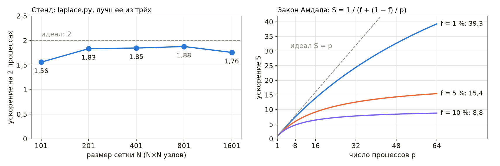

# Кластеры и воспроизводимое окружение для расчётов

Глава [«CUDA и вычисления на GPU»](./cuda.md) подводит итог разделу лестницей ускорения. Её первые ступени — профилирование, проверка алгоритма, векторизация, компиляция, распараллеливание на процессоре и перенос на видеокарту — используют ресурсы одной машины всё полнее, а последней ступени, кластеру, посвящена настоящая глава. Расчёт, которому одной машины недостаточно, переносится на **вычислительный кластер** — набор машин с общей файловой системой и быстрой сетью, ресурсы которого распределяет планировщик. Типичных случаев два. В первом расчёт состоит из сотен независимых частей: скан параметров магнитной оптики, серия Монте-Карло детектора с разными зёрнами, обработка тысяч файлов с установки. Во втором один расчёт настолько велик, что его приходится делить между процессами на разных узлах, и процессы обмениваются данными на каждом шаге: задачи электродинамики, расчёт пучка с пространственным зарядом, решение уравнения Пуассона на большой сетке.

Перенос на кластер ставит ещё две задачи, о которых на рабочем компьютере задумываться не приходится. Окружение расчёта — версии Python, NumPy и системных библиотек — на узлах кластера иное, и результат, полученный на рабочем компьютере, должен воспроизводиться там без изменений. Машины, на которых выполняются расчёты, — узлы кластера, стенды, компьютеры сбора данных — необходимо настраивать одинаково и повторяемо, иначе через год никто не скажет, чем одна машина отличается от другой.

В настоящей главе рассматриваются планировщик Slurm и устройство кластера, массивы задач для независимых расчётов, библиотека MPI и её привязка к Python mpi4py для связанных расчётов, контейнеры Apptainer для воспроизводимого окружения и система управления конфигурацией Ansible; в завершение кратко описаны Kubernetes и Terraform и пределы их применимости к физическим расчётам. Сквозным примером служат расчёты ускорительной лаборатории: скан токов квадрупольного дублета, Монте-Карло эффективности сцинтилляционного счётчика и расчёт электростатического потенциала в камере. Листинги на Python выполнены на macOS под Python 3.12 с NumPy 2.5.3, mpi4py 4.1.2 и Open MPI 5.0.11 из колеса PyPI. Демонстрации лекции «Кластеры и воспроизводимое окружение для расчётов» записаны на виртуальной машине с Ubuntu 24.04 (процессор ARM64, два ядра), на которой развёрнут одноузловой учебный кластер, далее называемый стендом: Slurm 23.11.4, Open MPI 4.1.6 из пакетов Ubuntu, NumPy 2.5.3 и mpi4py 4.1.2 в окружении Python 3.12.3, Apptainer 1.5.4 и ansible-core 2.21.4. На стенде выполнены пакетные скрипты, команды Slurm и Apptainer и плейбуки главы, а числа со ссылкой на демонстрацию к лекции взяты из этих записей.

> **Слайды к главе.** Планировщик и Slurm, массивы задач, MPI из Python, образы Apptainer, Ansible, Kubernetes и Terraform изложены также в лекции «Кластеры и воспроизводимое окружение для расчётов» с демонстрациями в терминале; слайды лекции доступны [на сайте книги](https://phys-dev.github.io/soft-dev-book/slides/lecture-21.html#/cover) и [в PDF](https://github.com/phys-dev/soft-dev-book/releases/latest/download/soft-dev-book-lecture-21.pdf).

<iframe src="../slides/lecture-21.html#/cover" title="Слайды лекции «Кластеры и воспроизводимое окружение для расчётов»" loading="lazy" allowfullscreen style="width:100%; aspect-ratio:16/10; border:0; border-radius:6px"></iframe>

## Вычислительный кластер и планировщик

> **Слайды к главе.** Устройство кластера, планировщик и очередь, резервирование и заполнение промежутков изложены также в первой части лекции «Кластеры и воспроизводимое окружение для расчётов» с демонстрацией в терминале; слайды лекции доступны [на сайте книги](https://phys-dev.github.io/soft-dev-book/slides/lecture-21.html#/sec-cluster) и [в PDF](https://github.com/phys-dev/soft-dev-book/releases/latest/download/soft-dev-book-lecture-21.pdf).

<iframe src="../slides/lecture-21.html#/sec-cluster" title="Слайды лекции «Кластеры и воспроизводимое окружение для расчётов»: вычислительный кластер и планировщик" loading="lazy" allowfullscreen style="width:100%; aspect-ratio:16/10; border:0; border-radius:6px"></iframe>

### Устройство кластера

Вычислительный кластер состоит из машин нескольких назначений. **Узел входа** (login node) является точкой подключения пользователей по ssh: на нём редактируют программы, собирают их и ставят задачи в очередь, но не считают. **Вычислительные узлы** выполняют задачи; на крупных кластерах их сотни и тысячи, часть из них оснащена видеокартами. На **управляющем узле** работает планировщик: он принимает задачи, ведёт очередь и следит за состоянием узлов. Все узлы видят **общую файловую систему**. Обычно она представлена двумя областями: домашним каталогом с небольшой квотой и резервными копиями и рабочей областью (scratch) — большой и быстрой, без резервных копий и с периодической очисткой. Для небольших кластеров применяется NFS, для крупных — параллельные файловые системы наподобие Lustre. Узлы соединены быстрой сетью (InfiniBand или Ethernet с RDMA), по которой процессы одного расчёта обмениваются данными. Программное обеспечение на узлах обычно подключается модулями окружения (`module load gcc openmpi`), что позволяет держать на кластере несколько версий компиляторов и библиотек одновременно.

Различают два режима использования. **HPC** (high-performance computing) — плотно связанные расчёты, один расчёт занимает много узлов, и процессы обмениваются данными на каждом шаге; для них важны быстрая сеть и одновременный запуск всех процессов. **HTC** (high-throughput computing) — множество независимых задач, каждая на одном-двух ядрах; для них важна пропускная способность очереди. Физика высоких энергий исторически опирается на HTC — обработку событий детектора, — а расчёты плазмы и пучков с самосогласованным полем требуют HPC.

### Планировщик и очередь

Ресурсы кластера распределяет **планировщик** (batch scheduler, менеджер ресурсов). Пользователь не выбирает узел сам: он отправляет задачу — скрипт и запрос ресурсов, то есть число ядер, объём памяти, лимит времени, число узлов и видеокарт. Планировщик ставит задачу в очередь и запускает её, когда запрошенные ресурсы освобождаются; на время работы задачи они принадлежат только ей. Порядок запуска определяется приоритетом, в котором учитываются время ожидания, размер задачи и справедливая доля (fair-share): пользователь, много считавший в последние дни, ждёт дольше. Лимит времени является обещанием пользователя: задача, превысившая его, снимается.

Наиболее распространённым планировщиком в научных вычислениях является Slurm, разработанный в Ливерморской национальной лаборатории имени Лоуренса с 2002 года [56] и развиваемый компанией SchedMD; в декабре 2025 года SchedMD купила компания NVIDIA, объявившая, что Slurm останется открытым программным обеспечением, не привязанным к оборудованию одного производителя. Применяются также OpenPBS и PBS Pro, HTCondor (массовая обработка, в том числе в CERN) и LSF. Kubernetes, о котором сказано в конце главы, распределяет ресурсы между долгоживущими службами и для пакетных расчётов на кластере используется реже.

### Резервирование и заполнение промежутков

Простейшая очередь запускает задачи строго по порядку (FIFO). Её недостаток виден, когда в очереди находится большая задача: пока для неё освобождаются ядра, остальные ядра простаивают, хотя следом за ней ждут небольшие задачи. Планировщики поэтому применяют **заполнение промежутков** (backfill). В схеме EASY первой задаче очереди резервируется ближайший момент, когда для неё освободится достаточно ядер, а следующие задачи запускаются раньше неё при условии, что по запрошенному лимиту времени они закончатся до резерва или займут ядра, которые резерву не нужны. Существенно, что планировщик знает только лимит, а не фактическую длительность задачи. Slurm поступает осторожнее: задачу с меньшим приоритетом он запускает раньше, только если она не сдвигает ожидаемого старта ни одной из более приоритетных задач (консервативная схема), а ожидаемое время старта задачи, ждущей в очереди, сообщает команда `squeue --start`.

Рассмотрим модель: восемь задач поставлены в очередь на 8 ядер одновременно, у каждой заданы число ядер, фактическая длительность и лимит. Третий вариант отличается от второго единственной задачей H, которая запросила 120 минут «с запасом» вместо достаточных ей 20.

```python
CORES = 8
JOBS = [("A", 4, 60, 60), ("B", 8, 30, 40), ("C", 2, 20, 30), ("D", 2, 50, 60),
        ("E", 4, 10, 15), ("F", 1, 40, 45), ("G", 6, 30, 35), ("H", 2, 15, 20)]


def simulate(jobs, backfill):
    """Старт и конец каждой задачи; все задачи поставлены в очередь в момент 0."""
    queue, running, start, t = list(jobs), [], {}, 0
    while queue or running:
        free = CORES - sum(r[2] for r in running)
        while queue and queue[0][1] <= free:          # голова очереди помещается
            name, cores, run, limit = queue.pop(0)
            running.append((t + run, t + limit, cores))
            start[name], free = t, free - cores
        if backfill and queue:                        # резерв для головы очереди
            avail = free
            for _, end_limit, cores in sorted(running, key=lambda r: r[1]):
                avail += cores
                if avail >= queue[0][1]:
                    reserve, spare = end_limit, avail - queue[0][1]
                    break
            for job in list(queue[1:]):
                name, cores, run, limit = job
                in_time = t + limit <= reserve
                if cores <= free and (in_time or cores <= spare):
                    queue.remove(job)
                    running.append((t + run, t + limit, cores))
                    start[name], free = t, free - cores
                    spare -= 0 if in_time else cores
        t = min(r[0] for r in running)                # следующее завершение
        running = [r for r in running if r[0] > t]
    return {n: (start[n], start[n] + run) for n, _, run, _ in jobs}


padded = [(n, c, r, 120 if n == "H" else lim) for n, c, r, lim in JOBS]
print("вариант                ожидание, мин  конец, мин  загрузка  старт H, мин")
for title, jobs, bf in [("FIFO", JOBS, False), ("backfill", JOBS, True),
                        ("backfill, H просит 120", padded, True)]:
    s = simulate(jobs, bf)
    wait = sum(v[0] for v in s.values()) / len(s)
    end = max(v[1] for v in s.values())
    busy = sum(c * r for _, c, r, _ in jobs) / (CORES * end)
    print(f"{title:<22} {wait:13.1f} {end:11d} {busy:9.0%} {s['H'][0]:13d}")
```

    вариант                ожидание, мин  конец, мин  загрузка  старт H, мин
    FIFO                            88.8         170       67%           140
    backfill                        45.0         130       88%            20
    backfill, H просит 120          58.8         145       78%           130

Большая задача B, занимающая все 8 ядер, в обоих случаях стартует в 60 минут, когда завершается задача A, но при заполнении промежутков задачи C, D и H успевают выполниться до неё. Среднее ожидание сокращается с 88,8 до 45,0 минуты, загрузка ядер растёт с 67 до 88 %. Если же задача H запрашивает 120 минут, она уже не помещается в промежуток до резерва и стартует на 110 минут позже. Таким образом, точный лимит времени выгоден прежде всего самому пользователю. Для системы в целом завышенные оценки обходятся дешевле, чем можно ожидать: моделирование заполнения промежутков на нагрузке машин IBM SP2 привело к неожиданному результату — при оценках, завышенных в несколько раз, средние показатели очереди даже улучшаются [62]. Проигрывает же задача, запросившая лишнее.


## Slurm

> **Слайды к главе.** Службы и команды Slurm, пакетный скрипт, ресурсы и лимиты, учёт изложены также во второй части лекции «Кластеры и воспроизводимое окружение для расчётов» с демонстрациями в терминале; слайды лекции доступны [на сайте книги](https://phys-dev.github.io/soft-dev-book/slides/lecture-21.html#/sec-slurm) и [в PDF](https://github.com/phys-dev/soft-dev-book/releases/latest/download/soft-dev-book-lecture-21.pdf).

<iframe src="../slides/lecture-21.html#/sec-slurm" title="Слайды лекции «Кластеры и воспроизводимое окружение для расчётов»: Slurm" loading="lazy" allowfullscreen style="width:100%; aspect-ratio:16/10; border:0; border-radius:6px"></iframe>

### Устройство и команды

Slurm состоит из нескольких служб. Контроллер **slurmctld** ведёт очередь, планирует запуск и следит за состоянием узлов. На каждом вычислительном узле работает **slurmd**, который запускает процессы задачи через вспомогательную программу slurmstepd. Подлинность сообщений между ними обеспечивает служба **munge**, использующая общий ключ, одинаковый на всех узлах. Необязательная служба **slurmdbd** записывает учёт выполненных задач в базу MySQL или MariaDB. Узлы объединяются в **разделы** (partitions), которые выполняют роль очередей с собственными лимитами: короткие отладочные задачи, длинные расчёты, узлы с видеокартами.

В терминологии Slurm **задача** (job) представляет собой выделение ресурсов, **шаг** (step) — запуск программы внутри выделения командой `srun`, а **процессы шага** (tasks) — экземпляры этой программы; у задачи из одного шага на одном ядре все три понятия совпадают, у расчёта MPI на нескольких узлах — нет. Пользователь работает с кластером следующими командами.

| Команда | Назначение |
|---|---|
| `sinfo` | состояние разделов и узлов |
| `squeue` | очередь: задачи, их состояние и причина ожидания |
| `sbatch скрипт` | постановка пакетной задачи |
| `srun программа` | запуск шага; вне выделения — выделение и запуск сразу |
| `salloc` | выделение ресурсов для интерактивной работы |
| `scancel номер` | снятие задачи |
| `scontrol show job номер` | подробные сведения о задаче или узле |
| `sacct` | учёт завершённых задач |

Состояние задачи обозначается кратким кодом: PD — ожидает (с причиной, например `Resources` — ресурсы заняты, `Priority` — впереди более приоритетные задачи, `Dependency` — ждёт другую задачу), R — выполняется, CG — завершается, CD — завершена успешно, F — завершилась с ошибкой, CA — снята, TO — превысила лимит времени, OOM — превысила память.

### Пакетный скрипт

Задача описывается скриптом командной оболочки, в начале которого строки `#SBATCH` задают запрос ресурсов. Для оболочки эти строки являются комментариями, а `sbatch` читает из них параметры, как если бы они были переданы в командной строке.

```bash
#!/bin/bash
#SBATCH --job-name=hello
#SBATCH --cpus-per-task=1
#SBATCH --mem=100M
#SBATCH --time=00:01:00
#SBATCH --output=hello-%j.out
# Первая задача: что планировщик выделил и что видит процесс
echo "задача $SLURM_JOB_ID, узел $SLURMD_NODENAME, раздел $SLURM_JOB_PARTITION"
echo "ядер: $SLURM_CPUS_ON_NODE, память: $SLURM_MEM_PER_NODE МБ"
python3 -c 'import os; print("доступны ядра:", sorted(os.sched_getaffinity(0)))'
sleep 5
```

Задача ставится в очередь командой `sbatch hello.sh`, которая печатает её номер; `%j` в имени файла вывода заменяется этим номером. Переменные окружения `SLURM_JOB_ID`, `SLURMD_NODENAME`, `SLURM_CPUS_ON_NODE`, `SLURM_MEM_PER_NODE` сообщают программе, что ей выделено. По умолчанию задача наследует окружение командной оболочки, из которой её поставили (`--export=ALL`), поэтому `python3` в задаче тот же, что был найден при постановке, — например, интерпретатор виртуального окружения. Последняя строка Python показывает ядра, на которых процессу разрешено выполняться: при включённом ограничении ядер планировщик оставляет задаче ровно одно ядро из двух, даже если узел свободен.

В демонстрации к лекции на стенде, конфигурация которого приведена ниже, эти команды дали следующий вывод:

```bash
sinfo
sbatch slurm/hello.sh
sleep 6; cat hello-*.out
```

    PARTITION AVAIL  TIMELIMIT  NODES  STATE NODELIST
    main*        up    1:00:00      1   idle lab
    Submitted batch job 60
    задача 60, узел lab, раздел main
    ядер: 1, память: 100 МБ
    доступны ядра: [0]

Команда `sinfo` показывает единственный раздел `main` (звёздочка отмечает раздел по умолчанию) с лимитом времени 1 ч и свободным узлом `lab`. Задача получила одно ядро и 100 МБ памяти, как и запрошено, а её процессу разрешено выполняться только на ядре 0.

Стенду соответствует следующая конфигурация одноузлового кластера: узел `lab` с двумя ядрами в одном сокете, которому для задач отведено 3000 МБ из 3,9 ГБ памяти машины, один раздел `main` с лимитом времени 1 ч, ограничение ядер и памяти через cgroups и журнал завершения задач в текстовом файле. Строку описания узла удобно получить командой `slurmd -C`, которая печатает конфигурацию оборудования в формате slurm.conf, и уменьшить в ней `RealMemory`, оставив часть памяти системе.

```ini
ClusterName=lab
SlurmctldHost=lab
SlurmUser=slurm
AuthType=auth/munge
SlurmctldPidFile=/run/slurmctld/slurmctld.pid
SlurmdPidFile=/run/slurm/slurmd.pid
StateSaveLocation=/var/lib/slurm/slurmctld
SlurmdSpoolDir=/var/lib/slurm/slurmd
SlurmctldLogFile=/var/log/slurm/slurmctld.log
SlurmdLogFile=/var/log/slurm/slurmd.log
SchedulerType=sched/backfill
SelectType=select/cons_tres
SelectTypeParameters=CR_Core_Memory
DefMemPerCPU=500
ProctrackType=proctrack/cgroup
TaskPlugin=task/cgroup,task/affinity
JobAcctGatherType=jobacct_gather/cgroup
JobCompType=jobcomp/filetxt
JobCompLoc=/var/log/slurm/jobcomp.log
MpiDefault=none
ReturnToService=2
NodeName=lab CPUs=2 CoresPerSocket=2 RealMemory=3000 State=UNKNOWN
PartitionName=main Nodes=lab Default=YES MaxTime=01:00:00 State=UP
```

Параметр `SelectTypeParameters=CR_Core_Memory` заставляет планировщик распределять ядра и память, а `DefMemPerCPU` задаёт память по умолчанию для задач, в которых она не запрошена; без него такая задача получила бы всю память узла, и вторая задача ждала бы, хотя ядро для неё свободно. Файл `cgroup.conf` рядом включает ограничения строками `CgroupPlugin=cgroup/v2`, `ConstrainCores=yes`, `ConstrainRAMSpace=yes` и `ConstrainSwapSpace=yes`.

### Ресурсы, лимиты и учёт

Запрос ресурсов различает процессы и потоки. Параметр `--ntasks` задаёт число процессов — его используют программы MPI; `--cpus-per-task` — число ядер на процесс, то есть потоки OpenMP или библиотеки BLAS, которой пользуется NumPy. Число потоков необходимо согласовать с запросом явно, например `export OMP_NUM_THREADS=$SLURM_CPUS_PER_TASK`. Библиотека OpenBLAS, с которой собраны колёса NumPy для Linux, и среда OpenMP компилятора GCC по умолчанию запускают столько потоков, сколько ядер разрешено процессу: при ограничении ядер через cgroups это выделенные задаче ядра, а без такого ограничения — все ядра узла, и потоки задачи занимают ядра чужих задач. Функция `os.cpu_count()` возвращает число ядер узла в любом случае, поэтому пул процессов `multiprocessing`, размер которого в Python 3.12 выбирается по ней, делит между процессами одно выделенное ядро; число разрешённых ядер даёт `len(os.sched_getaffinity(0))`, а в Python 3.13 — функция `os.process_cpu_count()`. Память запрашивается на узел (`--mem`) или на ядро (`--mem-per-cpu`).

Выделение обеспечивается механизмом cgroups ядра Linux, описанным в главе [«Внутреннее устройство Linux»](../linux/structure.md): процессы задачи помещаются в отдельную группу с ограничением ядер (`cpuset`) и памяти (`memory.max`). Процесс, превысивший память, завершается ядром по нехватке памяти, а задача получает состояние OUT_OF_MEMORY; задача, превысившая лимит времени, снимается с состоянием TIMEOUT. Запрос, превышающий возможности раздела в целом, например четыре ядра в разделе из одного двухъядерного узла, как на стенде, при значении по умолчанию `EnforcePartLimits=NO` не отклоняется: задача принимается и остаётся в очереди с причиной `PartitionConfig`, пока её не снимут или не изменят конфигурацию раздела. Значения `ANY` и `ALL` заставляют контроллер отклонять такую задачу сразу при постановке, как и задачи, превышающие ограничения раздела по размеру и времени. Если же ядер в разделе достаточно, но ни на одном узле их нет в нужном числе, задача отклоняется при постановке при любом значении параметра: «CPU count per node can not be satisfied». Запрос «с запасом» выполним, но обходится дорого: задача дольше ждёт освобождения ресурсов, не помещается в промежутки и занимает место, которое могли бы использовать другие.

В демонстрации к лекции на стенде с двумя ядрами задача, запросившая четыре ядра, была принята и осталась в очереди, а из двух следующих задач по два ядра одна выполнялась, а другая ждала освобождения ресурсов (ключ `--wrap` превращает строку команды в пакетный скрипт):

```bash
sbatch -c 4 --wrap hostname
for i in 1 2; do sbatch -c 2 --wrap 'sleep 10'; done
squeue -o '%.5i %.8j %.2t %.6M %R'
```

    Submitted batch job 61
    Submitted batch job 62
    Submitted batch job 63
    JOBID     NAME ST   TIME NODELIST(REASON)
       63     wrap PD   0:00 (Resources)
       61     wrap PD   0:00 (PartitionConfig)
       62     wrap  R   0:00 lab

После снятия ожидающих задач командой `scancel -t PD -u student` в очередь поставлена задача, которой запрошено 200 МБ памяти, а сценарий `hog.py` занимает память блоками по 50 МиБ:

```bash
sbatch --mem=200M --wrap 'python3 hog.py 400'
sleep 12; cat slurm-*.out | tail -4 | fold -sw 78
```

    Submitted batch job 64
    занято 100 МиБ
    занято 150 МиБ
    Killed
    slurmstepd-lab: error: Detected 1 oom_kill event in StepId=64.batch. Some of
    the step tasks have been OOM Killed.

Процесс завершён ядром при попытке занять четвёртый блок: вместе с самим интерпретатором он превысил бы запрошенный объём. Завершённые задачи контроллер показывает ещё `MinJobAge` секунд (по умолчанию 300 с), и команда `squeue -t all` выводит их итоговые состояния:

```bash
squeue -t all -o '%.5i %.8j %.14T %.6M'
```

    JOBID     NAME          STATE   TIME
       61     wrap      CANCELLED   0:00
       63     wrap      CANCELLED   0:00
       62     wrap      COMPLETED   0:10
       60    hello      COMPLETED   0:05
       64     wrap  OUT_OF_MEMORY   0:00

Подбирать запрос по измерениям позволяет учёт. Команда `sacct` показывает для завершённых задач номер, состояние, время старта и длительность, код завершения и пиковую память (`MaxRSS`), по которой выбирают `--mem`; среди дополнительных программ из исходных текстов Slurm (каталог `contribs`) есть сценарий `seff`, сравнивающий запрошенное с использованным, — многие центры его устанавливают, в пакеты Ubuntu он не входит. Запрашивают обычно с запасом, например на 20 % больше измеренной памяти и в полтора раза больше измеренного времени. Такой учёт ведёт служба slurmdbd с базой данных. На небольшом кластере или стенде без неё задачи записываются только в журнал завершения (`JobCompType=jobcomp/filetxt`): одна строка на задачу с её состоянием и временами, без сведений о шагах и памяти. Команда `sacct -c` читает этот журнал, но в Slurm 23.11 — только от имени root и пользователя, под которым работает контроллер (`SlurmUser`): загружая модуль журнала, она открывает файл на дописывание, и у обычного пользователя завершается сообщением «sacct: fatal: open /var/log/slurm/jobcomp.log: Permission denied», хотя читать журнал разрешено всем. Поэтому на стенде для просмотра последних задач достаточно команды `squeue -t all`, а сценарий `timeline.py` из демонстрации к лекции строит диаграмму массива задач, читая журнал напрямую.

### Правила общего кластера

Кластер разделяют десятки пользователей, и у всех центров коллективного пользования похожие правила. На узле входа не выполняют расчёты: их отправляют в очередь, а для интерактивной работы запрашивают узел командой `salloc` или `srun --pty bash`. Сессию `tmux` на узле входа, описанную в главе [«Инструменты Linux»](../linux/tools.md), используют для интерактивной работы, а не для многочасового счёта. Данные расчёта размещают в рабочей области, а результаты своевременно забирают, поскольку рабочую область чистят. Тысячи мелких задач по несколько секунд не ставят по отдельности: их объединяют в массив, а работу — в порции, рассчитанные на минуты, поскольку каждая задача проходит через планировщик и между завершением одной задачи и запуском следующей проходит порядка секунды (в демонстрации к лекции — от 1 до 3 с). Квоты ограничивают не только объём файлов, но и их число, поэтому миллион маленьких файлов результата хуже одного файла HDF5. Окружение берут из модулей кластера или переносят своё — виртуальным окружением либо образом контейнера, о котором сказано ниже.

## Массивы задач и сканы параметров

> **Слайды к главе.** Массивы задач, скан токов дублета со сбором по зависимости и зёрна генератора изложены также в третьей части лекции «Кластеры и воспроизводимое окружение для расчётов» с демонстрациями в терминале; слайды лекции доступны [на сайте книги](https://phys-dev.github.io/soft-dev-book/slides/lecture-21.html#/sec-array) и [в PDF](https://github.com/phys-dev/soft-dev-book/releases/latest/download/soft-dev-book-lecture-21.pdf).

<iframe src="../slides/lecture-21.html#/sec-array" title="Слайды лекции «Кластеры и воспроизводимое окружение для расчётов»: массивы задач" loading="lazy" allowfullscreen style="width:100%; aspect-ratio:16/10; border:0; border-radius:6px"></iframe>

### Массив задач

Большая часть расчётов в лаборатории состоит из независимых частей: точки скана параметров, серии Монте-Карло с разными зёрнами, файлы запусков установки. Для них в Slurm предусмотрен **массив задач**, который позволяет поставить в очередь множество однотипных задач одной командой: строка `#SBATCH --array=0-11` превращает один скрипт в двенадцать задач, каждая из которых получает свой номер в переменной `SLURM_ARRAY_TASK_ID`. Отображение номера на параметр выполняет сама программа — по формуле или по строке таблицы параметров. Суффикс `%2` (`--array=0-11%2`) ограничивает число одновременно выполняемых задач массива, а в имени файла вывода `%A` заменяется номером массива и `%a` — номером задачи в нём. Задачи массива независимы, и порядок их выполнения не гарантирован. Наибольший номер задачи определяется параметром `MaxArraySize` конфигурации, по умолчанию равным 1001, то есть допустимы номера от 0 до 1000.

```bash
#!/bin/bash
#SBATCH --job-name=scan
#SBATCH --array=0-11
#SBATCH --cpus-per-task=1
#SBATCH --mem=300M
#SBATCH --time=00:05:00
#SBATCH --output=logs/scan-%A_%a.out
# Строка k двумерного скана токов дублета: I_F = 2k А, I_D = 0…24 А
python3 scan_point.py "$SLURM_ARRAY_TASK_ID" results/
```

Начиная с версии 23.02 Slurm сам создаёт недостающий каталог для файлов вывода; в более ранних версиях задача с несуществующим каталогом в пути вывода завершается ошибкой, и каталоги `logs` и `results` на таких кластерах необходимо создавать заранее. Результаты всех задач собирает отдельная задача, которой задана зависимость: `sbatch --dependency=afterok:ID collect.sh` запускает сбор после успешного завершения всех задач массива с номером ID; номер удобно получить при постановке массива ключом `--parsable`, печатающим только его. Программа сбора проверяет, что ни одна точка не пропущена, — задача массива может завершиться по нехватке памяти или по лимиту времени, и её результат тогда отсутствует.

### Скан токов дублета

Рассмотрим подбор токов квадрупольного дублета, проводящего пучок электронов с кинетической энергией 5 МэВ через коллиматор радиусом 3 мм. Магнитная жёсткость пучка составляет \\(B\rho = p/e \approx 0{,}0183\\) Тл·м. Линзы QF и QD длиной 0,1 м считаются тонкими; градиент пропорционален току, \\(G = g I\\) с \\(g = 0{,}02\\) Тл/(м·А), и оптическая сила линзы равна \\(1/f = G L_q / (B\rho)\\). Линза QF фокусирует пучок по \\(x\\) и дефокусирует по \\(y\\), линза QD — наоборот. Пучок на входе гауссов, с эмиттансом 1 мм·мрад в каждой плоскости, функциями Твисса \\(\beta = 2\\) м, \\(\alpha = -1\\) и разбросом импульса 2 %; из-за разброса импульса сила линз у разных частиц различна, и доля прошедших частиц определяется методом Монте-Карло, а не по формулам для огибающей.

```python
import numpy as np

T, MC2 = 5.0, 0.51099895                       # кинетическая энергия и mc², МэВ
BRHO = np.sqrt(T**2 + 2 * T * MC2) * 1e6 / 299_792_458.0   # жёсткость, Тл·м
L0, D, L1, LQ, G = 0.5, 0.3, 1.5, 0.1, 0.02    # м, м, м, м, Тл/(м·А)
A, EMIT, BETA, ALPHA, DP = 3e-3, 1e-6, 2.0, -1.0, 0.02


def transmission(i_f, i_d, n, rng):
    """Доля частиц, прошедших коллиматор радиусом A после дублета QF–QD."""
    u = rng.standard_normal((5, n))
    x, y = np.sqrt(EMIT * BETA) * u[0], np.sqrt(EMIT * BETA) * u[2]
    xp = np.sqrt(EMIT / BETA) * (u[1] - ALPHA * u[0])
    yp = np.sqrt(EMIT / BETA) * (u[3] - ALPHA * u[2])
    kf = G * i_f * LQ / BRHO / (1 + DP * u[4])  # 1/f линз с учётом разброса импульса
    kd = G * i_d * LQ / BRHO / (1 + DP * u[4])
    x, y = x + L0 * xp, y + L0 * yp
    xp, yp = xp - kf * x, yp + kf * y          # QF: фокусирует по x
    x, y = x + D * xp, y + D * yp
    xp, yp = xp + kd * x, yp - kd * y          # QD: фокусирует по y
    x, y = x + L1 * xp, y + L1 * yp
    return np.count_nonzero(x * x + y * y < A * A) / n


print(f"Bρ = {BRHO:.4f} Тл·м; ток QF 18 А, 10⁶ частиц на точку")
for i_d in range(15, 24):
    p = transmission(18.0, float(i_d), 10**6, np.random.default_rng([2026, i_d]))
    print(f"I_D = {i_d} А: прошло {100 * p:5.2f} % ± {100 * np.sqrt(p * (1 - p) / 1e6):.2f} %")
```

    Bρ = 0.0183 Тл·м; ток QF 18 А, 10⁶ частиц на точку
    I_D = 15 А: прошло 73.59 % ± 0.04 %
    I_D = 16 А: прошло 84.01 % ± 0.04 %
    I_D = 17 А: прошло 91.74 % ± 0.03 %
    I_D = 18 А: прошло 94.59 % ± 0.02 %
    I_D = 19 А: прошло 94.73 % ± 0.02 %
    I_D = 20 А: прошло 93.72 % ± 0.02 %
    I_D = 21 А: прошло 89.71 % ± 0.03 %
    I_D = 22 А: прошло 81.05 % ± 0.04 %
    I_D = 23 А: прошло 70.19 % ± 0.05 %

Функция переносит частицы через дрейф, линзу QF, промежуток, линзу QD и дрейф до коллиматора и возвращает долю частиц внутри апертуры; погрешность оценки равна \\(\sqrt{p(1-p)/N}\\). При токе QF 18 А наибольшая доля, около 94,7 %, достигается при токе QD 18–19 А. Одна строка скана из девяти точек вычисляется за доли секунды, а полная карта по двум токам с \\(4 \cdot 10^{6}\\) частиц в точке — строка за строкой — оказывается естественной работой для массива: задача \\(k\\) вычисляет строку с током QF \\(2k\\) А и 25 значениями тока QD и записывает её в файл `results/row-KK.json`.

В демонстрации к лекции массив из 12 таких задач и задача сбора поставлены в очередь стенда так:

```bash
J=$(sbatch --parsable slurm/scan.sh); echo $J
squeue -o '%.10i %.6j %.2t %.6M %R'
sbatch -d afterok:$J slurm/collect.sh
```

    79
         JOBID   NAME ST   TIME NODELIST(REASON)
     79_[2-11]   scan PD   0:00 (Resources)
          79_0   scan  R   0:01 lab
          79_1   scan  R   0:01 lab
    Submitted batch job 82

Две задачи массива выполняются, остальные десять ждут освобождения ядер и показаны одной строкой; задача сбора поставлена с зависимостью от массива (`-d` — краткая форма `--dependency`). Каждая задача считала от 2,8 до 3,0 с, в сумме 35 с, программа сбора нашла все 12 строк, и наибольшая доля прошедших частиц, 94,78 %, получена при токах QF 18 А и QD 19 А. По журналу завершения задачи шли парами: первая пара — с 0 до 3 с от постановки массива, вторая — с 6 до 9 с, последняя — с 19 до 22 с, и одновременно выполнялось не более двух задач. Промежутки между парами, 3 с после первой и около 1 с далее, приходятся на задержку планировщика между завершением одних задач и запуском следующих, поэтому 35 с счёта заняли на двух ядрах 22 с, а не около 18. Таким образом, при задачах длительностью в несколько секунд задержка планировщика сравнима со счётом. Журнал хранит время с точностью до секунды, так что длительности на диаграмме округлены.


### Зёрна генератора

Задачи массива Монте-Карло должны получать независимые последовательности случайных чисел, и способ задания зерна влияет на результат сильнее, чем может показаться. Скопированный в каждую задачу сценарий с фиксированным зерном даёт одинаковые результаты во всех задачах. Зерно, взятое из текущего времени с точностью до секунды, на кластере повторяется, поскольку задачи массива стартуют почти одновременно: в демонстрации к лекции они стартовали парами в одну и ту же секунду. Надёжный способ в NumPy состоит в передаче генератору последовательности из общего зерна расчёта и номера задачи: `np.random.default_rng([seed, k])` строит по ней с помощью `SeedSequence` независимые потоки и при этом остаётся воспроизводимым.

Оценим последствия на модели. Пусть восемь задач считают эффективность сцинтилляционного счётчика NaI(Tl) размером 2″×2″ для точечного изотропного источника на оси на расстоянии 10 см, по 200 000 квантов каждая, а линейный коэффициент ослабления в кристалле принят равным 0,29 1/см, что близко к значению для γ-квантов 662 кэВ, около 0,28 1/см. Квант регистрируется, если он входит в кристалл через переднюю грань и взаимодействует на пути \\(L\\) внутри него с вероятностью \\(1 - e^{-\mu L}\\). Точное значение эффективности вычисляется квадратурой по косинусу угла вылета, и с ним сравнивается среднее по восьми задачам.

```python
import statistics

import numpy as np

R, T, H, MU = 2.54, 5.08, 10.0, 0.29          # кристалл 2″×2″, источник в 10 см, μ в 1/см
C0 = H / np.hypot(H, R)                        # cosθ направления на край передней грани


def path(c):
    """Путь кванта в кристалле при cosθ = c > C0: выход через заднюю грань или боковую."""
    tan = np.sqrt(1 - c * c) / c
    z = np.where((H + T) * tan <= R, H + T, R / np.maximum(tan, 1e-300))
    return (z - H) / c


def efficiency(seed, n=200_000):
    rng = np.random.default_rng(seed)
    c = rng.uniform(-1, 1, n)                  # изотропный источник
    p = 1 - np.exp(-MU * path(c[c > C0]))      # вероятность взаимодействия
    return np.count_nonzero(rng.random(p.size) < p) / n


cgrid = np.linspace(C0, 1, 2_000_001)[1:]
exact = 0.5 * (1 - C0) * np.mean(1 - np.exp(-MU * path(cgrid)))
starts = [1759651200 + s for s in (0, 0, 0, 1, 1, 1, 1, 2)]   # старт задач, с
ways = {"одно зерно 42": [42] * 8, "зерно = время старта": starts,
        "[зерно скана, номер]": [[20261005, k] for k in range(8)]}
print(f"квадратура {100 * exact:.4f} %")
for name, seeds in ways.items():
    eff = [efficiency(s) for s in seeds]
    m, sem = statistics.fmean(eff), statistics.stdev(eff) / 8**0.5
    dev = f"{(m - exact) / sem:+.1f} σ" if sem else "погрешность 0"
    print(f"{name:<21} различных {len(set(eff))}, среднее {100 * m:.4f} %, {dev}")
```

    квадратура 0.8808 %
    одно зерно 42         различных 1, среднее 0.8890 %, погрешность 0
    зерно = время старта  различных 3, среднее 0.8672 %, -2.5 σ
    [зерно скана, номер]  различных 8, среднее 0.8776 %, -0.5 σ

При одинаковом зерне восемь задач дают один и тот же результат, разброс между ними равен нулю, и погрешность, оценённая по разбросу, тоже равна нулю — хотя истинная погрешность одной задачи около 0,02 %. При зерне из времени старта различных результатов только три: задачи, стартовавшие в одну секунду, повторяют друг друга, погрешность занижена, и среднее отклоняется от точного значения на 2,5 погрешности. Последовательность из общего зерна и номера задачи даёт восемь независимых результатов, и отклонение среднего (−0,5 погрешности) согласуется со статистикой. Таким образом, зерно задачи необходимо выводить из её номера, а не из времени, и записывать в файл результата вместе с версиями Python и NumPy.

Версии существенны. Политика совместимости NumPy гарантирует одинаковую последовательность чисел для одного и того же зерна при одной сборке библиотеки, в одном окружении и на одной машине; между версиями и платформами в редких случаях возможны отличия, а методы распределений объекта `Generator` могут меняться сильнее, чем потоки битовых генераторов. В демонстрациях к лекции сборки NumPy 2.5.3 для macOS и для Linux на процессорах ARM64 дали одинаковые числа и в этой модели, и в расчётах скана и эффективности счётчика, однако политика совместимости этого не обещает. Воспроизводимость результата на другом компьютере поэтому обеспечивается не только зерном, но и зафиксированным окружением, которому посвящён раздел о контейнерах.

## MPI из Python

> **Слайды к главе.** Модель передачи сообщений, обмен точка-точка, коллективные операции, разбиение области, ускорение и запуск под Slurm изложены также в четвёртой части лекции «Кластеры и воспроизводимое окружение для расчётов» с демонстрациями в терминале; слайды лекции доступны [на сайте книги](https://phys-dev.github.io/soft-dev-book/slides/lecture-21.html#/sec-mpi) и [в PDF](https://github.com/phys-dev/soft-dev-book/releases/latest/download/soft-dev-book-lecture-21.pdf).

<iframe src="../slides/lecture-21.html#/sec-mpi" title="Слайды лекции «Кластеры и воспроизводимое окружение для расчётов»: MPI из Python" loading="lazy" allowfullscreen style="width:100%; aspect-ratio:16/10; border:0; border-radius:6px"></iframe>

### Модель передачи сообщений

Массив задач подходит для независимых расчётов. Если же части расчёта обмениваются данными на каждом шаге, как при решении уравнения поля на сетке, разделённой между узлами, необходима модель с явной передачей данных между процессами. Стандартом такой модели является MPI (Message Passing Interface) [57]. Программа MPI запускается в нескольких экземплярах одновременно — обычно одна и та же программа (модель SPMD), — и каждый процесс получает свой номер, **ранг**, в коммуникаторе `COMM_WORLD`, объединяющем все процессы. Общей памяти у процессов нет: данные передаются сообщениями, и процессы могут находиться на разных узлах. Распространены две реализации стандарта — Open MPI и MPICH, обе свободные. В июне 2025 года утверждён стандарт MPI 5.0, впервые определивший единый двоичный интерфейс (ABI): программа, собранная с одной реализацией, поддерживающей этот интерфейс, может работать с другой такой реализацией.

Привязкой Python к MPI является пакет mpi4py [58]. Начиная с версии 4.1 (2025 год) он распространяется на PyPI готовыми колёсами для Linux и macOS, которые работают как с системными Open MPI и MPICH, так и с колёсами `openmpi` и `mpich`, устанавливаемыми рядом в то же виртуальное окружение. Программа запускается командой `mpiexec -n 2 python3 программа.py`; модуль `multiprocessing` из главы [«Многопоточность и GIL»](./gil.md) тоже запускает несколько процессов, но только на одной машине и без средств обмена между узлами.

### Обмен точка-точка

Каждое сообщение имеет отправителя, получателя и метку. В mpi4py методы со строчной буквы (`send`, `recv`) передают произвольный объект Python, сериализуя его модулем `pickle`, а методы с прописной (`Send`, `Recv`) передают содержимое буфера — например, массива NumPy — без сериализации; приёмный буфер нужного размера и типа создаётся заранее.

```python
# mpiexec -n 2
import numpy as np
from mpi4py import MPI

comm = MPI.COMM_WORLD
rank = comm.Get_rank()

if rank == 0:
    comm.send({"run": 42, "currents": [18.0, 19.0]}, dest=1, tag=1)  # объект: pickle
    data = np.arange(5, dtype=np.float64)
    comm.Send(data, dest=1, tag=2)                                  # буфер NumPy
    total = comm.recv(source=1, tag=3)
    print(f"процесс 0 из {comm.Get_size()}: процесс 1 вернул сумму {total}")
else:
    params = comm.recv(source=0, tag=1)
    buf = np.empty(5, dtype=np.float64)       # приёмный буфер заранее нужного размера
    comm.Recv(buf, source=0, tag=2)
    comm.send(float(buf.sum()) + params["run"], dest=0, tag=3)
```

    процесс 0 из 2: процесс 1 вернул сумму 52.0

Процесс 0 отправляет словарь параметров и массив, процесс 1 возвращает сумму элементов массива, увеличенную на номер запуска из словаря: \\(0 + 1 + 2 + 3 + 4 + 42 = 52\\). Обмен блокирующий: `recv` ждёт сообщения, а `send` большого сообщения может ждать, пока получатель не начнёт приём. Поэтому два процесса, которые одновременно отправляют друг другу большие сообщения и лишь затем принимают, могут заблокировать друг друга навсегда; встречный обмен записывают одной операцией `Sendrecv` или неблокирующими `Isend` и `Irecv` с последующим ожиданием.

Цена сообщения складывается из задержки и времени передачи данных. В демонстрации к лекции два процесса на двух ядрах стенда обменивались сообщениями разного размера: передача 8 байт буферным методом заняла около 0,4 мкс, 1 МиБ — около 36 мкс (29 ГБ/с через общую память), а те же данные, переданные через `pickle`, — 4,3 и 179 мкс соответственно. Арифметическая операция над числом занимает доли наносекунды, поэтому параллельная программа тем эффективнее, чем реже она обменивается данными и чем крупнее её сообщения; между узлами кластера задержка выше — от единиц микросекунд в специализированных сетях до десятков микросекунд в обычном Ethernet.

### Коллективные операции

Операции, в которых участвуют все процессы коммуникатора, называются коллективными: `bcast` рассылает объект от одного процесса всем, `scatter` раздаёт части, `gather` собирает результаты на одном процессе, `reduce` объединяет значения операцией (сумма, максимум), `allreduce` делает результат доступным всем, `Barrier` синхронизирует процессы. Реализации выполняют их деревом обменов за число шагов порядка \\(\log_2 p\\). Коллективную операцию обязаны вызвать все процессы коммуникатора в одном и том же порядке; процесс, пропустивший вызов, оставляет остальных в ожидании.

Рассмотрим распределение Монте-Карло между процессами. Если генератор каждого процесса зависит от его ранга, результат меняется с числом процессов и не воспроизводится на другом числе узлов. Работу поэтому делят на порции с собственными зёрнами, а процессы получают порции по кругу; результат тогда от числа процессов не зависит.

```python
# mpiexec -n 2
import numpy as np
from mpi4py import MPI

comm = MPI.COMM_WORLD
rank, size = comm.Get_rank(), comm.Get_size()
cfg = {"seed": 20261005, "chunks": 16, "n": 500_000} if rank == 0 else None
cfg = comm.bcast(cfg, root=0)                  # параметры — от процесса 0 всем


def hits(chunk):
    """Порция Монте-Карло: доля точек в четверти круга, зерно — номер порции."""
    rng = np.random.default_rng([cfg["seed"], chunk])
    x, y = rng.random(cfg["n"]), rng.random(cfg["n"])
    return int(np.count_nonzero(x * x + y * y < 1.0))


mine = list(range(rank, cfg["chunks"], size))  # порции процесса: rank, rank + size, …
local = sum(hits(c) for c in mine)
total = comm.reduce(local, op=MPI.SUM, root=0)
counts = comm.gather(len(mine), root=0)
if rank == 0:
    n = cfg["chunks"] * cfg["n"]
    print(f"процессов {size}, порций по процессам {counts}")
    print(f"попаданий {total} из {n}, π ≈ {4 * total / n:.5f}")
```

    процессов 2, порций по процессам [8, 8]
    попаданий 6283553 из 8000000, π ≈ 3.14178

Тот же листинг, запущенный на одном процессе, печатает «порций по процессам [16]» и то же число попаданий 6283553. В демонстрации к лекции тем же способом распределён расчёт эффективности счётчика: 64 порции по \\(2 \cdot 10^{6}\\) квантов дали одинаковое число зарегистрированных квантов, 1 128 023, на одном и на двух процессах, а время сократилось с 0,49 до 0,26 с.

### Разбиение области

Связанная задача требует обмена на каждом шаге. Рассмотрим потенциал в квадратной камере, верхняя стенка которой находится под потенциалом 1000 В, а остальные заземлены. Внутри камеры потенциал удовлетворяет уравнению Лапласа, и на сетке его можно найти итерациями Якоби: новое значение в узле равно среднему значений в четырёх соседних узлах. Точное значение в центре известно: сложив четыре поворота задачи, получим камеру, все стенки которой находятся под потенциалом 1000 В, и потенциал в центре такой камеры равен 1000 В, следовательно, в исходной задаче он равен \\(V_0/4 = 250\\) В.

Сетка делится между процессами полосами строк. Процессу для обновления его крайних строк необходимы строки соседа, поэтому у каждой полосы есть две **теневые строки** — копии граничных строк соседей, — которые обновляются обменом перед каждой итерацией. У крайних процессов вместо соседа указывается `MPI.PROC_NULL`, и обмен с ним ничего не делает.

```python
# mpiexec -n 2
import numpy as np
from mpi4py import MPI

comm = MPI.COMM_WORLD
rank, size = comm.Get_rank(), comm.Get_size()
N, ITERS, V0 = 51, 6000, 1000.0                # сетка N×N, верхняя стенка под 1000 В


def sweep(u, iters, exchange=lambda a: None):
    new = u.copy()
    for _ in range(iters):
        exchange(u)                            # обновить теневые строки
        new[1:-1, 1:-1] = 0.25 * (u[:-2, 1:-1] + u[2:, 1:-1] + u[1:-1, :-2] + u[1:-1, 2:])
        u, new = new, u
    return u


rows = np.array_split(np.arange(N), size)[rank]          # полоса строк процесса
u = np.zeros((rows.size + 2, N + 2))
if rank == 0:
    u[0, :] = V0                               # граница процесса 0 — верхняя стенка
up = rank - 1 if rank > 0 else MPI.PROC_NULL
down = rank + 1 if rank < size - 1 else MPI.PROC_NULL


def exchange(a):
    comm.Sendrecv(a[1, :], dest=up, recvbuf=a[-1, :], source=down)
    comm.Sendrecv(a[-2, :], dest=down, recvbuf=a[0, :], source=up)


parts = comm.gather(sweep(u, ITERS, exchange)[1:-1], root=0)
if rank == 0:
    ref = np.zeros((N + 2, N + 2))
    ref[0, :] = V0
    ref = sweep(ref, ITERS)                    # тот же расчёт на одном процессе
    full = np.vstack(parts)
    c = N // 2
    print(f"полос {size}, строки по процессам {[p.shape[0] for p in parts]}")
    print(f"φ в центре {full[c, c + 1]:.2f} В, точное значение {V0 / 4:.2f} В")
    print(f"наибольшее расхождение с одним процессом {np.abs(full - ref[1:-1]).max():.1e} В")
```

    полос 2, строки по процессам [26, 25]
    φ в центре 249.99 В, точное значение 250.00 В
    наибольшее расхождение с одним процессом 0.0e+00 В

Первая операция `Sendrecv` отправляет первую собственную строку соседу сверху и принимает в нижнюю теневую строку первую строку соседа снизу; вторая выполняет встречный обмен. Строки двумерного массива NumPy лежат в памяти подряд, поэтому срезы `a[1, :]` и `a[-1, :]` служат буферами без копирования. Итерации Якоби поточечны: значение в каждом узле вычисляется по тем же четырём числам, что и в последовательной программе, поэтому параллельный результат совпадает с последовательным до последнего бита. Это свойство удобно для проверки: расхождение, отличное от нуля, указывает на ошибку в обмене, а не на округление. Для методов, где порядок суммирования зависит от разбиения, — например, при вычислении скалярного произведения для сопряжённых градиентов — результат отличается в последних знаках, и сравнение проводят с допуском.

### Ускорение и закон Амдала

Ускорение параллельной программы на \\(p\\) процессах определяется как \\(S = T_1 / T_p\\), а эффективность — как \\(E = S / p\\). Если доля \\(f\\) времени работы программы не распараллеливается, закон Амдала [60], уже встречавшийся в главе [«Причины низкой скорости Python»](../dev/python/optimization.md) для ускорения части программы, ограничивает ускорение величиной

\\[
S(p) \le \frac{1}{f + (1 - f)/p},
\\]

и при \\(f = 5\\) % ускорение не превысит 20 при любом числе процессов. Закон Густафсона [61] рассматривает другую постановку: задача растёт вместе с числом процессов так, что время её решения остаётся прежним, и масштабированное ускорение \\(S = p - f(p - 1)\\), где \\(f\\) — последовательная доля времени расчёта на \\(p\\) процессах, растёт почти линейно. Для физика вторая постановка часто естественнее: больше узлов означает более подробную сетку или больше частиц, а не тот же расчёт быстрее. По измеренному ускорению последовательную долю оценивает метрика Карпа—Флэтта [65]

\\[
e = \frac{1/S - 1/p}{1 - 1/p},
\\]

рост которой с числом процессов указывает на накладные расходы обмена, а не на исходно последовательную часть программы.

В демонстрации к лекции расчёт потенциала выполнялся на двух ядрах стенда для сеток разного размера при постоянном объёме работы около \\(4 \cdot 10^{8}\\) обновлений узлов; время — лучшее из трёх повторов.

| \\(N\\) | Итераций | \\(T_1\\), с | \\(T_2\\), с | Ускорение | Эффективность |
|---|---|---|---|---|---|
| 101 | 39 211 | 0,77 | 0,49 | 1,56 | 0,78 |
| 201 | 9900 | 0,67 | 0,37 | 1,83 | 0,92 |
| 401 | 2487 | 0,62 | 0,34 | 1,85 | 0,92 |
| 801 | 623 | 0,72 | 0,38 | 1,88 | 0,94 |
| 1601 | 156 | 0,81 | 0,46 | 1,76 | 0,88 |

На малой сетке каждая итерация содержит мало работы, а обмен и накладные расходы Python на итерацию остаются прежними, и ускорение составляет 1,56; на сетке 51×51 из листинга оно в той же демонстрации было 0,96, то есть параллельный расчёт оказался медленнее последовательного. С ростом сетки счёт на итерацию растёт как \\(N^2/p\\), а обмен — только как \\(N\\), и ускорение растёт до 1,83–1,88. На самой большой сетке скорость обоих процессов ограничивает общая пропускная способность памяти, и ускорение снова падает, до 1,76. На рабочем компьютере, где выполнены листинги главы, тот же ряд дал при \\(N = 801\\) ускорение 2,01, то есть эффективность чуть больше единицы: половина сетки помещается в кеш процессора лучше, чем целая.



### Запуск под Slurm

На кластере программа MPI запускается внутри выделения Slurm. Документация Slurm называет предпочтительным прямой запуск процессов командой `srun`: Slurm сам создаёт процессы, сообщает им ранги через интерфейс PMIx и учитывает их в учёте и при привязке к ядрам. Для Open MPI тип интерфейса задаётся ключом `--mpi=pmix` или параметром `MpiDefault=pmix` конфигурации; список доступных интерфейсов печатает `srun --mpi=list`. Команда `mpirun` Open MPI внутри выделения также работает: она получает список выделенных узлов от Slurm и запускает процессы его средствами. Запуск через ssh в обход планировщика документация не рекомендует, поскольку такие процессы выпадают из учёта и ограничений.

```bash
#!/bin/bash
#SBATCH --job-name=laplace
#SBATCH --ntasks=2
#SBATCH --mem-per-cpu=300M
#SBATCH --time=00:05:00
#SBATCH --output=laplace-%j.out
# Один расчёт MPI двумя способами запуска внутри одного выделения
echo "== srun"
srun --mpi=pmix python3 laplace.py 801 400
echo "== mpirun"
mpirun python3 laplace.py 801 400
```

Здесь `--ntasks=2` запрашивает два процесса, каждый с одним ядром; программе с потоками внутри процесса дополнительно задают `--cpus-per-task`. На кластере с несколькими узлами к запросу добавляют `--nodes`, а для процессов, которые должны находиться на одном узле, — `--ntasks-per-node`.

В демонстрации к лекции список интерфейсов на стенде выглядел так:

```bash
srun --mpi=list
```

    MPI plugin types are...
            none
            pmix
            pmi2
            cray_shasta
    specific pmix plugin versions available: pmix_v5

Задача 92 с приведённым скриптом, поставленная командой `sbatch --wait slurm/laplace.sh`, которая возвращает управление только после завершения задачи, выполнила оба запуска. В обоих результат совпал с последовательным расчётом до бита, а ускорение составило 1,93 при запуске через `srun` и 1,87 через `mpirun`; в четырёх других прогонах того же скрипта оба способа давали от 1,86 до 1,89, так что разница между ними лежит в пределах разброса.

## Воспроизводимое окружение

> **Слайды к главе.** Источники невоспроизводимости, Apptainer, файл определения и запуск образа без прав администратора изложены также в пятой части лекции «Кластеры и воспроизводимое окружение для расчётов» с демонстрациями в терминале; слайды лекции доступны [на сайте книги](https://phys-dev.github.io/soft-dev-book/slides/lecture-21.html#/sec-env) и [в PDF](https://github.com/phys-dev/soft-dev-book/releases/latest/download/soft-dev-book-lecture-21.pdf).

<iframe src="../slides/lecture-21.html#/sec-env" title="Слайды лекции «Кластеры и воспроизводимое окружение для расчётов»: воспроизводимое окружение" loading="lazy" allowfullscreen style="width:100%; aspect-ratio:16/10; border:0; border-radius:6px"></iframe>

### Источники невоспроизводимости

Результат расчёта зависит не только от кода и входных данных. На него влияют версии интерпретатора и библиотек; реализация BLAS, к которой обращается NumPy (OpenBLAS и MKL суммируют в разном порядке, и результат может отличаться в последних знаках, в том числе в зависимости от числа потоков); системные библиотеки и операционная система узла; переменные окружения наподобие `OMP_NUM_THREADS`; зёрна генераторов; в редких случаях — архитектура процессора. Расчёт, который на рабочем компьютере автора давал одни числа, на узле кластера через год может дать другие, и причину приходится искать долго.

Фиксация окружения выполняется на нескольких уровнях. Простейший уровень представляет собой список зависимостей с точными версиями, а лучше — с контрольными суммами (`pip freeze`, файл блокировки менеджера пакетов, установка с `--require-hashes`). Следующий — окружение conda с описанием в `environment.yml`, включающее и библиотеки, написанные не на Python. На кластере доступны модули, собранные администраторами. Наиболее полную фиксацию обеспечивает образ контейнера: в нём зафиксировано всё, кроме ядра операционной системы и драйверов устройств. Образ и файл, по которому он собран, хранят рядом с результатом и публикуют вместе со статьёй — к этой мысли глава [«Docker»](../dev/docker.md) подводит в разделе о контейнерах в науке.

### Apptainer

На общих кластерах Docker обычно не устанавливают. Его служба работает от имени root, а пользователь, которому разрешено к ней обращаться, фактически получает права root на узле: документация Docker прямо указывает, что группа `docker` даёт привилегии уровня root. В демонстрации к лекции обычный пользователь стенда, не входящий в эту группу, обратиться к службе Docker не смог:

```bash
docker run --rm python:3.12-slim python3 -V 2>&1 | fold -sw 78
ls -l /var/run/docker.sock
```

    permission denied while trying to connect to the docker API at
    unix:///var/run/docker.sock
    srw-rw---- 1 root docker 0 Oct  5 13:42 /var/run/docker.sock

Для вычислительных центров был создан Apptainer, до 2021 года называвшийся Singularity [59]. Проект Singularity был начат в Национальной лаборатории имени Лоуренса в Беркли в 2015 году; в ноябре 2021 года сообщество перевело его в Linux Foundation под именем Apptainer, а компания Sylabs продолжает развивать ответвление SingularityCE.

Apptainer отличается от Docker в нескольких отношениях, существенных для кластера. Службы нет: команда `apptainer` запускает процесс контейнера сама и от имени того же пользователя, с тем же идентификатором внутри контейнера, поэтому файлы, созданные расчётом, принадлежат пользователю, а не root. По умолчанию в контейнер подключаются домашний каталог, текущий каталог, `/tmp` и `/var/tmp`, `/proc`, `/sys`, `/dev`, а также файлы `/etc/hosts` и `/etc/localtime`, так что программа видит свои данные без дополнительных настроек. Образ формата SIF представляет собой один неизменяемый файл со сжатой файловой системой squashfs, который можно скопировать на кластер, подписать и проверить подпись. Видеокарта становится доступна ключом `--nv`, подключающим в контейнер драйвер хоста. Программа MPI в контейнере обычно запускается по гибридной схеме: процессы создаёт `srun` или `mpirun` хоста, а библиотека MPI внутри образа должна быть совместима с MPI и сетью кластера.

В Ubuntu 24.04 создание пространств имён непривилегированным пользователем ограничено политикой AppArmor; пакет Apptainer для этой версии устанавливает профиль, разрешающий их своей программе запуска, и обычный пользователь запускает образ без прав администратора. Apptainer 1.5 позволяет собирать образ по файлу определения и обычному пользователю: сборка без прав root выполняется в режиме fakeroot, который опирается на те же пространства имён пользователя. Права root или членство в группе `docker` требуются лишь для сборки из образа локальной службы Docker, как в примере ниже, поскольку Apptainer обращается к ней через её сокет. Запуск образа прав администратора не требует.

### Файл определения

Образ собирается по **файлу определения** (definition file). Заголовок указывает источник базового образа: `Bootstrap: docker` — реестр образов, `Bootstrap: docker-daemon` — образ в локальной службе Docker, `Bootstrap: localimage` — существующий файл SIF. Разделы задают файлы, копируемые в образ (`%files`), команды сборки (`%post`), переменные окружения (`%environment`), программу запуска (`%runscript`), проверку образа (`%test`), метки и справку.

```text
Bootstrap: docker-daemon
From: python:3.12-slim

%labels
    Title mc-detector
    Version 1.0

%help
    Монте-Карло эффективности сцинтилляционного счётчика (NumPy 2.5.3).
    Запуск: apptainer run mc.sif ЧИСЛО_КВАНТОВ [ФАЙЛ_РЕЗУЛЬТАТА] [ЗЕРНО]

%files
    numpy-2.5.3-cp312-cp312-manylinux_2_27_aarch64.manylinux_2_28_aarch64.whl /opt/wheels/
    detector.py /opt/mc/
    mc_detector.py /opt/mc/

%post
    python3 -m pip install --no-index --no-cache-dir /opt/wheels/numpy-*.whl
    rm -rf /opt/wheels

%environment
    export PYTHONDONTWRITEBYTECODE=1

%runscript
    exec python3 /opt/mc/mc_detector.py "$@"

%test
    python3 -c "import numpy; print('numpy', numpy.__version__)"
```

Образ строится на базе `python:3.12-slim` из локальной службы Docker, поэтому сборка не обращается к сети. NumPy устанавливается из заранее скачанного колеса с точной версией, а не из интернета, и программа расчёта копируется в образ; раздел `%runscript` делает образ исполняемым: `apptainer run mc.sif 2000000` запускает расчёт с аргументом. Файл определения сохраняется внутри SIF и выводится командой `apptainer inspect --deffile mc.sif`, так что описание сборки неотделимо от образа. Для полной воспроизводимости базовый образ из реестра (`Bootstrap: docker`) указывают не тегом, а дайджестом (`From: python@sha256:…`): тег `3.12-slim` со временем начинает указывать на новую сборку. Агент `docker-daemon` принимает только имя с тегом, и тогда базовый образ определяется тем, что хранится в локальной службе Docker; в образе стенда тег `3.12-slim` дал Python 3.12.14 на Debian 13. В демонстрации к лекции сборка от root выполнила проверку раздела `%test`, напечатавшую «numpy 2.5.3», и записала образ `mc.sif` размером 63 МиБ.

### Запуск образа

```bash
apptainer build mc.sif mc.def                     # сборка (здесь — от root)
apptainer run mc.sif 2000000                      # раздел %runscript
apptainer exec mc.sif python3 -c 'import numpy; print(numpy.__version__)'
apptainer run -B $PWD/data:/data mc.sif 2e6 /data/mc.json   # привязка каталога
apptainer exec --containall mc.sif ls ~           # без домашнего каталога хоста
srun --mem=300M apptainer run mc.sif 2000000      # тот же образ под Slurm
```

Команда `exec` выполняет в контейнере произвольную команду, `run` — программу раздела `%runscript`, `shell` открывает командную оболочку. Ключ `-B` (`--bind`) подключает каталог хоста по указанному пути контейнера; так в контейнер передают данные и рабочую область. Ключ `--contain` подставляет вместо домашнего каталога, `/tmp` и `/var/tmp` хоста пустые временные каталоги, а `--containall` вдобавок изолирует процессы и межпроцессное взаимодействие и не передаёт в контейнер переменные окружения хоста; так проверяют, не зависит ли расчёт от случайных файлов в домашнем каталоге и от окружения. Под Slurm образ запускается командой `srun apptainer …` внутри задачи, и ограничения cgroups действуют на процесс контейнера так же, как на любой другой.

В демонстрации к лекции образ запускался от имени обычного пользователя стенда:

```bash
apptainer run mc.sif 2000000
python3 mc_detector.py 2000000 | head -3
apptainer exec mc.sif grep PRETTY /etc/os-release
id -un; apptainer exec mc.sif id -un
```

    Python 3.12.14, NumPy 2.5.3, зерно 20261005
    испущено 2000000, зарегистрировано 17529
    эффективность 0.8764 % ± 0.0066 %, квадратура 0.8808 %
    отклонение -0.66 σ, время 0.04 с
    Python 3.12.3, NumPy 2.5.3, зерно 20261005
    испущено 2000000, зарегистрировано 17529
    эффективность 0.8764 % ± 0.0066 %, квадратура 0.8808 %
    PRETTY_NAME="Debian GNU/Linux 13 (trixie)"
    student
    student

Расчёт в образе, где работают Python 3.12.14 и Debian 13, и тот же сценарий в окружении стенда с Python 3.12.3 зарегистрировали одно и то же число квантов: версия NumPy в образе и на стенде одна и та же. Внутри контейнера процесс принадлежит тому же пользователю, что и снаружи, поэтому файл, записанный в привязанный каталог командой `apptainer run -B $PWD/data:/data mc.sif 2e6 /data/mc.json`, принадлежит этому пользователю, а не root.

Перенос образа имеет пределы. Образ, собранный для архитектуры x86-64, не запускается на узлах ARM (aarch64), и наоборот, — архитектура указывается в имени колеса NumPy в файле определения. Ядро и драйверы видеокарты берутся с хоста. Библиотеку MPI в образе необходимо согласовать с реализацией MPI на кластере, иначе процессы не свяжутся через быструю сеть. Таким образом, образ Apptainer фиксирует пользовательскую часть окружения, а совместимость с аппаратурой кластера остаётся заботой того, кто образ собирает.

## Управление конфигурацией

> **Слайды к главе.** Конфигурация как код, инвентарь, плейбук, идемпотентность и роли Ansible изложены также в шестой части лекции «Кластеры и воспроизводимое окружение для расчётов» с демонстрациями в терминале; слайды лекции доступны [на сайте книги](https://phys-dev.github.io/soft-dev-book/slides/lecture-21.html#/sec-ansible) и [в PDF](https://github.com/phys-dev/soft-dev-book/releases/latest/download/soft-dev-book-lecture-21.pdf).

<iframe src="../slides/lecture-21.html#/sec-ansible" title="Слайды лекции «Кластеры и воспроизводимое окружение для расчётов»: управление конфигурацией" loading="lazy" allowfullscreen style="width:100%; aspect-ratio:16/10; border:0; border-radius:6px"></iframe>

### Конфигурация как код

Машины, настроенные вручную, со временем расходятся. Один администратор обновил пакет на половине узлов, другой исправил конфигурационный файл прямо на сервере и забыл перенести исправление на остальные, третий переименовал машины, а сценарий выкатки о новых именах не знает. Это явление называют дрейфом конфигурации, и оно приводит к авариям, причину которых долго ищут: на одних узлах расчёт работает, на других — нет. **Управление конфигурацией** описывает желаемое состояние машин кодом — какие пакеты установлены, какие файлы и с каким содержимым лежат, какие службы запущены, — хранит этот код в git, проверяет его ревью и пробным прогоном и применяет одинаково ко всем машинам [64]. Важнейшим свойством такого кода является **идемпотентность**: повторное применение к машине, которая уже находится в описанном состоянии, ничего не меняет. Для лаборатории это означает, что стенд, машину сбора данных или узел кластера можно пересоздать за минуты, а машины учебного класса гарантированно настроены одинаково.

Распространены четыре системы управления конфигурацией.

| Система | Описание конфигурации | Агент на узле | Модель | Состояние на 2026 год |
|---|---|---|---|---|
| Ansible | YAML и шаблоны Jinja2 | нет, нужен Python | push по SSH; есть `ansible-pull` | Red Hat; ansible-core 2.21 |
| Salt | YAML и Jinja2 | миньон, постоянное соединение с мастером | шина сообщений ZeroMQ; есть salt-ssh | VMware с 2020 года, затем Broadcom |
| Chef | Ruby DSL | Chef Infra Client | pull: клиент сам загружает описание и применяет его | Progress Software |
| Puppet | язык Puppet, данные Hiera в YAML | агент | pull: сервер собирает каталог, агент применяет его | Perforce, новые сборки с 2025 года — по лицензионному соглашению; открытое ответвление OpenVox (январь 2025 года) |

Различие моделей существенно. В модели push управляющая машина подключается к узлам и выполняет на них действия; так работает Ansible. В модели pull агент на узле сам по расписанию обращается к серверу и приводит узел в соответствие с описанием; так работают Chef и Puppet. Клиент Chef загружает с сервера описание, сам собирает и применяет его, а сервер Puppet собирает для узла каталог желаемого состояния, который применяет агент. Для небольшого числа машин без постоянной инфраструктуры Ansible проще: ему достаточно доступа по SSH и интерпретатора Python на узлах [63]; ansible-core 2.21 поддерживает Python 3.9–3.14 на узлах и 3.12–3.14 на управляющей машине.

### Инвентарь и плейбук

Ansible узнаёт об управляемых машинах из **инвентаря** — списка узлов, объединённых в группы, с переменными для групп и узлов. Учебный стенд состоит из одного узла, которым Ansible управляет на той же машине (подключение `local` вместо SSH).

```ini
# Узлы стенда; файлы демонстраций пишутся в stand_root, а не в корень
[cluster]
lab ansible_connection=local

[cluster:vars]
ansible_python_interpreter="{{ ansible_playbook_python }}"
stand_root=/tmp/l21rec/stand
slurm_partition=main
```

Переменные раздела `[cluster:vars]` действуют на все узлы группы. Переменная `ansible_python_interpreter` задаёт интерпретатор, которым модули выполняются на узле; здесь это тот же Python, которым запущен сам Ansible (`ansible_playbook_python`), — виртуальное окружение ansible-core на стенде.

Действие над узлом выполняет **модуль**: `ping` проверяет связь, `setup` собирает факты об узле (число ядер, объём памяти, семейство ОС), `command` выполняет команду, `file`, `copy` и `template` управляют файлами, `apt`, `systemd_service`, `pip` и `user` — пакетами, службами, пакетами Python и пользователями. Разовая команда вызывает один модуль для группы узлов: `ansible cluster -m ping` или `ansible cluster -m setup -a filter=ansible_processor_vcpus`. В демонстрации к лекции факт `ansible_processor_vcpus` стенда равен 2, а проверка связи и разовая команда без указания модуля дали такой вывод:

```bash
ansible cluster -m ping
ansible cluster -a nproc
```

    lab | SUCCESS => {
        "changed": false,
        "ping": "pong"
    }
    lab | CHANGED | rc=0 >>
    2

Модулем по умолчанию является `command`: без ключа `-m` вызывается именно он, и он всегда сообщает об изменении (`CHANGED`), поскольку не может знать, что сделала команда.

Последовательность действий записывается **плейбуком**. Плейбук состоит из одного или нескольких сценариев (plays), каждый из которых относится к группе узлов и содержит задачи; задача вызывает модуль с параметрами, описывающими желаемое состояние. Следующий плейбук создаёт каталог конфигурации Slurm и два файла из шаблонов, а при изменении любого из файлов вызывает обработчик перезапуска служб.

```yaml
# Плейбук демонстрации: конфигурация узла Slurm в каталоге stand_root (на стенде — /tmp/l21rec/stand)
- name: Конфигурация узла Slurm
  hosts: cluster
  gather_facts: false
  vars:
    slurm_cluster: lab
    slurm_host: lab
    slurm_cpus: 2
    slurm_cores_per_socket: 2
    slurm_mem_mb: 3000
  tasks:
    - name: Каталог конфигурации
      ansible.builtin.file:
        path: "{{ stand_root }}/etc/slurm"
        state: directory
        mode: "0755"

    - name: Файлы конфигурации из шаблонов
      ansible.builtin.template:
        src: "{{ item.src }}"
        dest: "{{ stand_root }}/etc/slurm/{{ item.dest }}"
        mode: "0644"
      loop:
        - {src: slurm.j2, dest: slurm.conf}
        - {src: cgroup.j2, dest: cgroup.conf}
      loop_control:
        label: "{{ item.dest }}"
      notify: Перезапуск Slurm

  handlers:
    - name: Перезапуск Slurm
      ansible.builtin.debug:
        msg: перезапуск slurmctld и slurmd
```

Модуль `file` с параметром `state: directory` проверяет, существует ли каталог с нужными правами, и создаёт его только при необходимости; модуль `template` подставляет переменные в шаблон Jinja2 и заменяет файл, только если результат отличается от существующего. Поэтому каждая задача сообщает, изменила ли она что-нибудь: `changed` или `ok`. Обработчик (handler) выполняется один раз в конце сценария и только в том случае, если хотя бы одна задача, уведомившая его ключом `notify`, сообщила об изменении; таким образом, служба перезапускается лишь при изменении её конфигурации. В учебном плейбуке обработчик только печатает сообщение, а в плейбуке настоящего стенда он перезапускает службы модулем `systemd_service`. Ниже приведены выводы первого и повторного применения плейбука; команда `tr -s ' *\n'` в конце сжимает повторяющиеся пробелы, звёздочки заголовков и пустые строки, чтобы вывод помещался в окно шириной 80 символов.

```bash
ansible-playbook stand.yml | tr -s ' *\n'
```

    PLAY [Конфигурация узла Slurm] *
    TASK [Каталог конфигурации] *
    changed: [lab]
    TASK [Файлы конфигурации из шаблонов] *
    changed: [lab] => (item=slurm.conf)
    changed: [lab] => (item=cgroup.conf)
    RUNNING HANDLER [Перезапуск Slurm] *
    ok: [lab] => {
     "msg": "перезапуск slurmctld и slurmd"
    }
    PLAY RECAP *
    lab : ok=3 changed=2 unreachable=0 failed=0 skipped=0 rescued=0 ignored=0

```bash
ansible-playbook stand.yml | tr -s ' *\n' | tail -3
```

    ok: [lab] => (item=cgroup.conf)
    PLAY RECAP *
    lab : ok=2 changed=0 unreachable=0 failed=0 skipped=0 rescued=0 ignored=0

Первое применение создало каталог и оба файла (`changed=2`) и вызвало обработчик. Повторное ничего не изменило (`changed=0`), и обработчик не вызывался. Перед применением выполняют **пробный прогон**: ключ `--check` (`-C`) выполняет плейбук, не изменяя узел, и сообщает, что было бы изменено, а `--diff` (`-D`) показывает, как изменятся файлы. В демонстрации к лекции пробный прогон перед первым применением вывел те же строки и тот же итог `ok=3 changed=2`, но ничего не создал: следующее за ним применение снова сообщило о создании каталога и обоих файлов. Модули `command` и `shell` выполняют произвольные команды и поэтому неидемпотентны: при каждом прогоне они сообщают об изменении и в пробном прогоне не выполняются. Их делают идемпотентными параметрами `creates` и `removes` — команда выполняется, только если указанного файла нет (или он есть), — либо условием `changed_when`.

### Роли и шаблоны

Плейбук, выросший до десятков задач, разбивают на **роли** — каталоги стандартной структуры: `tasks` (задачи), `handlers` (обработчики), `templates` (шаблоны Jinja2), `files` (файлы для копирования), `defaults` (значения переменных по умолчанию), `vars` (переменные роли) и `meta` (зависимости). Роль подключается одной строкой `roles: [slurm_node]` и может применяться в разных плейбуках с разными значениями переменных. Переменные Ansible задаются во многих местах, и порядок их старшинства в документации насчитывает 22 уровня: значения по умолчанию из `defaults` роли — второй снизу, переменные инвентаря, сценария и роли — выше, а переменные, переданные в командной строке ключом `-e`, имеют высший приоритет. Поэтому в `defaults` помещают разумные значения, которые пользователь роли переопределяет. Так, роль `slurm_node` по умолчанию пишет файлы в системные каталоги (`stand_root` в `defaults` пуст), но в демонстрации переменная группы из инвентаря старше значения по умолчанию, и роль пишет их во временный каталог `/tmp/l21rec/stand`; плейбук настоящего стенда снова задаёт пустое `stand_root` переменной сценария, которая старше переменных инвентаря.

Шаблон роли `slurm_node` формирует `slurm.conf` из переменных; строка с описанием узла выглядит так:

```text
NodeName={{ slurm_host }} CPUs={{ slurm_cpus }} CoresPerSocket={{ slurm_cores_per_socket }} RealMemory={{ slurm_mem_mb }} State=UNKNOWN
```

Изменение переменной в пробном прогоне с показом различий — команда `ansible-playbook site.yml -e slurm_mem_mb=2800 -CD`, где `site.yml` подключает роль, — показывает ровно одну изменившуюся строку и вызов обработчика (приведён фрагмент вывода записи; две строки заголовка различий с путями файлов опущены):

    TASK [slurm_node : Файлы конфигурации из шаблонов] *
    @@ -22,3 +22,3 @@
     ReturnToService=2
    -NodeName=lab CPUs=2 CoresPerSocket=2 RealMemory=3000 State=UNKNOWN
    +NodeName=lab CPUs=2 CoresPerSocket=2 RealMemory=2800 State=UNKNOWN
     PartitionName=main Nodes=lab Default=YES MaxTime=01:00:00 State=UP
    changed: [lab] => (item=slurm.conf)
    ok: [lab] => (item=cgroup.conf)
    RUNNING HANDLER [slurm_node : Перезапуск Slurm] *

Итог этого прогона — `ok=3 changed=1 skipped=2`: пропущены задача и обработчик роли, которые управляют службами systemd и в демонстрации отключены переменной `manage_services`.

Из той же роли собран плейбук, настраивающий учебный стенд целиком: установка пакетов Slurm, munge, Open MPI и Apptainer из локального каталога файлов `.deb` (стенд не имеет доступа к сети), проверка ключа munge, роль `slurm_node` с перезапуском служб, установка mpi4py в виртуальное окружение из локальных колёс и создание учебного пользователя.

```yaml
# Стенд лекции 21 одним плейбуком (только на стенде, от root):
# пакеты из локального каталога, munge, Slurm, mpi4py в /opt/l9venv, пользователь student
- name: Стенд лекции 21
  hosts: cluster
  gather_facts: false
  become: true
  vars:
    debs_dir: /root/l21/debs
    wheels_dir: /root/l21/wheels
    stand_root: ""
    manage_services: true
  pre_tasks:
    - name: Пакеты Slurm, munge, Open MPI, Apptainer из каталога .deb
      ansible.builtin.shell: >
        apt-get install -y --no-install-recommends {{ debs_dir }}/*.deb
      args:
        creates: /usr/sbin/slurmctld-wlm

    - name: Ключ munge создан при установке
      ansible.builtin.stat:
        path: /etc/munge/munge.key
      register: munge_key

    - name: Ключ munge на месте
      ansible.builtin.assert:
        that: munge_key.stat.exists and munge_key.stat.pw_name == "munge"
        quiet: true
  roles:
    - slurm_node
  tasks:
    - name: mpi4py в /opt/l9venv из локальных колёс
      ansible.builtin.pip:
        name: mpi4py==4.1.2
        virtualenv: /opt/l9venv
      environment:                 # не extra_args: с ними пробный прогон всегда сообщает об изменении
        PIP_NO_INDEX: "1"
        PIP_FIND_LINKS: "{{ wheels_dir }}"

    - name: Пользователь student для задач
      ansible.builtin.user:
        name: student
        shell: /bin/bash
        create_home: true
```

Установка пакетов записана через модуль `shell`, поскольку модуль `apt` принимает только один локальный файл `.deb`; идемпотентность обеспечивает параметр `creates`: если программа `slurmctld` уже установлена, задача пропускается. Каталог колёс передаётся pip переменными окружения, а не параметром `extra_args`: с `extra_args` модуль `pip` в пробном прогоне всегда сообщает об изменении. Повторный прогон плейбука на настроенном стенде, в том числе в режиме `--check`, не должен сообщать ни об одном изменении; это и есть проверка того, что стенд находится в описанном состоянии. В демонстрации к лекции пробный прогон завершился итогом `ok=8 changed=0`.

## Kubernetes и Terraform

> **Слайды к главе.** Kubernetes, Terraform и принципы инфраструктуры как кода изложены также в седьмой части лекции «Кластеры и воспроизводимое окружение для расчётов»; слайды лекции доступны [на сайте книги](https://phys-dev.github.io/soft-dev-book/slides/lecture-21.html#/sec-cloud) и [в PDF](https://github.com/phys-dev/soft-dev-book/releases/latest/download/soft-dev-book-lecture-21.pdf).

<iframe src="../slides/lecture-21.html#/sec-cloud" title="Слайды лекции «Кластеры и воспроизводимое окружение для расчётов»: Kubernetes и Terraform" loading="lazy" allowfullscreen style="width:100%; aspect-ratio:16/10; border:0; border-radius:6px"></iframe>

### Kubernetes

Kubernetes представляет собой систему управления контейнерами на кластере, ориентированную прежде всего на долгоживущие службы. Минимальная единица — **под** (pod), один или несколько контейнеров с общей сетью и томами; вспомогательные контейнеры пода (sidecar) получили собственную поддержку, стабильную с версии 1.33 (апрель 2025 года). Объект **Deployment** поддерживает заданное число одинаковых подов и выкатывает новые версии, **Service** даёт подам постоянное имя и адрес, **Job** и **CronJob** выполняют пакетные задачи до завершения. Управляющий уровень кластера (control plane) состоит из сервера API (kube-apiserver), через который проходят все запросы, хранилища состояния etcd, планировщика, выбирающего узел для пода, и менеджера контроллеров. На каждом узле kubelet запускает контейнеры и перезапускает их при отказе пробы живости, а kube-proxy настраивает в ядре правила для адресов служб. Пользователь описывает желаемое состояние, а контроллеры постоянно приводят к нему фактическое; собственные типы объектов с собственными контроллерами (операторами) позволяют управлять через Kubernetes практически чем угодно.

Для физической лаборатории Kubernetes уместен там, где работают службы: JupyterHub для сотрудников, веб-доступ к данным установки, архив и мониторинг, конвейеры обработки. Пакетные задачи в нём тоже выполняются, а для очередей с приоритетами и справедливой долей существуют расширения (например, Kueue и Volcano). Плотно связанные расчёты MPI, точное распределение ядер и видеокарт, учёт ресурсов по пользователям и проектам традиционно остаются за Slurm. Для кластера лаборатории из нескольких узлов Kubernetes избыточен, а на суперкомпьютере коллективного пользования, как правило, недоступен.

### Terraform и OpenTofu

Если вычислительные ресурсы арендуются в облаке, машины, диски и сети тоже описывают кодом. Terraform описывает облачные ресурсы на языке HCL; команда `terraform init` загружает **провайдеры** — отдельные программы на Go для конкретного облака, — `terraform plan` сравнивает описание с фактическим состоянием и показывает, что будет создано, изменено и удалено, `terraform apply` выполняет изменения, `terraform destroy` удаляет ресурсы. Связь между кодом и созданными ресурсами обеспечивает **файл состояния** (`terraform.tfstate`); при работе нескольких человек его держат в общем хранилище с блокировкой. Повторяющиеся описания оформляют **модулями**. В 2023 году компания HashiCorp перевела Terraform на лицензию Business Source License, после чего сообщество под эгидой Linux Foundation создало открытое ответвление OpenTofu (общедоступно с января 2024 года, лицензия MPL 2.0); с февраля 2025 года HashiCorp принадлежит IBM. Для физика Terraform полезен, когда под расчёт или учебный класс на время поднимаются облачные машины; на собственном оборудовании лаборатории он не нужен.

### Инфраструктура как код и её пределы

Ansible, Terraform и файлы определения образов реализуют один подход — инфраструктуру как код: описание хранится в git, изменения проходят ревью и пробный прогон (`plan`, `--check`), применяются автоматически и повторяемо. Различают изменяемую инфраструктуру, в которой работающие машины приводятся к новому состоянию (так работает Ansible), и неизменяемую, в которой вместо изменения создаётся новый экземпляр из нового образа (образ контейнера, образ виртуальной машины, файл SIF). Неизменяемость упрощает воспроизведение и откат, но требует пересборки образа при каждом изменении.

У подхода есть цена. Инструменты требуют освоения, и описание, в котором разбирается один человек, не лучше ручной настройки. Инструменты меняют лицензии и владельцев: смена лицензии Terraform в 2023 году и объявленный в 2024 году перевод новых сборок Puppet под лицензионное соглашение вызвали появление ответвлений OpenTofu и OpenVox. Доступ к внешним реестрам пакетов и образов может прекратиться. Поэтому копии пакетов, колёс и образов, необходимых для расчёта, хранят у себя: учебный стенд, использованный в этой главе, устанавливался целиком из заранее скачанных и проверенных по контрольным суммам файлов, без доступа к сети.

## Итоги

Расчёт переносится на кластер в несколько шагов. Независимые части ставятся в очередь массивом задач, ресурсы запрашиваются по измерениям, а зерно каждой задачи выводится из её номера. Связанный расчёт делится между процессами MPI так, чтобы обмена было мало относительно счёта, а ускорение измеряется и сравнивается с законом Амдала. Окружение расчёта фиксируется образом Apptainer, который запускается на узлах без прав администратора, а описание образа хранится вместе с результатом. Машины, на которых всё это работает, описываются кодом с пробным прогоном и повтором без изменений. Каждый из этих шагов обеспечивает одно и то же свойство — возможность получить тот же результат снова, на другой машине и через годы.

## Полезные ссылки

* [Документация Slurm](https://slurm.schedmd.com/documentation.html): быстрый старт для пользователей, `sbatch`, `srun`, массивы задач, руководство по MPI.
* [MPI for Python](https://mpi4py.readthedocs.io/): установка, учебник, справочник.
* [Стандарт MPI 5.0](https://www.mpi-forum.org/docs/) и документация [Open MPI](https://docs.open-mpi.org/) и [MPICH](https://www.mpich.org/documentation/guides/).
* [Документация Apptainer](https://apptainer.org/docs/user/latest/): файлы определения, привязка каталогов, GPU и MPI.
* [Документация Ansible](https://docs.ansible.com/ansible/latest/): плейбуки, роли, порядок старшинства переменных.
* [Kubernetes](https://kubernetes.io/docs/concepts/) и [OpenTofu](https://opentofu.org/docs/).
